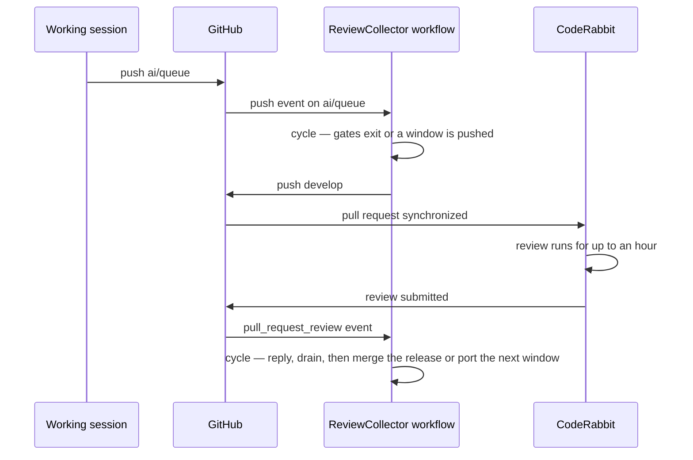
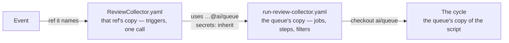
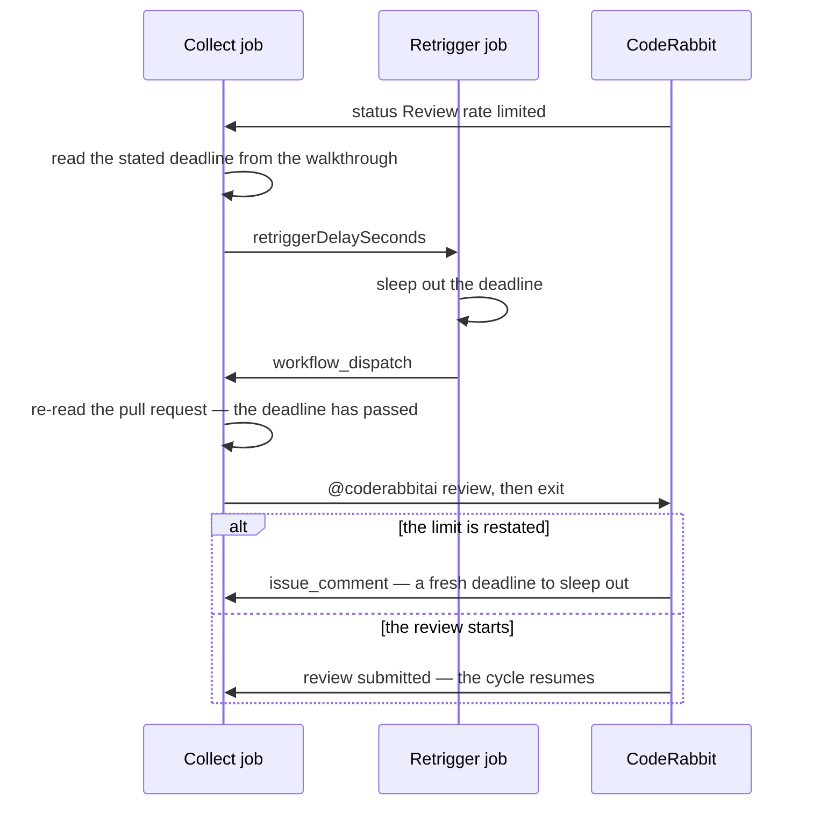

# Runner

The [collection cycle](/docs/infra/review-collector/collection-cycle) is a script; this is what runs it when nobody is at a keyboard. It is a GitHub Actions workflow because every fact the cycle reacts to — a branch push, a review submission, a status flip — is a webhook GitHub already delivers to Actions, and the repo already runs Claude Code headless there (`claude-warmup.yaml`). A cloud routine is cron-only with no event input, a local loop dies with the session that started it, and the raw API would rebuild the agent loop `claude -p` already is.

## Triggers

Every event below runs the identical cycle:

| Event                                       | Filter                                                  | What it is                                                                                                                                                                                                                                                                                                                  |
| :------------------------------------------ | :------------------------------------------------------ | :-------------------------------------------------------------------------------------------------------------------------------------------------------------------------------------------------------------------------------------------------------------------------------------------------------------------------- |
| `push` on `ai/queue`                        | —                                                       | the allocation event, one per session commit; almost all exit at the gates                                                                                                                                                                                                                                                  |
| `pull_request_review` `submitted`           | the bot's login, a pull request whose head is `develop` | the free event — the head filter holds it to the release, and `.coderabbit.yaml` ignores `renovate[bot]`, so no pull request of the bot's is reviewed at all                                                                                                                                                                |
| `status`                                    | the `CodeRabbit` context, on a sha `develop` carries    | the same free event from its other end; the body and the status flip arrive as separate deliveries, and either is enough. The bot statuses every pull request it is asked about, renovate's included, so the branch is what keeps one of those from paying for a runner, a clone and an install to reach the gates and exit |
| `push` on `main`                            | —                                                       | the return stroke; the release pull request is closed by then, so no review event carries `develop` forward — and the pass goes on from there, since the fast-forward it makes fires nothing                                                                                                                                |
| `pull_request` `closed`                     | a merged `develop` → `main` release                     | the release-completion fallback: it covers a missing or delayed `main` push delivery. Both events may arrive, but the concurrency group serializes them and the second pass re-derives the remote state, so it exits harmlessly                                                                                             |
| `workflow_run` of CI or CodeQL, `completed` | `main`'s head, concluded `failure`                      | the [repair](/docs/infra/review-collector/repair)'s event. It fires from the default branch's copy of the triggers alone, so it reaches `main` a release after it is written; the cycle reads the same verdict on every event, so nothing waits on it                                                                       |
| `workflow_dispatch`                         | —                                                       | the manual nudge, for a dropped webhook                                                                                                                                                                                                                                                                                     |
| `issue_comment` `created` or `edited`       | the bot's login, on a pull request                      | the bot's answer to a retrigger — a comment or an edit of its walkthrough, never a review or a status                                                                                                                                                                                                                       |

**One copy of the runner runs, whichever event fired it.** GitHub reads a workflow file from the ref the event names, and `main`'s copy is a release behind the remote state the newest copy defines — left to the event, a rename in the collector is a deadlock, since the copy on `main` fails on the missing ref and never ports the commit that would teach it the new name. So `ReviewCollector.yaml` is the triggers and the filter above, and calls `run-review-collector.yaml` **at `ai/queue`**, whose checkout pins the same ref. The filter is the one thing it also carries, because the concurrency group makes a skipped job cost what a working one costs — [the job](#the-job).

**The trigger and the runner it calls sit on different refs, so what they agree on is what a release lag can break.** That contract is the file name and the queue branch spelled in four places — held to the constant by `scripts/src/services/coderabbit/collect/queueBranch.test.ts` — and nothing else; the secrets are inherited, never named (Notes), and the call passes no inputs, since an input the callee no longer declares fails the call at startup for every event `main`'s copy fires until the release that carries the removal. A trigger added to the shell still waits for a release before it fires on statuses and comments.

**No `schedule`.** [No polling](/docs/architecture/no-polling) is the standing rule, and every automatic trigger above is a webhook the platform delivers — `workflow_dispatch` is the manual nudge, delivered because a person asked. The one state change that reports none is a rate limit lifting, and the retrigger below answers it with a scheduled delivery rather than a loop.

## The delayed retrigger

CodeRabbit skips a review when the account is over its hourly limit, sets `Review rate limited`, and says nothing when the limit turns over — but the walkthrough it rewrites when it skips states when the next review becomes available. The cycle reads that sentence, a second job sleeps it out and dispatches the cycle again, and that run — the deadline now passed — posts `@coderabbitai review` and exits: the bot's answer arrives as an `issue_comment`, which is a trigger.

**The job that sleeps is not the one that asks.** A session push during the sleep may already have a review running once the limit lifts, and a retrigger posted blind would cancel it; so the sleeping job only wakes the cycle, and every decision is made in the script with fresh state. The deadline is **relative to the comment that carries it**, never to now — the block is not removed when the limit lifts, so an expired one must read as nothing left to wait for — and it is the deadline only, never the fact: whether a limit applies is the commit status's answer. A block stating no readable deadline is asked about rather than guessed at. One sleep is capped under the job's timeout; a longer deadline is slept in relays, each dispatched run reading what is left.

## The job

The `collect` job carries the concurrency group (`review-collector`, never cancelling in progress): a run waits for the one ahead and re-reads the remote, and cancelling a run mid-push would be the only way to lose work. GitHub holds one run pending per group, so a third arriving while one waits cancels the waiting one — harmless, since every run derives its work from the remote afresh and the newest carries it. **That last half is a property of the filter, not of the group.** A run whose job is skipped takes the slot exactly as a run that works does, and then carries nothing: a burst is four or five deliveries seconds apart, and one of them being an event the filter rejects was enough to evict the fire that would have read the bot's verdict and leave the collector idle until an unrelated push woke it — measured at eighteen minutes, several times in one day, and unbounded when the session stops pushing. So the filter is the caller's, in `ReviewCollector.yaml`: a caller job that skips starts no called workflow, so what it rejects never enters the group and everything that does enters runs the cycle. It is written on the called job as well, and `eventFilter.test.ts` holds the two equal — the caller is the copy that cannot be pinned, so a change to the filter reaches the events read from `main`'s copy a release later, and the pinned copy is what filters them until it does. Two copies that agree skip nothing, which is the whole of why the second one is free. The group sits on the job rather than the workflow so the retrigger's wait never holds it; the retrigger has a group of its own that does cancel, since a newer run carries the newer deadline, and runs on the built-in token with `actions: write` alone — a `workflow_dispatch` is the one event that token may start.

The steps are the warmup workflow's plus what the script needs: a full-history checkout of the `ai/queue` head with the collector's token and `persist-credentials: false`; the dependency setup and the library builds restored from the `package-builds` cache 🏗️ CI saves for this content, built here only on a miss — the script imports `@esposter/shared` by its published entry, and the drain's finishing checks resolve every library the touched package reads the same way; the git identity the fix commits carry and `core.fileMode false`, because the install flips an executable bit that would read as a dirty tree; the `trust-workspace` action; then `gh auth setup-git` and `pnpm ai:coderabbit:collect`.

Claude Code runs headless with permission prompts bypassed — the runner is ephemeral and holds one credential scoped to this repository, so the interactive model protects nothing and would stall the session on its first `git commit`. Six steps spawn it, each only where a reading no rule can make is owed, each bounded by the one attempt cap (`SESSION_ATTEMPT_CAP`), each proved by the tree or the remote afterwards rather than by the session's word:

| Step            | Runs when                                                                            | Bound                              | Proof                                                                                 |
| :-------------- | :----------------------------------------------------------------------------------- | :--------------------------------- | :------------------------------------------------------------------------------------ |
| drain           | a finding is open                                                                    | per review, then quarantined       | a clean exit over a clean tree                                                        |
| replay resolver | a queue commit conflicts with the tree the window is built on, outside the lockfile  | per commit                         | the sequence run to its end over a clean tree                                         |
| reshaper        | the first owed commit alone exceeds the cap                                          | per commit                         | the same tree as the original, no part naming its copies, every untrailered part fits |
| fold resolver   | `main` conflicts with the window outside the lockfile                                | per `main` head                    | the merge committed over a clean tree                                                 |
| release verdict | a clean review at the head the bot does not rate the least risk, including no rating | once per head                      | one line, `merge` or `hold`, recorded on the pull request                             |
| repairer        | CI red on `main`'s head                                                              | per streak — attempts plus repairs | a trailered commit over a clean tree, then every check green                          |

The counts live in marker comments — on the pull request for the drain and the verdict, on the commit itself for the rest, since the queue is synced with no pull request open as often as with one — and the repairer's adds the repairs already stacked at `main`'s head, since each of those made the head it is counted on, each naming its basis in its own trailer because a commit carries no marker ([the repair](/docs/infra/review-collector/repair)). **Every attempt names what it was made against**, and a count reads only the attempts naming the same basis: the hash of the collector's own source tree at the run's start (`COLLECTOR_SOURCE_PATH`) for every step, and the `main` head as well for the repairer and the fold resolver, whose work answers the same for the same tree. A collector fixed since, or a `main` that moved, is a fresh turn for the work by itself; a count that outlived the code that ran it up would leave every fix to the collector waiting on a person to reset a number, and nothing resets one by hand. **A session holds nothing that reaches GitHub:** its prompt carries CodeRabbit's finding text verbatim, model-written prose about code anyone may have contributed, steering a session that skips its prompts — the shape a prompt injection wants. `GH_TOKEN` is withheld from the child and the checkout persists none, so a rejection leaves the session as a file the collector posts. What it can still do is local — edit this checkout, spawn subprocesses, and commit to the branch its step writes, which the collector pushes on a clean exit, so an injected commit arrives by the same route a fix does and is bounded by the same review. The one credential it holds is the Claude Code token, which authenticates the process that spawns every tool — no mode Claude Code offers keeps it from a subprocess. What it can spend is the account's own quota, never anything here; closing that channel means an egress allow-list around the runner, the first thing to add if the repository ever takes contributions the drain would read.

## Credentials

| Secret                    | Holds                                                                                                      | Why                                                                                                                                                                |
| :------------------------ | :--------------------------------------------------------------------------------------------------------- | :----------------------------------------------------------------------------------------------------------------------------------------------------------------- |
| `CLAUDE_CODE_OAUTH_TOKEN` | the Claude Code subscription token, already present                                                        | every session the cycle spawns, exactly as the warmup uses it                                                                                                      |
| `REVIEW_COLLECTOR_TOKEN`  | the `gh` CLI login token of the account that runs the working session, refreshed with the `workflow` scope | the collector's pushes to `develop` and `ai/review-fixes`, its thread replies and the release pull request it opens — never the drain's, and `GITHUB_TOKEN` cannot |
| `TYPESAFE_API_KEY`        | the key the [typed-decision](/docs/infra/typed-decisions) tier's SDK authenticates with                    | the gates the cycle answers before it spawns a session — absent, each answers nothing and escalates, so a fork runs as the cycle did before there were gates       |

**The trigger inherits and the runner declares nothing.** Those above are the only secrets any step in it spends, read straight from `secrets.*`; no declaration under `on.workflow_call.secrets`, because with inheritance one would be a second list to keep true. Inheriting narrows nothing: `CI.yaml` runs on a push to any branch with the same repository secrets, so a step added to `ai/queue` reaches every one of them through that workflow whatever this call hands over.

A push made with `GITHUB_TOKEN` starts no workflow runs, so `develop`'s CI and deployment would never fire on a collector push; it also posts as the shared Actions bot. The login token is the credential the session already holds rather than one minted for the job, because every alternative is created in a browser form GitHub exposes no API for. It needs the `workflow` scope because a ported window can carry a workflow file, and lives as a secret in the stack's Pulumi ESC environment. Rotation is `gh auth refresh` and re-setting the value; `gh auth logout` on that machine stops the collector at its checkout.

## Failure semantics

A run fails red and leaves the remote in a state the next run resumes from — and red is also how a person is told the queue needs them: a first owed commit whose reshaping or whose conflict the session failed on past the attempt cap fails every run until a person splits or resolves it, since no event clears either and a green idle run reports to nobody. It is noted once on the commit itself by the first run that holds on it, because under a rate limit that run exits idle to keep the retrigger. The other residual cases — a release the verdict held, a red `main` past its repairs — are a comment where they are read and no red at all, since nothing waits on any of them. Before the push everything is a local branch in the runner; the drain pushes `ai/review-fixes` only after Claude exits clean with a clean tree, and a crash mid-drain is retried from the same open set until the attempt cap quarantines the review; the push is a single fast-forward that either moves `develop` or is refused; after it, the replies are predicate-guarded and finished by the next run. The job summary says which step and why. Nothing pages — the collector's failures are found where every other workflow's are, in the Actions tab.

## Key files

| File                                                          | Role                                                                                                                    |
| :------------------------------------------------------------ | :---------------------------------------------------------------------------------------------------------------------- |
| `.github/workflows/ReviewCollector.yaml`                      | the triggers and the event filter — the one file read from the event's ref, calling the reusable workflow at `ai/queue` |
| `.github/workflows/run-review-collector.yaml`                 | the reusable workflow — the jobs, the pinned copy of the filter, concurrency groups and steps                           |
| `scripts/src/services/coderabbit/collect/queueBranch.test.ts` | the four places the two files spell the queue branch, kept equal to the constant                                        |
| `scripts/src/services/coderabbit/collect/eventFilter.test.ts` | the event filter both workflow files carry, kept equal to each other                                                    |
| `scripts/src/services/coderabbit/collect/runCycle.test.ts`    | the pass run end to end against a fixture repository, one test per way it exits                                         |
| `.github/workflows/claude-warmup.yaml`                        | the headless invocation this workflow reuses                                                                            |
| `.github/actions/trust-workspace`                             | the trust-dialog shim both workflows run                                                                                |
| `.github/actions/setup-project-dependencies`                  | the install step                                                                                                        |
| `.github/actions/restore-package-builds`                      | the library builds, restored from the cache and verified on disk before the miss builds them                            |
| `apps/infra/src/github/secrets/reviewCollectorToken.ts`       | the collector token as a Pulumi-managed repository secret                                                               |
| `apps/infra/src/github/secrets/typesafeApiKey.ts`             | the typed-decision key as a Pulumi-managed repository secret                                                            |

## Notes

- **Rejected: handing the runner its secrets by name.** The list protected nothing — every repository secret is readable from `CI.yaml` on the same push — and a name the two copies disagreed on refused every status, review and comment event at startup, a failure the cycle cannot heal because healing needs a run.
- **Rejected: GitHub environments for the deployment credentials.** The Azure login is a federated credential already scoped to `develop` and `main` by branch, so an environment admits the same set for more configuration; what would change the threat model is a required reviewer on production — a workflow decision, not a secret-scoping one.
- **Rejected: running the cycle from the event's own ref, or from `develop`'s copy.** `develop` is the verified copy and the event's ref is what GitHub hands over, and both lose to one fact — the cycle reads remote state whose shape the newest copy defines. "Verified" buys nothing: a queue push already runs the queue's copy with the same secrets, and a broken queue copy fails the next push loudly for the session that broke it.
- **Runner minutes are not the constraint.** The repository is public, so Actions minutes are free, and most runs exit at the gates before the install matters. If that changes, the gates can move into a first job that needs only `gh` and `git`.
- **A session has a wall clock.** The job's `timeout-minutes` bounds a Claude session that has lost its way; the cycle's ordering means a timeout costs the same as a crash, which is nothing on the remote.
