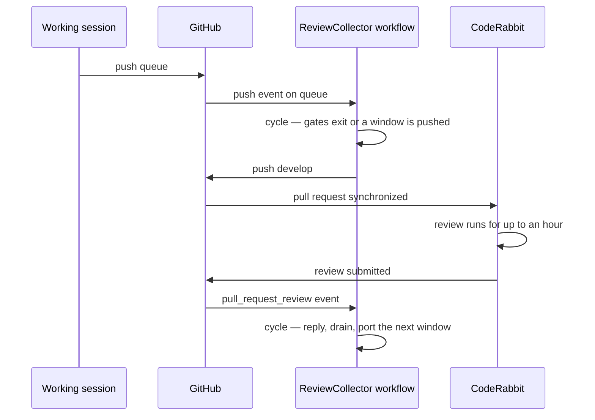
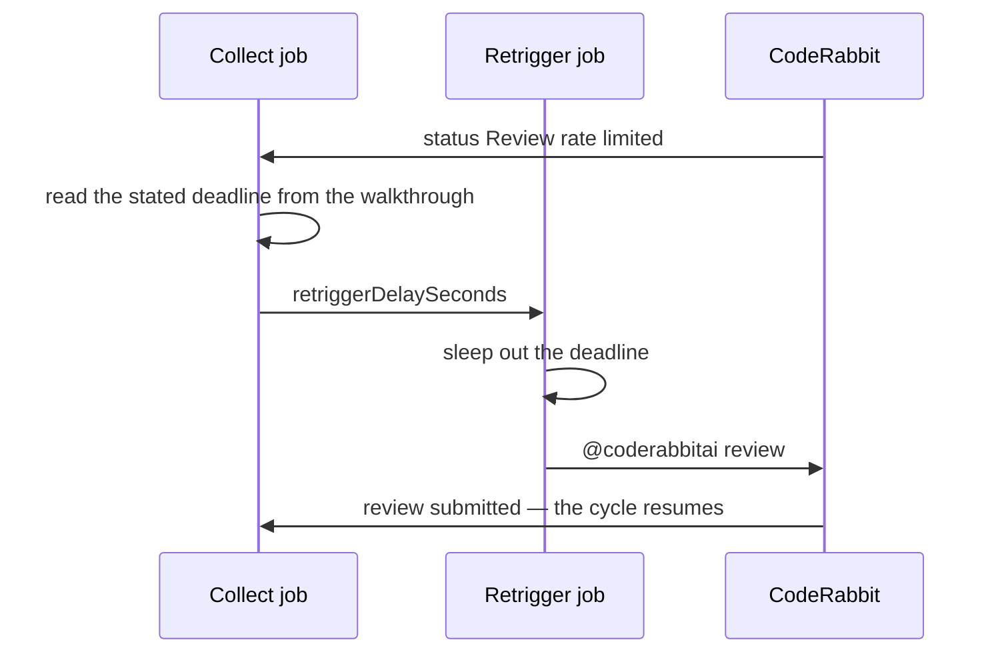

# Runner

The [collection cycle](/docs/infra/review-collector/collection-cycle) is a script; this page is the thing that runs it when nobody is at a keyboard. It is a GitHub Actions workflow, `ReviewCollector.yaml`, because every fact the cycle reacts to — a branch push, a review submission, a status flip — is a webhook GitHub already delivers to Actions, the repo already runs Claude Code headless there (`claude-warmup.yaml`), and the alternatives fall short in ways that matter: a cloud routine is cron-only with an hour floor and has no event input, a local `/loop` dies with the session that started it, and the raw API would rebuild the agent loop `claude -p` already is, without the skills tree that teaches it how findings are answered.

## Triggers



Five events, and every one runs the identical cycle:

- **`push` on `queue`** — the allocation event. Fires on every push the session makes, which under a standing sweep is one per commit; almost all of them exit at the gates within seconds of the checkout. The one that arrives when the slot is free and the queue has reached the target is the one that pushes.
- **`pull_request_review` of type `submitted`**, filtered in the job's `if` to the bot's login and to a pull request whose head is `develop` — the free event. Renovate's pull requests also target `main` and also get reviewed, and the filter is what keeps their reviews from running a cycle against the release pull request for nothing. The workflow file for this event is taken from the pull request's merge ref, so it runs from `develop`'s copy while the release pull request is open; it does not need to be on `main` first.
- **`status`**, filtered to the `CodeRabbit` context — the same free event read from its other end. CodeRabbit writes the review body and flips its commit status a moment later, so the two arrive as separate deliveries and either one is enough to run the cycle. Every deployment writes a status against the same commits, which is what the context filter is for.
- **`push` on `main`** — the return stroke. A release merging, or a dependency bump landing directly, both move `main`; the cycle fast-forwards `develop` to it when `develop` is an ancestor and otherwise leaves the fold to the next window's port. The release pull request is closed by the time a release lands, so no review event will ever fire for it again and this is the only thing that carries `develop` forward.
- **`workflow_dispatch`** with a `force` boolean, passed through to the script — the manual nudge, for a short window worth pushing anyway or for a webhook that was dropped.

**Which copy of the workflow runs is the event's choice, not the collector's.** A `push` runs the file as that branch has it, and a `pull_request_review` takes it from the pull request's merge ref — which is why the review trigger works from `develop` while the release pull request is open. A `status` has no branch at all, so GitHub runs the default branch's copy: a trigger added here reaches `develop` immediately and only starts firing on statuses once the release that carries it merges to `main`.

**No `schedule`.** [No polling](/docs/architecture/no-polling) is the repo's standing rule, and every trigger above is a webhook the platform already delivers. The one state change that reports none is a rate limit lifting, and the `retrigger` job below answers it with a scheduled delivery rather than a loop asking whether it has happened yet.

## The delayed retrigger

CodeRabbit skips a review when the account is over its hourly limit, sets `Review rate limited` on the commit status, and says nothing at all when the limit turns over. Left there the pipeline parks: the window it skipped is never reviewed, and no event exists to re-fire the cycle.

The bot does publish one thing, though — the walkthrough it rewrites when it skips states **when the next review becomes available**. The cycle reads that sentence, and a second job sleeps it out and posts `@coderabbitai review`. The review that starts submits a `pull_request_review`, which is a trigger the collector already runs on, so the pipeline resumes itself.



Two things make that sentence safe to act on. It is **relative to the comment that carries it**, never to now: the block is not removed when the limit lifts, so a pull request merged yesterday still shows the one its last skipped review wrote, and a wait read from the present would park the collector behind a deadline that passed a day ago. And it is **the deadline only**, never the fact — whether a limit applies at all is the commit status's answer, which is why an expired block resolves to no wait rather than to a contradiction. A block that states no readable deadline falls back to the hourly window the plan itself grants.

This is the shape [no polling](/docs/architecture/no-polling) calls a scheduled delivery: the work happens _at a time_, and nothing asks in the meantime whether it is time yet.

## The job

```yaml
concurrency:
  group: review-collector
  cancel-in-progress: false
```

The group serializes every run, whichever event fired it. The bot's own replies arrive as `pull_request_review` events, so a drain is followed by several fires within seconds; each waits for the one ahead of it and then exits at the gates. `cancel-in-progress` stays false because a run in the port step holds nothing another run needs, and cancelling one mid-push would be the only way to lose work.

It sits on the `collect` job rather than on the workflow so that the retrigger, whose wait is measured in the bot's minutes, does not hold that queue behind it. The retrigger takes a group of its own and cancels in progress, the opposite choice for the opposite reason: it holds nothing, and a newer run carries the newer deadline.

The steps are the warmup workflow's, plus what the script needs:

1. Checkout with the full history, authenticated with the collector's token so the push it makes fires `develop`'s own workflows, and with `persist-credentials: false` so the token does not end up in `.git/config` where the drain could spend it. Every ref the cycle reads — `main`, `develop`, `queue` and, when it exists, `review-fixes` — is read from `origin`, and a shallow clone cannot run `git cherry` across them.
2. The repo's dependency setup action and the install, then a build of `@esposter/shared` and what it depends on, since the script imports the workspace package's built output.
3. The git identity the fix commits and the fold of `main` carry, and `core.fileMode false`, because the runner's checkout flips an executable bit the cycle would otherwise refuse as a dirty tree.
4. The `trust-workspace` action the warmup workflow shares, since a fresh runner has no `~/.claude.json` and treats the checkout as untrusted.
5. `gh auth setup-git`, which points git's credential helper at `gh` and so at the token in this step's environment alone, then `pnpm ai:coderabbit:collect` with `--force` when the dispatch input says so. The script finds the pull request itself.

The script spawns Claude Code headless for the drain step with the open findings on its stdin and permission prompts bypassed. The runner is ephemeral, holds one credential scoped to this repository, and is discarded when the job ends, so the interactive permission model protects nothing here and would only stall the drain on its first `git commit`. The model is pinned by family alias rather than left to the account's default, so two runs a month apart answer on the same tier and the log says which. The session is streamed one event per line and each is written to the job log as it lands — the model that opened it, every tool call, the prose between them, and the result with its turn count and cost — so a run twenty minutes in shows what the drain is doing rather than the install it started with. Stdout is read rather than inherited for the reason it always was: the sentence Claude Code prints on its way out is what tells a drain that failed from one that never started, and it is parsed off the lines the log was given.

Each finding reaches the drain as the reviewer wrote it — the reasoning, the proposed diff and the prompt block it addresses to an agent — with the bot's hidden fingerprints and its static-analysis transcript stripped. The drain holds no `gh` to read a thread itself, so a title alone would have it re-derive the case the reviewer already made, slower and with less to go on than a person reading the thread would have.

**The drain holds no credential that can act on this repository.** Its prompt carries CodeRabbit's finding text verbatim, which is model-written prose about code anyone may have contributed, steering a session that skips its permission prompts — the shape a prompt injection wants. So `GH_TOKEN` is withheld from the child process and the checkout persists none, leaving `gh` authenticated only in the parent, which is the process that pushes and replies. What the drain loses by that is the ability to answer a finding it rejects, so a rejection leaves the session as a written line in a file outside the checkout and the collector posts it — the same split an accepted finding already had, whose reply waits for the push.

## Credentials

| Secret                    | Holds                                                                                                      | Why                                                                                                                                                      |
| :------------------------ | :--------------------------------------------------------------------------------------------------------- | :------------------------------------------------------------------------------------------------------------------------------------------------------- |
| `CLAUDE_CODE_OAUTH_TOKEN` | the Claude Code subscription token, already present                                                        | the drain step, exactly as the warmup uses it                                                                                                            |
| `REVIEW_COLLECTOR_TOKEN`  | the `gh` CLI login token of the account that runs the working session, refreshed with the `workflow` scope | the collector's own pushes to `develop` and `review-fixes` and its thread replies — never the drain's, and the built-in `GITHUB_TOKEN` cannot do the job |

The built-in token is ruled out by a platform rule rather than a permission: a push made with `GITHUB_TOKEN` starts no workflow runs, so `develop`'s CI and its deployment would never fire on a collector push, and the release branch would silently stop deploying. It also posts as the shared Actions bot, so a collector reply could not be told from any other workflow's comment. The login token posts and pushes as the account that owns it, which is the same identity the manual process has always used. It is the credential the session already holds rather than one minted for the job because every alternative — a fine-grained personal access token, a GitHub App and its private key — is created in a browser form GitHub exposes no API for, and the collector exists to remove manual steps, not to add one. The token is read with `gh auth token`, needs the `workflow` scope on top of `gh`'s default set because a ported window can carry a workflow file and GitHub refuses such a push from a token without it, and is stored as a secret in the stack's Pulumi ESC environment beside the other repository secrets `apps/infra` declares. Rotation is `gh auth refresh` followed by re-setting the environment value; a `gh auth logout` on that machine revokes it and stops the collector at its checkout.

## Failure semantics

A run fails red and leaves the remote in a state the next run resumes from, because of how the cycle orders its effects:

- **Before the push,** everything is a local branch in the runner. A crash during read, gate or port leaves no remote trace at all.
- **The drain** pushes `review-fixes` only after Claude exits successfully **and left the working tree clean** — a zero exit says the session ended, never that it finished, so a half-written fix is a failed attempt rather than something to push. A crash mid-drain discards Claude's partial commits with the runner, and the next run drains the same open set from scratch. Repeated failure on one review hits the attempt cap the cycle page describes and is quarantined with a visible comment; a session limit is the one non-zero exit that counts against nothing, and parks the drain until the instant it states.
- **The push** is a single fast-forward that either moves `develop` or is refused. Nothing else in the run is half-applied when it fails.
- **After the push,** the replies are predicate-guarded. A crash before they are all posted is finished by the next run's reply-first step, whichever event fires it.

A red run is the poison signal, and the job summary says which step and why — the gate that failed, the commit that conflicted, the range that stayed red. Nothing pages; the repo's observability posture is deliberately absent, so the collector's failures are found where every other workflow's are, in the Actions tab.

## Key files

| File                                                    | Role                                                      |
| :------------------------------------------------------ | :-------------------------------------------------------- |
| `.github/workflows/ReviewCollector.yaml`                | the workflow — triggers, concurrency groups, steps        |
| `.github/workflows/claude-warmup.yaml`                  | the headless invocation this workflow reuses              |
| `.github/actions/trust-workspace`                       | the trust-dialog shim both workflows run                  |
| `.github/actions/setup-project-dependencies`            | the install step                                          |
| `apps/infra/src/github/secrets/reviewCollectorToken.ts` | the collector token as a Pulumi-managed repository secret |

## Notes

- **Runner minutes are not the constraint.** The repository is public, so Actions minutes are free, and most runs exit at the gates before the dependency install matters. If that ever changes, the gates can move into a first job that needs only `gh` and `git`, with the install gated behind them.
- **The drain has a wall clock.** A `timeout-minutes` on the job bounds a Claude session that has lost its way; the cycle's ordering means a timeout costs the same as a crash, which is nothing on the remote.
