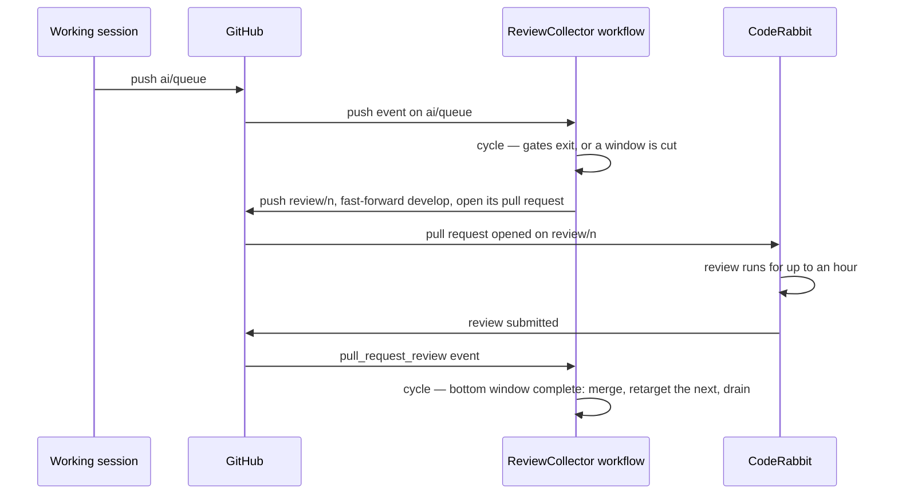
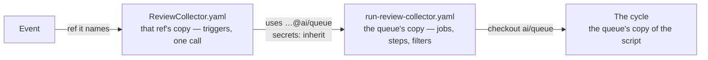
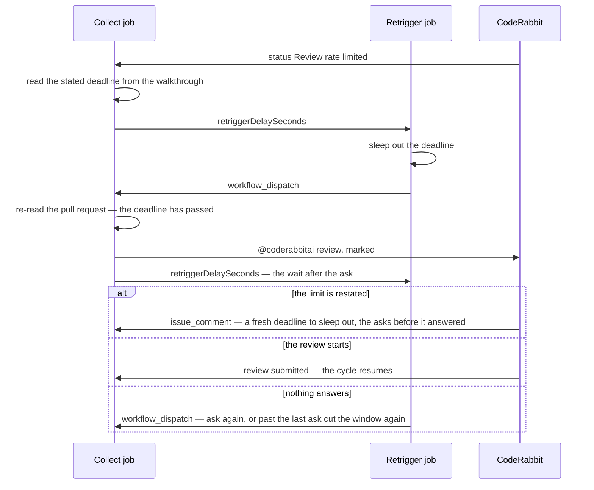
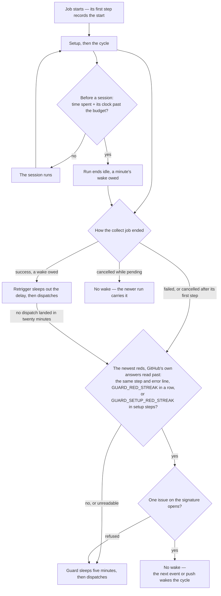

# Runner

The [collection cycle](/docs/infra/review-collector/collection-cycle) is a script; this is what runs it when nobody is at a keyboard. It is a GitHub Actions workflow because every fact the cycle reacts to — a branch push, a review submission, a status flip — is a webhook GitHub already delivers to Actions, and the repo already runs Claude Code headless there (`claude-warmup.yaml`). A cloud routine is cron-only with no event input, a local loop dies with the session that started it, and the raw API would rebuild the agent loop `claude -p` already is.

## Triggers

```mermaid
sequenceDiagram
  participant S as Working session
  participant GH as GitHub
  participant W as ReviewCollector workflow
  participant CR as CodeRabbit
  S->>GH: push ai/queue
  GH->>W: push event on ai/queue
  W->>W: cycle — gates exit, or a window is cut
  W->>GH: push review/n, fast-forward develop, open its pull request
  GH->>CR: pull request opened on review/n
  CR->>CR: review runs for up to an hour
  CR->>GH: review submitted
  GH->>W: pull_request_review event
  W->>W: cycle — bottom window complete: merge, retarget the next, drain
```

Every event below runs the identical cycle:

| Event                                       | Filter                                                                                | What it is                                                                                                                                                                                                                                                                                             |
| :------------------------------------------ | :------------------------------------------------------------------------------------ | :----------------------------------------------------------------------------------------------------------------------------------------------------------------------------------------------------------------------------------------------------------------------------------------------------- |
| `push` on `ai/queue`                        | —                                                                                     | the allocation event, one per session commit; almost all exit at the gates                                                                                                                                                                                                                             |
| `pull_request_review` `submitted`           | the bot's login, a pull request whose head is a `review/**` branch of this repository | the free event — the head filter holds it to the windows, and `.coderabbit.yaml` ignores `renovate[bot]`, so no pull request of the bot's is reviewed at all                                                                                                                                           |
| `status`                                    | the `CodeRabbit` context, on a sha a window branch carries                            | the same free event from its other end; the status flip to completed is the event the merge answers. The bot statuses every pull request it is asked about, renovate's included, so the branch is what keeps one of those from paying for a runner, a clone and an install to reach the gates and exit |
| `push` on `main`                            | —                                                                                     | the return stroke; the window that merged is closed by then, so no review event is left to carry `develop` forward — and the pass goes on from there, since the fast-forward it makes fires nothing                                                                                                    |
| `pull_request` `closed`                     | a window closed into `main` or onto a `review/**` branch                              | the merge fallback: it covers a missing or delayed delivery of the merge's push to `main`, and a window closed onto another window wakes it too. Both events may arrive, but the concurrency group serializes them and the second pass re-derives the remote state, so it exits harmlessly             |
| `workflow_run` of CI or CodeQL, `completed` | this repository's `main` head, concluded `failure`                                    | the [repair](/docs/infra/review-collector/repair)'s event. It fires from the default branch's copy of the triggers alone, so it reaches `main` a release after it is written; the cycle reads the same verdict on every event, so nothing waits on it                                                  |
| `workflow_dispatch`                         | —                                                                                     | the manual nudge, for a dropped webhook                                                                                                                                                                                                                                                                |
| `issue_comment` `created` or `edited`       | the bot's login, on a pull request                                                    | the bot's answer to a retrigger — a comment or an edit of its walkthrough, never a review or a status                                                                                                                                                                                                  |

**A branch name is matched with the repository that holds it.** A fork's pull request can come from a branch the fork named `review/…` or `main`, so the review and `workflow_run` filters also require the head to be this repository's — otherwise a fork's failed CI run or reviewed pull request would start a cycle with the runner's secrets.

**One copy of the runner runs, whichever event fired it.** GitHub reads a workflow file from the ref the event names, and `main`'s copy is a release behind the remote state the newest copy defines — left to the event, a rename in the collector is a deadlock, since the copy on `main` fails on the missing ref and never ports the commit that would teach it the new name. So `ReviewCollector.yaml` is the triggers and the filter above, and calls `run-review-collector.yaml` **at `ai/queue`**, whose checkout pins the same ref. The filter is the one thing it also carries, because the concurrency group makes a skipped job cost what a working one costs — [the job](#the-job).

```mermaid
flowchart LR
  E[Event] -->|ref it names| T[ReviewCollector.yaml<br/>that ref's copy — triggers, one call]
  T -->|uses …@ai/queue<br/>secrets: inherit| R[run-review-collector.yaml<br/>the queue's copy — jobs, steps, filters]
  R -->|checkout ai/queue| S[The cycle<br/>the queue's copy of the script]
```

**The trigger and the runner it calls sit on different refs, so what they agree on is what a release lag can break.** That contract is the file name and the queue branch, spelled wherever the two files name it — held to the constant by `scripts/src/services/coderabbit/collect/queueBranch.test.ts` — and nothing else; the secrets are inherited, never named (Notes), and the call passes no inputs, since an input the callee no longer declares fails the call at startup for every event `main`'s copy fires until the release that carries the removal. A trigger added to the shell still waits for a release before it fires on statuses and comments.

**No `schedule`.** [No polling](/docs/architecture/no-polling) is the standing rule, and every automatic trigger above is a webhook the platform delivers — `workflow_dispatch` is the manual nudge, delivered because a person asked. Several state changes report none — a rate limit lifting, CodeRabbit's or GitHub's own, Claude Code's limit lifting, the hourly opening ceiling turning over (the oldest window's creation plus the hour), the collector's own waits on a review the bot has not run running out, a lease lost on a branch whose push fires no run, a held commit owed its first re-land or its next one at an unmoved head, a red signature's oldest repair ageing out of its span, and a red `main` head the repairer holds owed its next reading — the queue's CI concluding over it, a transit gap left with nothing in flight to heal it, a re-run of its failed jobs — and the retrigger below answers each with a scheduled delivery rather than a loop.

**The new filters take effect on `main`.** A `pull_request` or `status` event's filter is read from `main`'s copy of the trigger, as the `workflow_run` filter already is, so the `review/**` filters reach those events only once this change is on `main`. Until then, pushes to `ai/queue` and the retrigger drive the cycle.

## The delayed retrigger

CodeRabbit skips a review when the account is over its hourly limit, sets `Review rate limited`, and says nothing when the limit turns over — but the walkthrough it rewrites when it skips states when the next review becomes available. The cycle reads that sentence, a second job sleeps it out and dispatches the cycle again, and that run — the deadline now passed — posts `@coderabbitai review` and exits: the bot's answer arrives as an `issue_comment`, which is a trigger, and an answer that never comes is the wait after the ask running out, after which the window is asked again as a skipped review is.

```mermaid
sequenceDiagram
  participant W as Collect job
  participant R as Retrigger job
  participant CR as CodeRabbit
  CR->>W: status Review rate limited
  W->>W: read the stated deadline from the walkthrough
  W->>R: retriggerDelaySeconds
  R->>R: sleep out the deadline
  R->>W: workflow_dispatch
  W->>W: re-read the pull request — the deadline has passed
  W->>CR: @coderabbitai review, marked
  W->>R: retriggerDelaySeconds — the wait after the ask
  alt the limit is restated
    CR->>W: issue_comment — a fresh deadline to sleep out, the asks before it answered
  else the review starts
    CR->>W: review submitted — the cycle resumes
  else nothing answers
    R->>W: workflow_dispatch — ask again, or past the last ask cut the window again
  end
```

**The job that sleeps is not the one that asks.** A session push during the sleep may already have a review running once the limit lifts, and a retrigger posted blind would cancel it; so the sleeping job only wakes the cycle, and every decision is made in the script with fresh state. The deadline is **relative to the comment that carries it**, never to now — the block is not removed when the limit lifts, so an expired one must read as nothing left to wait for — and it is the deadline only, never the fact: whether a limit applies is the commit status's answer. A block stating no readable deadline is asked about rather than guessed at. One sleep is capped under the job's timeout; a longer deadline is slept in relays, each dispatched run reading what is left. With several windows open, each rate-limited one is settled on its own deadline, and the retrigger sleeps out the soonest of them.

**More holds lift at an instant the run can state, and are slept out the same way.** Claude Code's limit lifts at the reset its marker carries ([the drain](/docs/infra/review-collector/drain), "When it cannot"), and the sessions that push `ai/queue` draw on the same account, so they stop at the same limit and no push wakes the cycle until it lifts. The hourly opening ceiling counts windows by their pull request's creation time, so it gives a slot back when the oldest window opened in the last hour passes the hour, with nothing pushed or reviewed to report it; a run sets that wake whenever the hour's openings are spent, however many windows are open (`getOpeningWaitMs`). A skipped review's ask is followed by its wait (`REVIEW_ASK_WAITS_MS`), a bottom window with no check is waited on from its opening (`MISSING_CHECK_WAIT_MS`), and a bottom window whose check is pending is waited on from the status that set it (`PENDING_CHECK_WAIT_MS`); the bot states no deadline for any of them — a review it dropped sends no status at all — so each wait is the collector's own, set by every run that sees it, and the run that ends it posts the next ask or the re-cut ([the collection cycle](/docs/infra/review-collector/collection-cycle)); an ask a rate limit's window is owed once its deadline passes is followed by the same waits. A push the lease refused on `develop`, `ai/review-fixes` or a window's branch wakes the cycle a minute later (`MOVED_BRANCH_RETRY_DELAY_SECONDS`), since no push to those fires a run; an ask the re-read check withholds, five minutes later (`CHECK_REREAD_DELAY_SECONDS`); a commit a run first finds held, a minute later (`ATTEMPT_RETRY_DELAY_SECONDS`), so its re-land is tried at the `main` head it was parked at rather than only once `main` moves, which a quiet queue may not do for hours, and so is one let go for the paths that parked it to try again; a head a held commit's re-land already failed at, once the wait after that try passes (`RELAND_RETRY_WAITS_MS`), so its attempts are spent with `main` still; GitHub's own rate limit, at the instant GitHub states it lifts, or after a set wait where it states none ([failure semantics](#failure-semantics)); a red signature past its repairs, at the instant enough of its oldest attempts age out of `REPAIR_SIGNATURE_SPAN_MS` to bring it under the cap; and a red `main` held — for the queue's run over it, in a transit gap, or for a re-run of its failed jobs — once the newest queue run's own span from push to verdict has passed again, or the red run's own for a workflow the queue never runs ([the repair](/docs/infra/review-collector/repair)). Each instant gets the buffer a rate limit's deadline gets and the same relays past one sleep's cap (`getRetriggerDelaySeconds`), and a run that knows of several holds sleeps out the soonest, since the run it wakes states the rest again.

## The job

The `collect` job carries the concurrency group (`review-collector`, never cancelling in progress): a run waits for the one ahead and re-reads the remote, and cancelling a run mid-push would be the only way to lose work. GitHub holds one run pending per group, so a third arriving while one waits cancels the waiting one — harmless, since every run derives its work from the remote afresh and the newest carries it. **That last half is a property of the filter, not of the group.** A run whose job is skipped takes the slot exactly as a run that works does, and then carries nothing: a burst is four or five deliveries seconds apart, and one of them being an event the filter rejects was enough to evict the fire that would have read the bot's verdict and leave the collector idle until an unrelated push woke it — measured at eighteen minutes, several times in one day, and unbounded when the session stops pushing. So the filter is the caller's, in `ReviewCollector.yaml`: a caller job that skips starts no called workflow, so what it rejects never enters the group and everything that does enters runs the cycle. It is written on the called job as well, and `eventFilter.test.ts` holds the two equal — the caller is the copy that cannot be pinned, so a change to the filter reaches the events read from `main`'s copy a release later, and the pinned copy is what filters them until it does. Two copies that agree skip nothing, which is the whole of why the second one is free. The group sits on the job rather than the workflow so the retrigger's wait never holds it; the retrigger has a group of its own that does cancel, since a newer run carries the newer deadline — the guard shares it ([below](#the-budget-and-the-guard)) — and runs on the built-in token with `actions: write` alone — a `workflow_dispatch` is the one event that token may start.

The steps are the warmup workflow's plus what the script needs: first the job's start, recorded for the cycle's budget and as the output that tells the guard the job ran ([below](#the-budget-and-the-guard)); a full-history checkout of the `ai/queue` head with the collector's token and `persist-credentials: false`; the dependency setup; an install of the collector's own projects — the libraries, `scripts` and the root toolchain through `install-projects`, never an app, so a postinstall a queue commit broke is the red of the step whose tree it is (`runInstall`) rather than the install the cycle needs to start; the library builds replayed from the task cache 🏗️ CI saves when this content built there, built here only on a miss — the script imports `@esposter/shared` by its published entry, and the drain's finishing checks resolve every library the touched package reads the same way; the git identity the fix commits carry and `core.fileMode false`, because the install flips an executable bit that would read as a dirty tree; the `trust-workspace` action; then `gh auth setup-git` and `pnpm ai:coderabbit:collect`.

Claude Code runs headless with permission prompts bypassed — the runner is ephemeral and holds one credential scoped to this repository, so the interactive model protects nothing and would stall the session on its first `git commit`. Six steps spawn it, each only where a reading no rule can make is owed, each bounded by the one attempt cap (`SESSION_ATTEMPT_CAP`), each proved by the tree or the remote afterwards rather than by the session's word:

| Step            | Runs when                                                                                                                                                  | Bound                                                                  | Proof                                                                                      |
| :-------------- | :--------------------------------------------------------------------------------------------------------------------------------------------------------- | :--------------------------------------------------------------------- | :----------------------------------------------------------------------------------------- |
| drain           | a finding is open                                                                                                                                          | per merged window, then deferred                                       | a clean exit over a clean tree                                                             |
| replay resolver | a queue commit conflicts with the tree the window is built on, outside the lockfile                                                                        | per commit, then parked                                                | the sequence run to its end over a clean tree                                              |
| reshaper        | the first owed commit adds more files than the window's room beside the fixes                                                                              | per commit, then parked                                                | the same tree as the original, no part naming its copies, every untrailered part fits      |
| fold resolver   | `main` conflicts with the window, or with a reviewed window, outside the lockfile                                                                          | per `main` head, then parked                                           | the merge committed over a clean tree                                                      |
| re-land         | a held commit conflicts with the queue's head, at a `main` head not yet tried or after the wait at a tried one                                             | per held commit, every try counted, then held                          | nothing unmerged or untracked, HEAD where the pick started                                 |
| repairer        | a red workflow on `main`'s head no queue run, transit gap or re-run holds — last in the pass, or first in the run after one whose budget could not hold it | per failure signature within `REPAIR_SIGNATURE_SPAN_MS`, then an issue | a trailered commit over a clean tree, then every check green inside the verify's own clock |

**The drain's fixes may go to haiku subagents.** The [drain](/docs/infra/review-collector/drain) page sets out the subagent. That subagent is a child of the session process, so it inherits the same scrubbed environment and the same bypassed prompts, and it draws on the same account window as the session. The other five sessions' prompts carry no such clause, and `CLAUDE_CODE_SUBAGENT_MODEL_FORCE` stays unset, so no environment default overrides the model a call names.

The counts live in marker comments — on the pull request for the drain; on the commit itself for the replay resolver, the reshaper, the fold resolver and the re-land, since the queue is synced with no window open to hold a count; for the express lane's cut, which no session makes, on whichever sha the claimed commit has, counted once per `main` head it failed on and keyed by the commit's patch id (`readCommitPatch`), which every rewrite of the queue keeps while it changes the sha ([the express lane](/docs/infra/review-collector/express-lane)); and for the repairer on whichever red head each attempt was made at, keyed by the red's failure signature, so a window merged over the red does not reset it ([the repair](/docs/infra/review-collector/repair)). Both of those are read from one page of every commit's newest comments (`readNewestCommitComments`). Wherever a count lives, one primitive reads it and hands back the only way to record the next attempt (`getAttempts`), so no step can count under one marker and write its attempt under another. A resolution and a reshaping are counted when they succeed as well: each reaches the remote only with the rewrite's push, and a refusal before it — a park's push, or the rewrite's own — throws the work away, so a success left uncounted would hand every later run the same session to pay for with nothing to cap it; a rewrite that lands carries the commit under a new sha, which no count keyed on the sha follows. **Every attempt names what it was made against**, and a count reads only the attempts naming the same basis: the hash of the collector's own services tree at the run's start (`COLLECTOR_SOURCE_PATH`). The fold resolver's count is keyed on the `main` head it folds, so a `main` that moved is a fresh turn for it; a collector fixed since is a fresh turn for every step; a count that outlived the code that ran it up would leave every fix to the collector waiting on a person to reset a number, and nothing resets one by hand. **A session holds nothing that reaches GitHub:** its prompt carries CodeRabbit's finding text verbatim, model-written prose about code anyone may have contributed, steering a session that skips its prompts — the shape a prompt injection wants. `GH_TOKEN` is withheld from the child and the checkout persists none, so a rejection leaves the session as a file the collector posts. What it can still do is local — edit this checkout, spawn subprocesses, and commit to the branch its step writes, which the collector pushes on a clean exit, so an injected commit arrives by the same route a fix does and is bounded by the same review. The one credential it holds is the Claude Code token, which authenticates the process that spawns every tool — no mode Claude Code offers keeps it from a subprocess. What it can spend is the account's own quota, never anything here; closing that channel means an egress allow-list around the runner, the first thing to add if the repository ever takes contributions the drain would read.

**The call is capped to reading caches** (`cache-mode: read`, on the job in `ReviewCollector.yaml`). The called workflow is read from `ai/queue`, where nothing has been reviewed yet and a drain's fixes land too, and a status, a comment or a red CI run on `main` runs it in the default branch's cache scope, which every branch restores from: uncapped, a called workflow asking for writes there would get them. Capped, every restore still runs and a save is skipped rather than failed, which costs nothing: the library build is saved by CI alone already, and the store cache by every CI job under the key the collector's would take. Dropping the cap fails the Lint check, whose actionlint reports a reusable call on a low-trust trigger with no limit ([monorepo tooling](/docs/architecture/monorepo-tooling)).

## The budget and the guard

A run its job's `timeout-minutes` kills writes no retrigger, and so does a run that fails red: nothing then wakes the cycle but an unrelated event, which is hours away once the sessions stop pushing. One check inside the run keeps the timeout from being met, and one job after it wakes whatever ended that way anyway — unless the newest runs keep failing on the same red, which a wake only meets again.

**The cycle has a budget** (`CYCLE_BUDGET_MS`), counted from the job's start, which the job's first step records as an environment variable so the setup steps before the cycle are spent from it too. Before a session launches, the launcher asks whether the time spent plus that session's wall clock (`SESSION_TIMEOUT_MS`) would pass the budget (`assertCycleBudget`). If it would, no session starts and nobody made an attempt, so nothing is counted: the launcher throws (`CycleBudgetSpentError`) and the run ends idle with the minute's retrigger, which launches the session on a fresh budget. The sync, the reshaper, the fold, the drain and the merge's session probe all take that one path, as they take the one for a launch that never started. The repair asks before its attempt, with the attempt's clocks end to end (`REPAIR_ATTEMPT_TIMEOUT_MS`), since its session runs on a sooner clock of its own that the launcher cannot read; one the budget refuses is marked on the head before the run ends, and the run after it starts with the repair, ahead of the walk whose sessions spent the budget — once per failure signature within an hour ([the repair](/docs/infra/review-collector/repair), "The cut"). The job's timeout sits above the budget plus the longest of those steps, so no step the budget let start can meet it. Outside the job — a run by hand, the queue push's carry session — the variable is unset and nothing is budgeted, since no timeout ends that run.

**The guard wakes a run that failed or was killed anyway.** A third job, `guard`, runs when the collect job failed, or was cancelled after its first step, or when the retrigger's dispatch never landed: it sleeps five minutes and dispatches the cycle as the retrigger does. A red the platform caused has most likely cleared by then. The retrigger asks for its dispatch for twenty minutes past its sleep, under a timeout on that step rather than the job's: a step past its timeout fails, and that red is what the guard wakes on, while a job past its own reads as cancelled, the same as a retrigger a newer wake replaced, which nothing may wake. The guard asks for its own dispatch for the same twenty minutes, under the same timeout on its step; one that never lands leaves the cycle to the next event or push. **Overturned: the dispatch asked until the job's timeout.** An Actions outage that outlasted the sleep ran the loop into the job's timeout, the cancelled job woke nothing, and the cycle stood still until an unrelated event; the user's goal overturned it: a collector that runs unattended, calling on a person only for billing, the tokens, a pause made on purpose and a commit past every resolver's caps. A run cancelled while pending — superseded in the concurrency group by a newer fire — never ran a step, so it set no output and is not woken: the newer run carries it. The guard shares the retrigger's concurrency group, so one wake waits at a time: a streak of red runs never multiplies its wakes, and a newer run's deadline replaces a waiting guard as a newer guard replaces a waiting deadline.

**The guard stops on a red the newest runs keep failing on.** Before it wakes anything it reads the newest collector runs whose collect job can have ended (`pnpm ai:coderabbit:guard`): each status is its own list, filtered by the API before the bound counts (`readCollectorRuns`) — the runs still going, its own among them, then the green and the red — so the events the filter skipped and the fires superseded while pending, three in four runs and most of the rest, never take a place in it. A cancelled run is a superseded fire, save one whose waiting retrigger or guard a newer run replaced after its collect job ended, so the cancelled runs are read only across the streak's own span, before it holds, and a span holding more of them than one list reads holds nothing. A collect job that neither succeeded nor failed is read past, and so is a red any of whose failure annotations is GitHub's own answer — a server error or a rate limit, in `gh`'s, `git`'s or Octokit's wording (`GITHUB_OUTAGE_REGEX`) — since it clears by itself and a streak of them would hold the cycle on a red no fix answers. A red in a step that fetches the code or its toolchain — the checkout, pnpm and node, the install (`SETUP_STEP_NAMES`) — never fails on the collector's code, and GitHub or the network fails those steps for a while as readily as a dead token or a broken tree fails them for good, so the setup's reds keep a streak of their own, `GUARD_SETUP_RED_STREAK` of them in a row, longer than the other; a red past the setup ends it, and the other streak reads past the setup's reds. The guard keys each red on its failed step and the first error line its log wrote: the collector writes its own error line as an annotation on the job (`writeErrorAnnotation`), read in place of the runner's exit code, which is the same for every red and stands only for a step that died without a line of its own. When the last `GUARD_RED_STREAK` reds share that signature — or the last `GUARD_SETUP_RED_STREAK` of the setup's — no rerun will answer it, and each wake may pay a session to meet it again, so the guard opens one issue keyed on the signature (`openCollectorIssue`) and wakes nothing; a setup's issue names its likely causes, the collector's token expired, a lockfile the frozen install refuses and a broken composite action under `.github/actions`. The issue comes first and the hold is written only once it is open (`runGuard`): one GitHub refuses — the content-creation limit, a server error — fails the step with no output, which the workflow reads as a wake, since a hold no issue reports would leave the cycle asleep with nobody told. The next push to `ai/queue`, or any event the collector listens to, wakes the cycle as usual, and a run that succeeds ends the streak. A guard that cannot read the runs wakes the cycle as it did before it could tell, and so does a red that breaks the guard's own setup, which is the collect job's: it fails before the cycle could spend anything, so a wake costs only a runner. The setup's streak therefore holds only on a red the guard's own setup and read survive — a dead token fails its read and a broken tree its install, so either is still woken every time. **Overturned: the newest runs read as one list, whatever their status.** A hundred of them held about one collect job in live traffic, so no streak was ever in reach and every red was woken, a session paid to meet it again each time; the `completed` status cannot narrow it either, since GitHub counts a skipped run and a cancelled one as completed. The user's goal overturned it: nothing a run can settle left for a person, and a red no wake can answer taken to the tracker once rather than paid for again. **Overturned: every red counted alike.** A rate limit turned a run red, and three in a row held the cycle on one issue with no wake, though the limit lifts by itself — as did a checkout that git failed on GitHub's side, which left only its exit code; the user's goal overturned it: a collector left alone at the plan's whole hourly rate, calling on a person for billing, the tokens, a pause made on purpose and a commit past every resolver's caps alone. **Overturned: a setup red never counted.** A setup red the guard could read was woken every eight to ten minutes for as long as it lasted, and nobody was told; the user's goal overturned it — a collector left unattended at the plan's rate, a red no wake answers taken to the tracker once — and its streak is longer than the other's, so a checkout GitHub fails for a while clears before it holds.

```mermaid
flowchart TD
  S[Job starts — its first step records the start] --> C[Setup, then the cycle]
  C --> Q{Before a session:<br/>time spent + its clock past the budget?}
  Q -->|no| R[The session runs]
  R --> C
  Q -->|yes| I[Run ends idle, a minute's wake owed]
  C --> E{How the collect job ended}
  I --> E
  E -->|success, a wake owed| T[Retrigger sleeps out the delay, then dispatches]
  E -->|failed, or cancelled after its first step| H{The newest reds, GitHub's own answers read past:<br/>the same step and error line, GUARD_RED_STREAK in a row,<br/>or GUARD_SETUP_RED_STREAK in setup steps?}
  T -->|no dispatch landed in twenty minutes| H
  H -->|no, or unreadable| G[Guard sleeps five minutes, then dispatches]
  H -->|yes| O{One issue on the signature opens?}
  O -->|refused| G
  O -->|yes| K[No wake —<br/>the next event or push wakes the cycle]
  E -->|cancelled while pending| N[No wake — the newer run carries it]
```

## Credentials

| Secret                    | Holds                                                                                                      | Why                                                                                                                                                                                     |
| :------------------------ | :--------------------------------------------------------------------------------------------------------- | :-------------------------------------------------------------------------------------------------------------------------------------------------------------------------------------- |
| `CLAUDE_CODE_OAUTH_TOKEN` | the Claude Code subscription token, already present                                                        | every session the cycle spawns, exactly as the warmup uses it                                                                                                                           |
| `REVIEW_COLLECTOR_TOKEN`  | the `gh` CLI login token of the account that runs the working session, refreshed with the `workflow` scope | the collector's pushes to `develop`, the window branches and `ai/review-fixes`, its thread replies and the window pull requests it opens — never the drain's, and `GITHUB_TOKEN` cannot |
| `TYPESAFE_API_KEY`        | the key the [typed-decision](/docs/infra/typed-decisions) tier's SDK authenticates with                    | the gates the cycle answers before it spawns a session — absent, each answers nothing and escalates, so a fork runs as the cycle did before there were gates                            |

**The trigger inherits and the runner declares nothing.** Those above are the only secrets any step in it spends, read straight from `secrets.*`; no declaration under `on.workflow_call.secrets`, because with inheritance one would be a second list to keep true. Inheriting narrows nothing: `CI.yaml` runs on a push to any branch with the same repository secrets, so a step added to `ai/queue` reaches every one of them through that workflow whatever this call hands over.

A push made with `GITHUB_TOKEN` starts no workflow runs, so `develop`'s CI and deployment would never fire on a collector push; it also posts as the shared Actions bot. The login token is the credential the session already holds rather than one minted for the job, because every alternative is created in a browser form GitHub exposes no API for. It needs the `workflow` scope because a ported window can carry a workflow file, and lives as a secret in the stack's Pulumi ESC environment. Rotation is `gh auth refresh` and re-setting the value; `gh auth logout` on that machine stops the collector at its checkout.

## Failure semantics

A run leaves the remote in a state the next run resumes from. A session that fails an attempt — a drain, a resolution, a reshaping, a fold, a repair — counts it where the step counts, then ends the run idle rather than red and sets the retrigger a minute out (`ATTEMPT_RETRY_DELAY_SECONDS`), since the retry is owed and automatic and no event may follow for hours; the collector's own errors still fail red. GitHub answering a server error or a rate limit — `gh`'s `(HTTP 5xx)`, `git`'s `returned error: 5xx`, a 429, a 403 saying `API rate limit exceeded` or `You have exceeded a secondary rate limit`, or GraphQL's content-creation limit, `was submitted too quickly`, met by a comment, an issue or a pull request the run creates (`GITHUB_OUTAGE_REGEX`), anywhere in the pass — is the same case with no attempt to count: the run ends idle with the retrigger five minutes out (`OUTAGE_RETRY_DELAY_SECONDS`), and the retrigger asks for its dispatch for twenty minutes past its sleep, since the outage that set it is the one most likely to still be refusing it; one that never lands fails the job, and the guard dispatches five minutes later ([the guard](#the-budget-and-the-guard)). A rate limit is waited out for as long as GitHub states instead (`readOutageRetryDelaySeconds`): `gh` prints none of a refusal's headers, so the run asks `rate_limit` with its headers, which spends nothing of the primary limit — a secondary limit still in force refuses that too, with the seconds to wait in `Retry-After`, and a primary one shows in the body as a resource with nothing left, its `reset` the epoch second the quota returns at. The latest such instant is the wait, and a probe stating none leaves the five minutes — or a minute for the content-creation limit (`CONTENT_CREATION_RETRY_DELAY_SECONDS`), which no header states and which counts creations per minute. The marker Claude Code's limit leaves is a write to GitHub as well, and an outage refusing it leaves the run idle at the limit's reset all the same; the next run meets the limit again and marks it then. A session launch that wrote nothing — no line from Claude Code, so no limit sentence naming a reset — counts no attempt and ends the run idle with the same five-minute retrigger, as an outage does: the launcher throws it (`SessionUnstartedError`) and the entry point answers it, so the sync, the reshaper, the fold, the drain, the repair and the merge's session probe all take the one path rather than each deciding for itself. A session the run's budget cannot hold counts no attempt either, and ends the run idle with the minute's retrigger ([the budget](#the-budget-and-the-guard)). An outage the checkout, the toolchain's setup or the install meets fails before the cycle starts, red, and the guard wakes the next run five minutes later, counting that red only towards the setup's own, longer streak ([the guard](#the-budget-and-the-guard)). Red is otherwise kept for what no run can route around, since a green idle run reports to nobody: the collector's own errors. A window the bot keeps skipping is no red: it is asked up to the ask cap and then re-cut at half its cap — one whose rate limit leaves every ask unanswered is re-cut under its own — so a CodeRabbit plan or billing that refuses every review only cuts the windows smaller and smaller until a person fixes it. A release from `develop` a person opened is asked the same way, and past the asks closed with its branch kept and its commits cut into windows under the opener's cap, the first measure they get. A window off the open windows' chain of bases is no red either: it is closed and cut again (`settleWindowChain`). Fixes that alone pass the cap are no red either: the port cuts them over as many windows as the cap takes, and a fix alone over it is parked as a queue commit is. A commit no window can carry past the sync's, the reshaper's or the fold's attempts is no red either, and neither is a claimed commit no express cut applied past its attempts, or with nothing in flight to move `main`: it is pushed to its own held branch, one issue says how to re-land it by hand, the queue moves on without it, and the collector re-lands it itself — first on the run after the park, at the same `main` head, then at each head after it, and again at a head that stays put once the wait after a failed try has passed ([the collection cycle](/docs/infra/review-collector/collection-cycle), "Re-land"). A review whose drain failed past the cap is no red: its findings are deferred, each with a reply and all in one issue, and the walk goes on ([the drain](/docs/infra/review-collector/drain)). A red `main` with a failing job the queue's run over that head passes is no red either: over a commit carrying more than `main` it is a transit gap, which the windows still carrying the rest close as they merge, and over `main`'s own tree a flake or a red of its own, whose failed jobs run again once before any repair; either is held, as one whose queue run is still going is, and the run wakes itself to judge it again ([the repair](/docs/infra/review-collector/repair)). A red `main` past the repairer's attempts at its signature is no red either: one issue carries it, the repairer stops on that signature until its oldest attempts age out, when the run wakes itself, and the walk and the openings, which run before the repair, never wait on it ([the repair](/docs/infra/review-collector/repair)). Before the push everything is a local branch in the runner; the drain pushes `ai/review-fixes` only after Claude exits clean with a clean tree, and a crash mid-drain, or a push of its fixes the remote refuses, is retried from the same open set until the attempt cap defers its findings; the push is a single fast-forward that either moves `develop` or is refused; after it, the replies are predicate-guarded and finished by the next run. The job summary says which step and why. Nothing pages — the collector's failures are found where every other workflow's are, in the Actions tab.

**What still needs a person is billing, the tokens, a pause made on purpose and a commit past every resolver's caps — nothing else.** Billing is the CodeRabbit plan or its usage credits, which past the asks only shrink the windows, and the Claude Code subscription every session draws on. The tokens are `REVIEW_COLLECTOR_TOKEN` and `CLAUDE_CODE_OAUTH_TOKEN` ([credentials](#credentials)), the first refreshed and the second minted only by a person. A pause is a window or the release from `develop` a person closed without merging, which holds all but the express lane until it is reopened ([the collection cycle](/docs/infra/review-collector/collection-cycle)); one a re-cut closed is no pause, and a release a person opened is no hold either, since the bot skipping it ends in its commits cut into windows. A commit past every resolver's caps is a held one the collector no longer re-lands — its re-land attempts spent, its copies parked as many times, or its size alone above the plan's cap — and it stays on its held branch, the steps that land it by hand in its issue. Every issue the collector opens is labelled `ready-for-agent`, for a session to take up. The one red no wake follows — the same step failing on the same line, run after run ([the guard](#the-budget-and-the-guard)) — runs again on the next event, and ends with the push that fixes the collector, or with the token a person renews when a token is what it fails on.

## Key files

| File                                                                     | Role                                                                                                                    |
| :----------------------------------------------------------------------- | :---------------------------------------------------------------------------------------------------------------------- |
| `.github/workflows/ReviewCollector.yaml`                                 | the triggers and the event filter — the one file read from the event's ref, calling the reusable workflow at `ai/queue` |
| `.github/workflows/run-review-collector.yaml`                            | the reusable workflow — the jobs, the pinned copy of the filter, concurrency groups and steps                           |
| `scripts/src/services/coderabbit/collect/queueBranch.test.ts`            | every place the two files spell the queue branch, each dispatch included, kept equal to the constant                    |
| `scripts/src/services/coderabbit/collect/eventFilter.test.ts`            | the event filter both workflow files carry, kept equal to each other                                                    |
| `scripts/src/services/coderabbit/collect/runCycle.test.ts`               | the pass run end to end against a fixture repository, one test per way it exits                                         |
| `scripts/src/services/coderabbit/collect/assertCycleBudget.ts`           | the run's budget, asked before every session the cycle launches                                                         |
| `scripts/src/services/coderabbit/collect/assertCycleBudget.test.ts`      | the budget's refusal, and the job's start variable and timeout held to its constants                                    |
| `scripts/src/services/coderabbit/collect/getRetriggerDelaySeconds.ts`    | the sleep an instant asks of the retrigger, capped under the job's timeout and relayed past it                          |
| `scripts/src/services/coderabbit/collect/readOutageRetryDelaySeconds.ts` | the wait after GitHub refused a run: five minutes, a minute for the content-creation limit, or as long as GitHub states |
| `scripts/src/services/coderabbit/collect/collectorSourcePath.test.ts`    | the attempt basis held over a commit to the `scripts` package around the collector                                      |
| `scripts/src/coderabbit/guard/index.ts`                                  | `pnpm ai:coderabbit:guard`, the guard's entry point                                                                     |
| `scripts/src/services/coderabbit/guard/runGuard.ts`                      | the guard's one decision — a wake, or one issue on a repeated red and the hold written once it is open                  |
| `scripts/src/services/coderabbit/guard/readHeldStreak.ts`                | the red the newest runs keep failing on, read over the runs whose collect job can have ended                            |
| `scripts/src/services/coderabbit/guard/readCollectorRuns.ts`             | the newest runs at one status, filtered by the API before the bound                                                     |
| `scripts/src/services/coderabbit/guard/readRedStreak.ts`                 | the streak the given runs end on, newest first, past the jobs that ran nothing and GitHub's reds, the setup's its own   |
| `scripts/src/services/coderabbit/guard/guardWorkflow.test.ts`            | the collect job's name, its setup steps' names and the guard's output, held to their constants                          |
| `scripts/src/services/coderabbit/collect/writeErrorAnnotation.ts`        | the collector's error line, written where the guard reads it                                                            |
| `.github/workflows/claude-warmup.yaml`                                   | the headless invocation this workflow reuses                                                                            |
| `.github/actions/trust-workspace`                                        | the trust-dialog shim both workflows run                                                                                |
| `.github/actions/setup-project-dependencies`                             | pnpm, node and the store cache                                                                                          |
| `.github/actions/install-projects`                                       | the install, narrowed to the collector's own projects                                                                   |
| `.github/actions/run-cached-task`                                        | the library builds, replayed from the task cache CI saves before a miss builds them                                     |
| `apps/infra/src/github/secrets/reviewCollectorToken.ts`                  | the collector token as a Pulumi-managed repository secret                                                               |
| `apps/infra/src/github/secrets/typesafeApiKey.ts`                        | the typed-decision key as a Pulumi-managed repository secret                                                            |

## Notes

- **Rejected: the whole `scripts` package as the attempt basis.** The queue's sessions change `scripts` on most pushes — the game-data steps live there — so a basis that moved with it would hand every capped step a fresh turn on every run: no cap would hold, a red `main` would pay on every cycle for a repair that cannot succeed, and a review past its cap would be drained afresh rather than deferred. The basis is the collector's own services, where every step's logic, prompt and verification live. A fix that lands only in the collector's models or its entry point is not a fresh turn; the attempt it would retry failed in the services, and the fix that answers it lands there.
- **Rejected: handing the runner its secrets by name.** The list protected nothing — every repository secret is readable from `CI.yaml` on the same push — and a name the two copies disagreed on refused every status, review and comment event at startup, a failure the cycle cannot heal because healing needs a run.
- **Rejected: GitHub environments for the deployment credentials.** The Azure login is a federated credential already scoped to `develop` and `main` by branch, so an environment admits the same set for more configuration; what would change the threat model is a required reviewer on production — a workflow decision, not a secret-scoping one.
- **Rejected: running the cycle from the event's own ref, or from `develop`'s copy.** `develop` is the verified copy and the event's ref is what GitHub hands over, and both lose to one fact — the cycle reads remote state whose shape the newest copy defines. "Verified" buys nothing: a queue push already runs the queue's copy with the same secrets, and a broken queue copy fails the next push loudly for the session that broke it.
- **Runner minutes are not the constraint.** The repository is public, so Actions minutes are free, and most runs exit at the gates before the install matters. If that changes, the gates can move into a first job that needs only `gh` and `git`.
- **A session has a wall clock.** Every headless session runs under `SESSION_TIMEOUT_MS`, with a caller's sooner deadline on top of it where one is passed — the queue push's carry session (`CARRY_SESSION_TIMEOUT_MS`) and the repair's session (`REPAIR_SESSION_TIMEOUT_MS`). Past it the session's whole process tree is killed, its own process group on POSIX, since a session `pnpm` launched can outlive `pnpm` and go on writing the checkout after the collector has moved on; the session then reads as one that did not end clean, so its step counts the attempt and the run ends idle with the minute's retrigger. The cycle's ordering means a timeout costs the same as a crash, which is nothing on the remote. **Overturned: the job's `timeout-minutes` as a session's only bound.** A session that lost its way held the runner until the job itself was cancelled, which counted no attempt and set no retrigger, so the next run waited on an unrelated event; the user's goal of a collector that is never stagnant and that nobody has to monitor overturned it.
- **Cancelling a run by hand wakes it again.** The guard reads a cancelled run that started as a killed one, so a run cancelled from the Actions tab is dispatched again five minutes later. The off switch is `gh workflow disable ReviewCollector.yaml`, under which a waiting retrigger's dispatch is refused for its twenty minutes, and then the guard's for its own.
- **Overturned: a run the job's timeout killed, or one that failed red, left for the next event.** A killed run counted no attempt and set no retrigger, and a red one waited on a push, so the pipeline stood still until something unrelated woke it; the user's goal of a collector that runs unattended and finishes on its own, with no stage waiting on a person but billing, overturned it.
- **Overturned: a red in the collector's own code, woken every five minutes until a push fixes it.** A red that repeats is one no wake answers, and every wake could pay a session to meet it again — the drain or the resolver whose work the red then throws away — without limit. The user's goal overturned it: the plan's whole hourly rate kept with nobody watching, the collector finishing its own work, and no stage left waiting on a person but billing and the token. The repeated red now goes to the tracker as one issue for an agent, as the collector's other issues do, and the next event wakes the cycle as before.
- **A workflow file GitHub cannot parse is CI's to catch, never the collector's.** A run of an invalid workflow fails at startup with no job, so neither the cycle nor the guard runs and nothing wakes the next one; the called workflow is read from `ai/queue` for every event, so one bad push would stop every run after it. The Lint check of the push that carried it reads every workflow with actionlint (`pnpm lint:workflows`, [monorepo tooling](/docs/architecture/monorepo-tooling)), which turns that push red for the session that made it.

## Sources

- [Dependency caching reference](https://docs.github.com/en/actions/reference/workflows-and-actions/dependency-caching), GitHub Docs — a trusted trigger such as `push` gets cache writes by default and a low-trust one such as `issue_comment` or `workflow_run` only reads; a caller's `cache-mode` limits what the called workflow can request, and a save its mode forbids is skipped without failing the step.
- [Rate limits for the REST API](https://docs.github.com/en/rest/using-the-rest-api/rate-limits-for-the-rest-api), GitHub Docs — a primary or a secondary limit is a 403 or a 429; wait out `retry-after` seconds when it is present, else until `x-ratelimit-reset` (UTC epoch seconds) when `x-ratelimit-remaining` is 0, else at least a minute; and asking `rate_limit` does not count against the primary limit.
- [`pkg/cmd/api/api.go`](https://github.com/cli/cli/blob/trunk/pkg/cmd/api/api.go), GitHub CLI — `gh api` prints a refusal as `gh: <message> (HTTP <status>)` on stderr and a response's headers only under `--include`, before its body.
- [`pkg/api/errors.go`](https://github.com/cli/go-gh/blob/trunk/pkg/api/errors.go), go-gh — every other `gh` command words a refusal `HTTP <status>: <message> (<url>)`, or `GraphQL: <message>` for a GraphQL error.
- [create issue fails with "GraphQL error: was submitted too quickly"](https://github.com/cli/cli/issues/4801), GitHub CLI — the content-creation limit is GitHub's own, apart from the query rate limit and stated in no response header, counting creations per minute and again per hour.
- [`src/Runner.Worker/StepsRunner.cs`](https://github.com/actions/runner/blob/main/src/Runner.Worker/StepsRunner.cs), GitHub Actions runner — a step past its `timeout-minutes` fails, while the job's own cancellation leaves the step cancelled.
