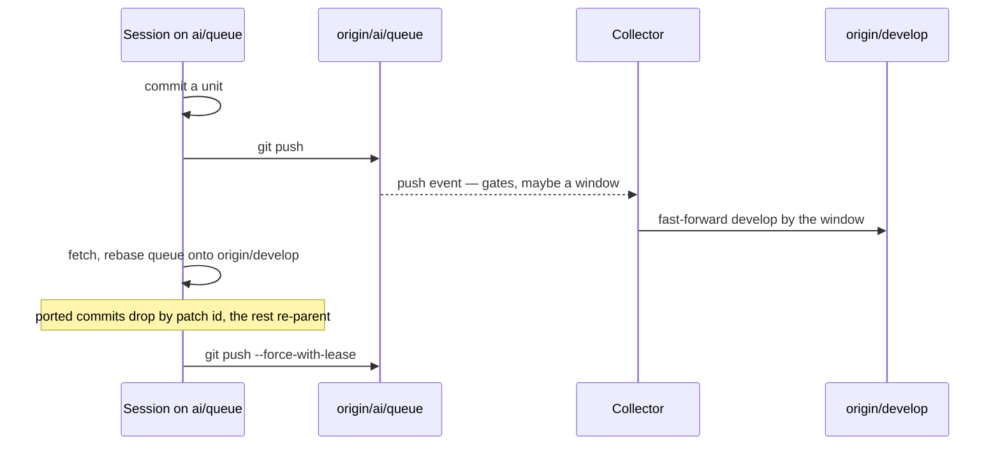

# Two Writers

Two actors work the release pull request — the working session and the collector — and two writers on one ref would be a race whatever the gates say. The rule is ownership, not a lock: every ref has exactly one writer, and the two actors communicate only through the refs the other one reads.

| Ref               | Written by                                                                                        | Read by          | Moves how                                                                                         |
| :---------------- | :------------------------------------------------------------------------------------------------ | :--------------- | :------------------------------------------------------------------------------------------------ |
| `develop`         | the collector                                                                                     | both, CodeRabbit | fast-forward only, one window per review cycle                                                    |
| `ai/review-fixes` | the collector                                                                                     | the session      | grows during a drain, re-created from `develop` by the next one once ported — never deleted       |
| `ai/queue`        | the working session                                                                               | the collector    | the session's checked-out branch, pushed after every commit                                       |
| `main`            | the collector merging a clean release or cutting the express lane, a person merging a riskier one | everyone         | `develop` follows it by fast-forward on the merge, and a bump landing there rides the next window |

The release pull request has one writer too: the collector opens it over whatever window `develop` carries that no review has read, and merges it once a review at the head is clean with the least merge risk; a person merges one the bot rates riskier, or closes it to pause. `main`'s two writers never race: the [express lane](/docs/infra/review-collector/express-lane) is closed unless `develop` and `main` agree, so the two never write between a merge base and the merge that consumes it.

A queue push spends nothing: it starts no review, only a collector run that measures. The collector holds the standing authorisation for `develop` and clears the gates from the remote on every run; the session's side of the loop — the push after every commit, the rebase before every unit, a finding answered by hand with the same trailer, a conflict with parked fixes resolved by rebasing onto `origin/ai/review-fixes` — is the `review-queue` skill (`.agents/skills/review-queue/SKILL.md`).

## Parallel work

Worktree agents executing specs commit on their own branches and hand the result to the main session, which merges it into its local `ai/queue` and publishes it. There is one writer of `ai/queue` per machine, and the lease handles two machines. A worktree agent never pushes `ai/queue` itself.

## Key files

| File                                                    | Role                                                                    |
| :------------------------------------------------------ | :---------------------------------------------------------------------- |
| `.agents/skills/review-queue/SKILL.md`                  | the session publishes `ai/queue`; the collector cuts and pushes windows |
| `scripts/src/services/coderabbit/collect/pushBranch.ts` | the compare-and-swap every collector push goes through                  |
