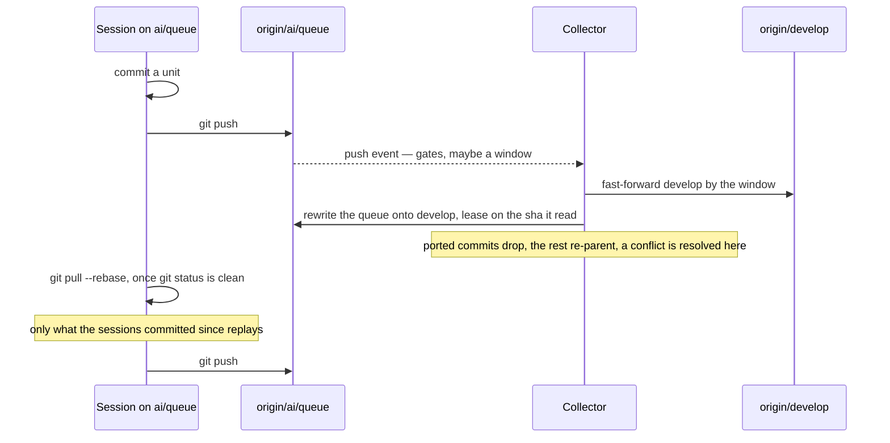

# Two Writers

Two actors work the release pull request — the working session and the collector — and two writers on one ref would be a race whatever the gates say. The rule is ownership, not a lock: every ref has exactly one writer, and the two actors communicate only through the refs the other one reads.

| Ref               | Written by                                                                                         | Read by          | Moves how                                                                                                       |
| :---------------- | :------------------------------------------------------------------------------------------------- | :--------------- | :-------------------------------------------------------------------------------------------------------------- |
| `develop`         | the collector                                                                                      | both, CodeRabbit | fast-forward only, one window per review cycle                                                                  |
| `ai/review-fixes` | the collector                                                                                      | the session      | grows during a drain, re-created from `develop` by the next one once ported — never deleted                     |
| `ai/queue`        | the working session, and the collector rewriting it onto the tree of the next window               | the collector    | pushed plain by the session after every commit; rewritten by the collector under a lease on the sha it read     |
| `main`            | the collector merging a release or cutting the express lane, a person merging one the verdict held | everyone         | `develop` follows it by fast-forward on the merge; a cut or a bump landing there is folded into the next window |

The one ref with two writers is `ai/queue`, and the lease is what keeps it one at a time: the session pushes it plain, so a queue the collector rewrote refuses the push until the session has pulled, and the collector rewrites it with `--force-with-lease` on the sha its run read, so a session push in between refuses the rewrite — which then carries what that push added onto itself and leases the new head. Neither can overwrite what the other wrote without having read it first.

The release pull request has one writer too: the collector opens it over whatever window `develop` carries that no review has read, and merges it once a review at the head is clean — on the least merge risk, or on the verdict's word for every other reading of that head, including the bot stating none; a person merges one the verdict held, or closes it to pause. `main`'s two writers never race: the [express lane](/docs/infra/review-collector/express-lane) cuts only what applies cleanly on `main`, and the fold brings `main` into `develop` before the release merge meets the two.

A queue push spends nothing: it starts no review, only a collector run that measures. The collector holds the standing authorisation for `develop` and clears the gates from the remote on every run; the session's side of the loop — a unit committed by pathspec, `git pull --rebase` only over a clean tree, the plain push after every pull, a finding answered by hand with the same trailer — is the `review-queue` skill (`.agents/skills/review-queue/SKILL.md`).

## Enforced by rulesets

The writers above are one GitHub account acting as the Admin repository role, and the rulesets let no other account update `ai/**`; on `develop` and `main` the Renovate GitHub App bypasses as well, so its branch automerge can land a bump — which ref each namespace's name grants to whom, and how a collaborator's work enters the queue, is [branch namespaces](/docs/infra/branch-namespaces).

## Parallel work

Worktree agents executing specs commit on their own branches and hand the result to the main session, which merges it into its local `ai/queue` and publishes it. There is one writer of `ai/queue` per machine, and the lease handles two machines. A worktree agent never pushes `ai/queue` itself.

## Key files

| File                                                    | Role                                                                    |
| :------------------------------------------------------ | :---------------------------------------------------------------------- |
| `.agents/skills/review-queue/SKILL.md`                  | the session publishes `ai/queue`; the collector cuts and pushes windows |
| `scripts/src/services/coderabbit/collect/pushBranch.ts` | the compare-and-swap every collector push goes through                  |
