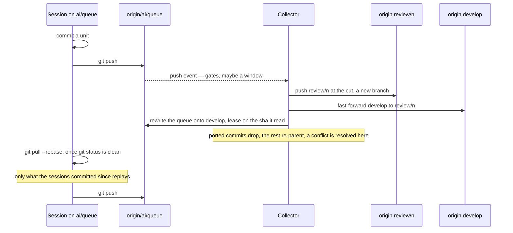

# Two Writers

Two actors work the stack — the working session and the collector — and two writers on one ref would be a race whatever the gates say. The rule is ownership, not a lock: every ref has exactly one writer, and the two actors communicate only through the refs the other one reads.

| Ref               | Written by                                                                           | Read by                   | Moves how                                                                                                                                            |
| :---------------- | :----------------------------------------------------------------------------------- | :------------------------ | :--------------------------------------------------------------------------------------------------------------------------------------------------- |
| `develop`         | the collector                                                                        | the collector             | the top of the stack: fast-forwarded to each new window's head when a window is cut, and to `main` by the return stroke once no window is open       |
| `review/<n>`      | the collector                                                                        | CodeRabbit, the collector | created at a window's cut and never moved again; deleted by the collector once its pull request has merged                                           |
| `ai/review-fixes` | the collector                                                                        | the session               | grows during a drain, re-created from `develop` by the next one once ported — never deleted                                                          |
| `ai/queue`        | the working session, and the collector rewriting it onto the tree of the next window | the collector             | pushed plain by the session after every commit; rewritten by the collector under a lease on the sha it read                                          |
| `main`            | the collector merging a window or cutting the express lane                           | everyone                  | the bottom window's merge; `develop` follows it by fast-forward once no window is open; a cut or a bump landing there is folded into the next window |

The one ref with two writers is `ai/queue`, and the lease is what keeps it one at a time: the session pushes it plain, so a queue the collector rewrote refuses the push until the session has pulled, and the collector rewrites it with `--force-with-lease` on the sha its run read, so a session push in between refuses the rewrite — which then carries what that push added onto itself and leases the new head. Neither can overwrite what the other wrote without having read it first.

The window pull requests have one writer too: the collector opens each one over the window it cut, retargets and merges them bottom up as each review completes, and a person closes one to pause. A window's branch is never pushed to after its cut, so its one review reads a head that does not move. `develop` does move, each time a window is cut, but no review reads `develop`: each open window is reviewed from its own branch. `main`'s two writers never race: the [express lane](/docs/infra/review-collector/express-lane) cuts only what applies cleanly on `main`, and the fold brings `main` into the window before the merge meets the two.

```mermaid
sequenceDiagram
  participant S as Session on ai/queue
  participant Q as origin/ai/queue
  participant C as Collector
  participant W as origin review/n
  participant D as origin develop
  S->>S: commit a unit
  S->>Q: git push
  Q-->>C: push event — gates, maybe a window
  C->>W: push review/n at the cut, a new branch
  C->>D: fast-forward develop to review/n
  C->>Q: rewrite the queue onto develop, lease on the sha it read
  Note over C: ported commits drop, the rest re-parent, a conflict is resolved here
  S->>S: git pull --rebase, once git status is clean
  Note over S: only what the sessions committed since replays
  S->>Q: git push
```

A queue push spends nothing: it starts no review, only a collector run that measures. The collector holds the standing authorisation for `develop` and the window branches and clears the gates from the remote on every run; the session's side of the loop — a unit committed by pathspec, the push through `pnpm ai:queue:push`, a finding answered by hand with the same trailer — is the `review-queue` skill (`.agents/skills/review-queue/SKILL.md`).

## Enforced by rulesets

The writers above are one GitHub account acting as the Admin repository role, and the rulesets let no other account update `ai/**`; on `develop` and `main` the Renovate GitHub App bypasses as well, so its branch automerge can land a bump — which ref each namespace's name grants to whom, and how a collaborator's work enters the queue, is [branch namespaces](/docs/infra/branch-namespaces).

## Parallel work

Worktree agents executing specs commit on their own branches and hand the result to the main session, which merges it into its local `ai/queue` and publishes it. There is one writer of `ai/queue` per machine, and the lease handles two machines. A worktree agent never pushes `ai/queue` itself.

## Key files

| File                                                    | Role                                                                                                 |
| :------------------------------------------------------ | :--------------------------------------------------------------------------------------------------- |
| `.agents/skills/review-queue/SKILL.md`                  | the session publishes `ai/queue`; the collector cuts and pushes windows                              |
| `scripts/src/services/coderabbit/collect/pushBranch.ts` | the compare-and-swap every collector push goes through                                               |
| `scripts/src/services/coderabbit/collect/constants.ts`  | the branch names — `develop`, `ai/queue`, `ai/review-fixes` — and the window branch prefix `review/` |
