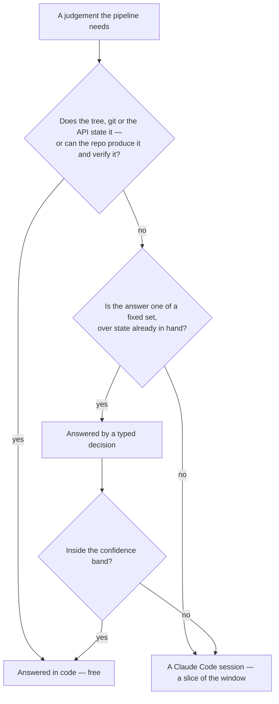

# Typed decisions

The pipeline's scarce resource is not money, it is **one shared Claude Code account window**. Every headless session the [review collector](/docs/infra/review-collector) spawns — a drain, a fold, a repair, a reshape, a sync, a release verdict — comes out of the same allowance a person's session draws on, which is why the collector carries a whole mechanism for the limit running out: a marker recording when it lifts, and a retrigger that sleeps until then.

So the cheapest session is the one never spawned. A judgement whose answer is one of a fixed set, and whose inputs the collector already holds, goes to a **typed-decision model** (TypeSafe's Jev, through `@typesafe-ai/sdk`) first. It returns a typed value and a probability rather than text, so there is nothing to parse and no way for it to answer outside the set it was given.

A question only ever moves **up** this diagram. Nothing the code can answer is asked of a model, and nothing a typed decision settles reaches a session.

The first box reaches further than it looks. Where the repository already holds a verifier for a mechanical answer, the deterministic tier does not have to know in advance whether that answer fits — it can produce it and let the verifier judge. That is how a red `main` is repaired without a session ([repair](/docs/infra/review-collector/repair)): the regenerators run, the check suite decides, and only what they cannot fix is read by anything.

## Where it decides

| Judgement                                                                  | What it saves                                                                                                                                                             |
| :------------------------------------------------------------------------- | :------------------------------------------------------------------------------------------------------------------------------------------------------------------------ |
| Does the merge-risk rationale name a concern no fix or rejection answered? | The whole release-verdict session, on the common head — the bot's risk level is sticky across rounds, so the rationale usually names only what the record already answers |
| How severe is each open finding?                                           | Nothing — it orders the drain's prompt so a session that ends mid-round has spent itself on what mattered most                                                            |
| Which of the five triage roles is this issue in?                           | A person reading the issue                                                                                                                                                |

The conflict resolvers are deliberately absent. A conflict has to be _edited_, and a typed decision returns a decision, never an artefact — so the only thing worth asking about a conflict is whether it needs a session at all, and for the one conflict where the answer is no (the lockfile, rebuilt rather than merged) the code already knows without asking.

The release verdict is asked ahead of the account’s own limit, because it spends none of it: a release the record already settles merges through an outage that holds every session behind it.

What it is asked about is the record the pull request actually holds. An inline rejection is posted as a reply on its own thread and never as a comment, so a gate reading only the pull request's comments would see a release whose findings were every one of them answered as a release where none were, and hand up each case to the session it exists to spare. The collector's own bookkeeping comments are left out for the opposite reason: a drain that failed, a limit that has not lifted, an older head's verdict say nothing about whether a concern stands.

## Confidence is an escalation gate, not a quality bar

Nothing acts on an answer below `0.6`; a decision that writes outside the checkout — a merge, a label on someone's issue — needs `0.85`. What falls short is not an error. It is the case that goes up a tier: to the session that reads the tree, or to `needs-triage`, which is what a maintainer weighing an issue already means.

An ordering decision has no gate at all, because nothing acts on it and nothing is dropped — every finding still reaches the session, just in a different order.

## With no key, everything still runs

`TYPESAFE_API_KEY` is a Pulumi-managed repository secret, handed to the collector job. Where it is absent — a fork, a local run, any test — every gate answers nothing and its caller escalates, so the pipeline behaves exactly as it did before there were gates. No path depends on a decision this tier made.

The key never reaches a spawned session either: the launcher withholds every secret-shaped variable from the child, and the session is given nothing but the credential that authenticates itself.
