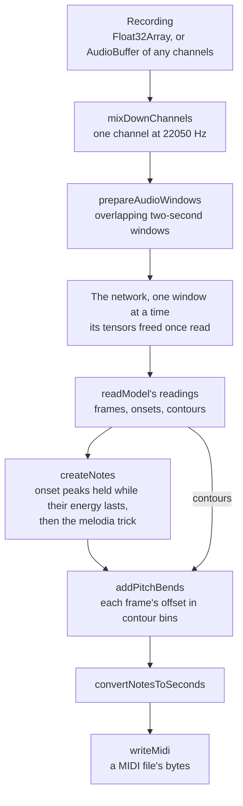

# pitch-transcription

`packages/pitch-transcription` (npm `pitch-transcription`) hears the notes played in a recording: each note's pitch, start, length, loudness and pitch bend. The hearing is Spotify's Basic Pitch, a small trained network that reads several notes at once on any instrument. The package ships the network's published weights unmodified, runs them on the consumer's own TensorFlow.js, and turns the network's readings into notes, bends and a MIDI file.

It replaced `@spotify/basic-pitch`, which held its consumers to TensorFlow.js 3, and is absorbed through [dependency admission](/docs/architecture/dependency-admission): the engine (TensorFlow.js) and the data (the weights) are kept, and the layer between them is ours. Its first consumer is the [Genshin music](/docs/genshin/music) re-derivation, whose fit transcribes the game's decoded sources with it.

## How a recording becomes notes

The network reads two-second windows of one channel at 22050 Hz, a hop of 256 samples to a frame, and gives three readings for every frame: how strongly each of a piano's 88 keys sounds (frames), how strongly each starts (onsets), and the pitch's finer contour at three bins to a semitone (contours). Everything after it is arithmetic over those arrays.

- **Reading.** `readModel` frames the recording with half a window's overlap of silence first, runs the network one window at a time, trims each window's overlap and anything past the recording's end, and stops once the readings cover the recording. Each window's tensors are freed inside a `tidy` before the next runs, so memory holds one window's readings whatever the recording's length.
- **Notes.** `createNotes` is the model repository's `output_to_notes_polyphonic`. Each onset peak — larger than the frames either side, above the onset threshold — starts a note, latest first, that lasts until its key's energy stays under the frame threshold for the energy tolerance, and claims that energy for its key and its neighbours. Inferred onsets add peaks where a key's frame reading jumps. Under the melodia trick the energy no onset claimed is then followed outward from its largest reading into further notes. The readings handed in are never changed.
- **Bends.** `addPitchBends` picks, for each frame of a note, the contour bin within 25 of the note's own whose reading — weighted by a Gaussian centred on the note — is largest, and records its offset in bins.
- **MIDI.** `writeMidi` writes one track through `@tonejs/midi`, each note's amplitude its velocity and each bend its share of the bend's two-semitone range.

`pitch-transcription/notes` exports note creation, bends, timing and MIDI alone, so a worker holding readings never loads TensorFlow.js. TensorFlow.js is a peer dependency: the consumer loads the model through its own copy — `loadGraphModelSync` over the two files under Node, `loadGraphModel` over their served URL in a browser — and picks its backend before doing so.

## Decisions

- **The model repository is the reference.** Where the TypeScript port and the Python model repository disagree, the package follows Python: a frequency range rounds to its nearest key, the first and last frames are never an onset peak (SciPy's `argrelmax` clips them), and a tie between readings goes to the earliest frame and lowest key (NumPy's `argmax`). The Gaussian weighting the bends stays symmetric about the note's own bin, where SciPy's periodic window centres it half a bin high.
- **One sort for the melodia trick.** Energy is only ever zeroed, so the largest reading left is always the largest not yet claimed. The candidates are sorted once and walked, where the port rescanned every reading of the recording for each note. `createNotes.bench.md` prices the trick against the onset pass alone over one and five minutes of music. It adds a small share at both lengths, and the cost grows with the length rather than with its square.
- **No inferred frame threshold.** The port infers the frame threshold from the frames' mean and deviation only when handed `null` against its own types; here the option is a number, defaulting to Basic Pitch's own.
- **No `adjustNoteStart`.** It shifted every note's start by an offset, a one-line map, and returned the wrong field name besides; a caller maps its own notes.

## Upstream

Every issue and pull request on [basic-pitch-ts](https://github.com/spotify/basic-pitch-ts), read with its comments, with its verdict. The four verdicts and what each owes are the [triage](/docs/architecture/dependency-admission) on the dependency admission page; a defect's proof is the named test beside the source it fixes.

| Upstream                                  | Verdict            | Proof                                                                                                                                                        |
| ----------------------------------------- | ------------------ | ------------------------------------------------------------------------------------------------------------------------------------------------------------ |
| #20, #21, #13 — update TensorFlow.js      | In scope — feature | Built on TensorFlow.js 4 from the catalog, a peer dependency Renovate moves; supersedes #13's bump within 3.x                                                |
| #18 — the model is not exported           | In scope — feature | `MODEL_URL` and `MODEL_WEIGHTS_URL`, read by "hears a tone's pitch" in `readModel.test.ts`                                                                   |
| #25 — export `generateFileData`           | In scope — feature | `writeMidi`, returning a `Uint8Array` a browser holds rather than Node's `Buffer`                                                                            |
| #9 — stereo input refused                 | In scope — defect  | "#9 averages a stereo recording's channels" in `mixDownChannels.test.ts`                                                                                     |
| #8 — shortest note default                | In scope — feature | `MIN_NOTE_LENGTH` is eleven frames, the length the Basic Pitch site uses                                                                                     |
| #19 — the main thread held                | In scope — feature | `pitch-transcription/notes` imports without TensorFlow.js; running the network off the main thread is the consumer's, in a worker of its own                 |
| #17 — the pitch bends' units              | In scope — defect  | "#17 writes a bend as its share of the bend's range, held at its edge" in `writeMidi.test.ts`; the port wrote a count of thirds of a semitone as a raw value |
| #22 — no transcription on newer iPhones   | Out of scope       | TensorFlow.js's WebGL backend on those GPUs; the model is the consumer's, so it picks the WebAssembly backend before loading it, as the comments found       |
| #23 — `Long.fromString is not a function` | Out of scope       | TensorFlow.js's hashing under a bundler's interop with `long`, owned by TensorFlow.js                                                                        |
| #24 — a TensorFlow Lite model             | Out of scope       | Which network is trained and published is the Basic Pitch model repository's                                                                                 |
| #12 — real time                           | Out of scope       | The network reads overlapping windows of seconds, as the model repository's own issue explains                                                               |
| #7 — spreading a non-iterable             | False positive     | A usage slip accumulating the per-window readings; `readModel` returns them accumulated                                                                      |
| #6, #10, #16 — examples and docs          | False positive     | The README's Getting Started carries the usage, the sample rate and the channels                                                                             |
| #1–#5, #11 — release housekeeping         | False positive     | No behaviour; #5's bundled model is carried                                                                                                                  |

Reading the source turned up defects nobody has filed, each reproduced against the port and given its test:

| Found in the source                                     | Proof                                                                                         |
| ------------------------------------------------------- | --------------------------------------------------------------------------------------------- |
| No tensor is ever disposed, so memory grows with length | "frees every tensor it makes" in `readModel.test.ts`                                          |
| Windows past the recording's end still run              | "runs no window past the recording's last frame" in `readModel.test.ts`                       |
| A frequency range zeroes the caller's own readings      | "leaves the readings it is handed unchanged under a frequency range" in `createNotes.test.ts` |
| `adjustNoteStart` returns `pitch_midi` for `pitchMidi`  | Not carried — see Decisions                                                                   |

## Key files

| File                                                         | Role                                             |
| ------------------------------------------------------------ | ------------------------------------------------ |
| `packages/pitch-transcription/src/services/readModel.ts`     | The network over a recording, a window at a time |
| `packages/pitch-transcription/src/services/createNotes.ts`   | The readings turned into notes                   |
| `packages/pitch-transcription/src/services/addPitchBends.ts` | Each note's bend per frame                       |
| `packages/pitch-transcription/src/services/writeMidi.ts`     | Notes as MIDI bytes                              |
| `packages/pitch-transcription/src/notes.ts`                  | The entry without TensorFlow.js                  |
| `packages/pitch-transcription/model`                         | The trained model, unmodified, with `NOTICE`     |

## Sources

- [spotify/basic-pitch-ts](https://github.com/spotify/basic-pitch-ts) — the package absorbed, its tracker and its Apache-2.0 licence.
- [spotify/basic-pitch](https://github.com/spotify/basic-pitch) — the model repository: `constants.py`, `note_creation.py`, and its issue on real-time transcription.
- [A Lightweight Instrument-Agnostic Model for Polyphonic Note Transcription and Multipitch Estimation](https://arxiv.org/abs/2203.09893), Bittner et al., ICASSP 2022 — the network and its three readings.
- [`scipy.signal.argrelmax`](https://docs.scipy.org/doc/scipy/reference/generated/scipy.signal.argrelmax.html) — the edge clipping the onset peaks follow.
