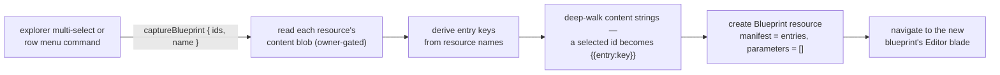

# Blueprint Capture

**Save as blueprint**: pick a set of your existing resources and capture them into a new [Blueprint](/docs/platform/blueprint-resource) — each resource becomes a manifest entry carrying its full content, and every cross-resource id reference _between_ the selected resources is rewritten to an `{{entry:key}}` alias. Build the real thing once by hand, capture it, and the working setup becomes the reusable, deployable plan — no manifest hand-authoring.

This is the authoring path that makes blueprints practical: the Editor blade's schema-validated JSON is the escape hatch; capture is how blueprints actually get made.

## How it works

- **Type-agnostic rewiring.** Resource ids are UUIDs and cross-resource references are bare id strings in content ([resources](/docs/architecture/resources)) — so capture needs no per-type knowledge: deep-walk every captured content's string values and replace whole-string matches of any _selected_ resource's id with that resource's alias token. Whatever binds to whatever — dataset references, a program's `emailId`/`surveyId`, future link shapes — rewires for free, including shapes invented after capture ships.
- **References to unselected resources stay as raw ids** — the captured blueprint still points at the live resource (deploys will share it). Dangling-on-deploy is the same fail-soft posture every bare-id link already has.
- **Entry keys** derive from resource names (kebab-cased, deduped with a numeric suffix on collision, and clamped to the key bound the manifest schema itself enforces — kebab-casing can lengthen a name past it, and a manifest whose own schema rejects it can never be opened or deployed again); **entry names** keep the original resource names. Parameters start empty — parameterizing ("this survey title should be `{{parameter:client}}`") is a manual edit in the Editor blade afterwards. Auto-parameterization is deliberately out: guessing which strings are variable is AI territory, not manifest mechanics.
- **UX**: multi-select in the explorer list → **Save as blueprint** command (alongside the existing bulk commands); also on a single resource's row menu, capturing just that one (a one-entry blueprint is a personal starter template).
- Capture reads working content, not publish snapshots — you capture what you're editing, and captured content is a _copy_: later edits to the source resources never change the blueprint.
- **A resource whose content was never written captures as an entry with no content**, which deploys back to the same content-less state — see [blueprint resource](/docs/platform/blueprint-resource).
- A resource in the Recycle bin is still yours, so capturing one is rejected as bad input naming the resource, never as an authorization failure — the fix is restoring it.

## Procedures

| Procedure          | Auth                | Input           | Purpose                                                     |
| ------------------ | ------------------- | --------------- | ----------------------------------------------------------- |
| `captureBlueprint` | owner (of every id) | `{ ids, name }` | read contents, alias-rewrite, create the Blueprint resource |

## Key files

| File                                                               | Role                                           |
| ------------------------------------------------------------------ | ---------------------------------------------- |
| `packages/app/server/trpc/routers/blueprint.ts`                    | `captureBlueprint` joins the blueprint router  |
| `packages/app/server/services/blueprint/captureBlueprint.ts`       | ownership check, key derivation, orchestration |
| `packages/app/server/services/blueprint/rewriteIdsToAliases.ts`    | the deep-walk exact-match rewrite              |
| `packages/app/app/components/Resource/List/Selection/Toolbar.vue`  | bulk Save-as-blueprint entry point             |
| `packages/app/app/components/Resource/Blueprint/CaptureDialog.vue` | name prompt + create + navigate                |

## Notes

- Capture + deploy together generalize Duplicate from one resource to a wired graph — Duplicate stays (one click, no manifest); capture is for setups worth repeating.
- Round-trip property worth a test: capture a set, deploy it with no parameters, and the deployed set's internal wiring is isomorphic to the original — this is the natural integration spec for both proposals.
- Contents are captured verbatim (only ids rewritten): volatile runtime state that lives _outside_ content blobs (survey responses, program participants, publications) is naturally excluded — a captured funnel deploys clean.
- Capture is also the cheapest **agent training set**: a captured manifest is a ground-truth example of a working resource graph in exactly the format an AI author would need to emit ([agentic-by-design note](/docs/platform/blueprint-resource)).
