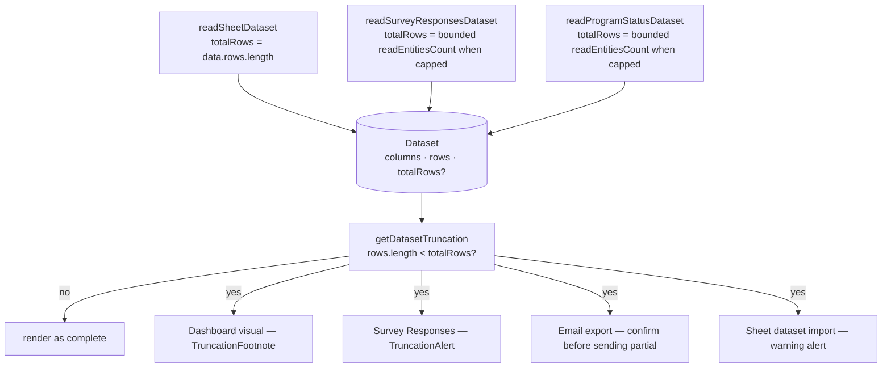

# Dataset Row-Cap Warning

Every dataset provider caps its read at `AZURE_MAX_PAGE_SIZE` (1000) rows. Unannounced, that cap is invisible: a survey with 1400 responses would chart, export and tabulate as though it had 1000, a bound dashboard would quietly under-report, and a personalized email export would quietly skip 400 people.

The fix is metadata, not pagination. A [`Dataset`](/docs/architecture/datasets) now carries the uncapped total alongside its capped rows, and every consumer surfaces the gap in the shape that fits it — a footnote on a chart, a banner over a table, a confirm before an export you cannot take back. Actually loading more rows stays [deferred](/docs/platform/deferred/dataset-row-cap-pagination); this warning is that page's explicit revisit trigger.

## How it works

`Dataset` gains one optional field, `totalRows`. `getDatasetTruncation` is the single check every consumer shares: given `rows.length < totalRows`, it returns what was shown, what is hidden, the total, and whether that total is itself a floor — otherwise nothing. A provider that cannot cheaply count omits `totalRows`, and its consumers simply never warn.

### The providers

- **Sheet** parses the whole content blob before slicing to the cap, so `totalRows` costs nothing — it is already holding every row.
- **SurveyResponses** and **ProgramStatus** cannot count for free: Azure Table Storage has no count API, so a total means walking every matching row. They therefore **only pay when they have to, and never more than a bounded walk**. A read that proved itself complete answers for itself (`totalRows = rows.length`) — the survey read fetches one entity past the cap so a partition holding exactly the cap never pays for a count — and only a read known to be truncated runs `readEntitiesCount`: a keys-only page walk, bounded at `DATASET_MAX_COUNTED_ROWS` so a huge partition cannot stall the read just to render a banner number. A count that hit the bound is a floor: `getDatasetTruncation` marks it `isCountCapped`, and every surface renders it as "M+" via `formatTruncationCount` rather than as an exact total.

### The consumers

Each surface is chosen by what an unnoticed truncation would cost there:

- **Dashboard visual** — a footnote under the chart (warning icon, tooltip explaining the cap). A chart still reads correctly as "the first 1000"; it just must not read as "all". A published snapshot froze whatever the read gave it, so a snapshotted visual warns exactly like a live one.
- **Survey Responses blade** — a banner above the table. Responses are the one dataset an owner reads as a record of truth, so a silent cut is never acceptable here.
- **Email personalized export** — a confirm dialog, not a footnote. Mailing a truncated audience is the one failure the sender cannot take back, so a capped read hands the decision over ("{M − N} rows will not get an email") instead of exporting. The command stages the dataset on a singleton dialog store and the Editor blade renders the choice; confirming and the uncapped path both run one export runner.
- **Sheet dataset import** — a warning alert after the copy. The sheet now looks like the whole survey, so a capped copy has to say so on the way in.

## Key files

| File                                                                    | Role                                                    |
| ----------------------------------------------------------------------- | ------------------------------------------------------- |
| `shared/models/dataset/Dataset.ts`                                      | the `totalRows` field                                   |
| `app/services/dataset/getDatasetTruncation.ts`                          | the one truncation check every consumer shares          |
| `app/services/dataset/getDatasetTruncationText.ts`                      | the one "Showing N of M rows" phrasing                  |
| `app/services/dataset/formatTruncationCount.ts`                         | renders a bound-hitting count as "M+"                   |
| `app/components/Dataset/TruncationAlert.vue`                            | banner form (Survey Responses)                          |
| `app/components/Dataset/TruncationFootnote.vue`                         | footnote form (Dashboard visual)                        |
| `app/components/Resource/Email/ExportTruncationDialog.vue`              | the pre-export confirm                                  |
| `packages/db/src/services/azure/table/readEntitiesCount.ts`             | keys-only page walk — the only way to count Azure Table |
| `server/services/dataset/sheet/readSheetDataset.ts`                     | free total from the parsed blob                         |
| `server/services/dataset/surveyResponses/readSurveyResponsesDataset.ts` | count only once a read is known to have capped          |

## Notes

- Deliberately metadata-only. The fix for _actually needing_ more rows is [pagination](/docs/platform/deferred/dataset-row-cap-pagination), and this warning is what gives that page a consumer: once users see "of M" and complain, it has earned its build.
- One phrasing service backs every surface, so a chart footnote and a table banner can never quote different numbers for the same read.
- `readEntitiesCount` is never free and never on the happy path — the guard that only calls it on a filled page is load-bearing, not an optimization. Its `maxCount` bound is load-bearing too: without it, every open of a huge partition's blade pays a full key-walk to render one number.
