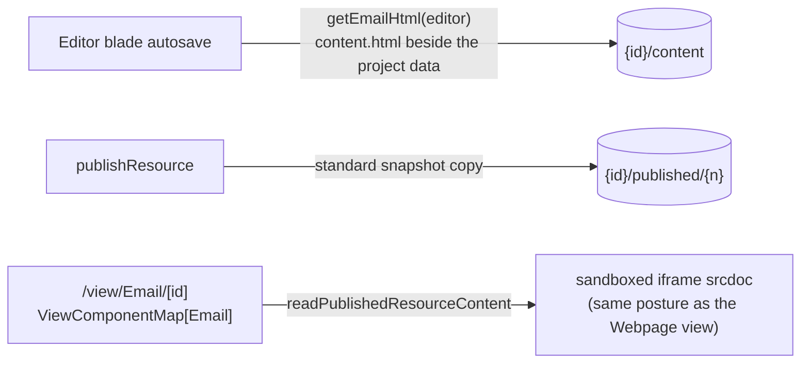

# Email Web View

Email opts into the **Publishable** capability, so a compiled email has a public URL: `/view/Email/[id]`. That is the industry-standard "view this email in your browser" artifact, a review link to hand a colleague before a send, and the natural merge target for a web-version link when [email sending](/docs/platform/deferred/email-sending) un-defers.

The published copy is the **unpersonalized template**: merge-field tokens render as authored, which is exactly right for a browser or review copy — a per-recipient web version is deliberately out (see Notes).

## How it works

The publish snapshot is taken server-side, but MJML compiles only in the client editor via the `grapesjs-mjml` plugin. The server therefore has no way to derive the HTML at publish time, so the editor captures it on every save, next to the GrapesJS project data — the same save-time capture Webpage already uses for its standalone render.

- **Content schema** — `EmailEditor` gains a compiled `html` string, written on every editor save. The class name stays frozen (it is registered in `JSONClassMap`, so renaming it would break superjson deserialization of persisted blobs).
- **Capability** — `publishable: true` on Email in `ResourceDefinitionMap`. The derived union then _requires_ a `ViewComponentMap[Email]` entry (a compile error until it exists) and _grants_ the publish procedures — zero bespoke endpoints, which is the whole point of the capability model. Publish and Unpublish appear in the command bar automatically through the existing capability gate.
- **View component** — serves the snapshot's `html` through a sandboxed iframe `srcdoc`, identically to the Webpage view: scripts run, but `allow-same-origin` is withheld, so a published email cannot touch a viewer's session. OG meta tags come with the existing view-page behaviour.

## Key files

| File                                                             | Role                                         |
| ---------------------------------------------------------------- | -------------------------------------------- |
| `packages/app/shared/models/emailEditor/data/EmailEditor.ts`     | compiled `html` on the content schema        |
| `packages/app/app/services/emailEditor/getEmailHtml.ts`          | the one MJML compile, shared with export     |
| `packages/app/app/store/emailEditor/index.ts`                    | save-time capture alongside the project data |
| `packages/app/app/components/Resource/Email/View.vue`            | `ViewComponentMap[Email]` renderer           |
| `packages/app/shared/services/resource/ResourceDefinitionMap.ts` | `publishable: true` on Email                 |

## Notes

- The same `getEmailHtml` compile backs the personalized HTML export ([email personalization](/docs/platform/email-personalization)) — one compile path, two consumers.
- A personalized web version per recipient (resolving merge fields server-side per invite token) is deliberately out: it would make the public view do per-request dataset reads, which is exactly what publishing exists to avoid. The published copy is one static artifact.
- Hosted images inside the published copy come from [resource file assets](/docs/platform/resource-file-assets); external-URL images work unchanged.
