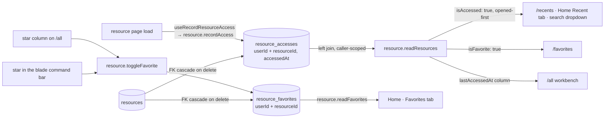

# Favorites & Recents

Two sets answer "take me back to what I was working on": **Favorites**, the resources you starred, and **Recent**, the ones you actually opened. Each renders twice — as a tab on Home for a quick glance, and as a full list route off the [service menu](/docs/platform/resource-service-menu) where it can be filtered, sorted and acted on in bulk.

## How it works

Both are relationship tables in Postgres, keyed on `(userId, resourceId)` and cascading on both sides.

Both are server-side rather than per-device. A star that vanishes on another machine reads as data loss, and a recent list is no different once it is a list route with a visible `Last accessed` column: a column that disagrees between two browsers is indefensible in a way a quietly-different card is not.

Recent means recently _opened_, which `updatedAt` desc does not approximate: it is wrong the moment anything autosaves, because a resource you never opened jumps to the top when a background save touches it. Opening a resource page calls `resource.recordAccess` through `useRecordResourceAccess`, which watches the resource's **identity**, not the object — autosave, rename and tag edits each replace the object, so re-recording on those would order Recent by last autosave instead. The write is best-effort and silent on failure: it records that a visit happened, and the visit itself succeeded.

## Data model

`resourceFavorites` carries nothing but the relationship: a `userId` + `resourceId` composite primary key and the inherited `createdAt`, which is the Favorites tab's sort key (most recently starred first).

`resourceAccesses` adds one column to that shape — `accessedAt`, rewritten on every open by an upsert, so the table stays bounded by what exists rather than growing with traffic. Its own index on `(userId, accessedAt)` is what keeps "this user's rows, newest first" from re-sorting every resource they have ever opened; the primary key orders by `resourceId` and cannot serve that.

It is deliberately not called a view. `ResourceViewEntity` counts anonymous hits on a _published_ resource ([published view analytics](/docs/platform/published-view-analytics)); this records the owner opening their own.

A star is a toggle, and `toggleFavorite` implements it as a delete-then-insert rather than a read-then-branch: the delete's own `returning()` reports whether the star was set, so the toggle cannot race with itself and report the wrong new state. The client takes that answer as authoritative rather than keeping its optimistic flip — a list that went stale (another tab starred the same row first) flips the wrong way, and nothing else would ever reconcile it.

## Procedures

| Procedure                 | Auth   | Input    | Purpose                                            |
| ------------------------- | ------ | -------- | -------------------------------------------------- |
| `resource.toggleFavorite` | owner  | `{ id }` | Insert/delete the favorite row, returns new state  |
| `resource.readFavorites`  | authed | —        | Favorites joined to live resources, newest starred |
| `resource.recordAccess`   | owner  | `{ id }` | Upsert this user's access row for the resource     |

The list routes use neither of the reads above: they are `resource.readResources` with `isFavorite: true` or `isAccessed: true`, so they inherit the whole workbench. `readFavorites` remains for the star lookup set and Home's tab.

## Key files

| File                                                  | Role                                     |
| ----------------------------------------------------- | ---------------------------------------- |
| `packages/db-schema/src/schema/resourceFavorites.ts`  | Favorites table                          |
| `packages/db-schema/src/schema/resourceAccesses.ts`   | Access table (one row per user/resource) |
| `server/trpc/routers/resource.ts`                     | Toggle/read/record procedures, filters   |
| `app/store/resource/favorite.ts`                      | Favorites store + optimistic toggle      |
| `app/components/Resource/FavoriteToggle.vue`          | The star, shared by the list and blade   |
| `app/composables/resource/useRecordResourceAccess.ts` | Identity-watching access write           |
| `app/store/resource/recent.ts`                        | Recents store + capped opened-first read |
| `app/components/Resource/Home/ResourcesCard.vue`      | Home Recent/Favorites tabs               |

## Notes

- The `/all` star renders always rather than on hover: hover does not exist on touch, and a star you cannot find is a star you do not use.
- Favorites are read once per list rather than once per row — every row asks "am I starred?", so the store exposes a `Set` of ids and the rows read it. The set itself is read once per session, not once per mount: the workbench list mounts inside the blade, so concurrent mounts share the in-flight query instead of each running the same joined read, and a delete invalidates it because only the server knows which stars still resolve.
- Soft-deleted resources are filtered out of every read here, so a starred resource sitting in the [recycle bin](/docs/platform/recycle-bin) disappears from Favorites and returns when restored — the star itself is never lost. The same is true of an access row.
- The search dropdown's **Recently opened** group reads the same server-side set, so it and the Recent route can never disagree. Recent _searches_ stay in `localStorage`: a query you typed is not something to follow you between machines.
- Recents are a store for the same reason favorites are: Home mounts the Recent card and the inline search box together, and both want the same capped list — the set is read once per session and the two mounts share the in-flight query rather than each issuing it.
