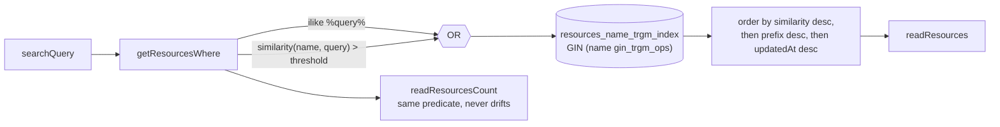

# Global Search Relevance

[Global search](/docs/platform/global-search) tolerates typos. "survye" finds Survey, at zero service cost and no new Azure resource.

## How it works

Exact-substring matching — ranked prefix-first, then newest-first — is fine until you mistype, at which point a resource you can see in the list simply does not exist as far as search is concerned. Name search therefore scores by similarity rather than by containment alone.

The `pg_trgm` extension makes Postgres compare strings by the trigrams they share. `similarity(name, query)` returns the fraction in common, so a transposition costs a little similarity instead of all of it. `SEARCH_SIMILARITY_THRESHOLD` is pg_trgm's own default cutoff — the point where "survye" still reaches "Survey" without unrelated names leaking in.

Similarity is added as an **OR-arm** next to the existing substring match, not as a replacement. Trigram similarity degrades on very short queries, where a two-character search shares few trigrams with anything, and dropping the substring arm would lose exact matches the user can see on screen. Both arms live in `getResourcesWhere`, so `readResourcesCount` and `readResources` stay in lockstep.

Ranking is a ladder: closest trigram match first so a typo still surfaces its resource at the top, then prefix matches above the remaining substring matches, then newest-first within each tier.



## Data model

One migration installs the extension and the index:

```sql
CREATE EXTENSION IF NOT EXISTS pg_trgm;
CREATE INDEX "resources_name_trgm_index" ON "resources" USING gin ("name" gin_trgm_ops);
```

The index is declared in the drizzle schema too, so drizzle-kit's next diff does not try to drop something it cannot see. The extension has no schema-level representation and is created by the migration alone.

Tests run against PGlite, which loads `pg_trgm` as a contrib extension in both `createMockDb` and the snapshot generator — otherwise the index and `similarity()` resolve against nothing.

## Key files

| File                                                      | Role                           |
| --------------------------------------------------------- | ------------------------------ |
| `server/trpc/routers/resource.ts`                         | The OR-arm, the ranking ladder |
| `server/services/resource/constants.ts`                   | `SEARCH_SIMILARITY_THRESHOLD`  |
| `packages/db-schema/src/schema/resources.ts`              | Trigram index declaration      |
| `server/db/migrations/20260715000200_resource_name_trgm/` | Extension + index              |
| `packages/db-mock/src/createMockDb.ts`                    | Loads `pg_trgm` into PGlite    |

## Notes

- Azure AI Search stays [deferred](/docs/platform/deferred/azure-ai-search) — nothing at current volumes needs it, and this is the cheap 80%.
- Only `resources.name` is trigram-indexed. Searching tag values or content is a different feature with a different index.
- Bundling a PGlite contrib extension breaks it: the extension resolves its own `.tar.gz` relative to `import.meta.url`, so `@electric-sql/pglite` and its subpaths are externalized in the shared rolldown config.
