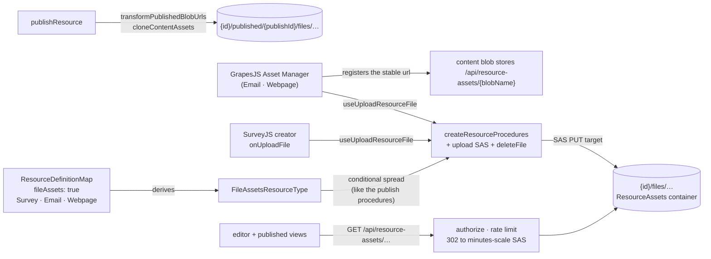

# Resource File Assets

The **FileAssets capability**: hosted binary assets for the resource types that need them. A type declaring `fileAssets: true` gets owner-only procedures for uploading and removing blobs under its own `{id}/files/…` directory, and the two GrapesJS editors wire their Asset Manager onto them — so an image in an email or a webpage is a hosted URL, never a base64 blob inlined into the content.

Adopters: Survey (SurveyJS image questions, logos, theme backgrounds), Email, Webpage. Three adopters clears the capability admission rule of two or more ([resources](/docs/architecture/resources)).

## How it works

Content embeds a **stable, relative app url** — `/api/resource-assets/{blobName}` — never a signed Azure url. The serving endpoint authorizes the caller and 302-redirects to a freshly signed minutes-scale SAS on every request, so nothing in stored content can expire and a leaked SAS dies in minutes. The app url itself carries whatever grant the authorization gives it: working-copy urls answer only to the owner, while published urls are intentionally anonymous-capable for as long as the publication row exists — unpublish is what revokes them. What an editor does with an asset url stays type-specific — SurveyJS puts it on an image question, GrapesJS registers it in the Asset Manager — which keeps the capability at the same altitude as Portable: the mechanism is declared centrally, the semantics stay with the type.

- **Declaration** — `fileAssets: true` in `ResourceDefinitionMap`; `FileAssetsResourceType` is derived through the existing `CapabilityResourceType` mapped type. The procedures are spread into the router conditionally, exactly like the publish procedures, so a non-declaring type has no asset endpoints at the type level.
- **Upload** — the standard two-step SAS flow ([file uploads](/docs/architecture/file-uploads)): the server signs a PUT target scoped to one blob path and the client uploads directly to Azure Blob. The client then builds the stable url itself from the pieces it already holds (`getResourceAssetUrl` over `{id}/files/{fileId}|{filename}`) — no second round trip. `useUploadResourceFile(type, id)` owns this once for every consumer.
- **Serving** — `GET /api/resource-assets/{encodedPath}`: parse and validate (`parseResourceAssetPath`), rate limit, authorize, then 302 to a short-lived read SAS with `Cache-Control: private, max-age` just under the SAS life so a browser-cached redirect can never outlive its signature. No existence probe — Azure itself 404s a missing blob.
- **Publish** — `transformPublishedBlobUrls` → `cloneContentAssets`: referenced working-copy asset blobs are cloned under `{id}/published/{publishId}/files/…` and the content rewritten to the clones' stable urls, so a published snapshot survives the owner replacing or deleting the working-copy asset. Already-published urls in the content are cloned too, exactly like working-copy ones: such a url names another publication's directory, which that resource's next unpublish wipes wholesale, so carrying it verbatim would leave this snapshot's images 404ing on an operation its own owner never performed. The destination is always `{directory}/files/{uuid}|{name}`, so a clone under the publish directory is the same five-segment shape `parseResourceAssetPath` already accepts — never a nested `published/…/published/…`. **`publishId` is minted per publish attempt, not the `publishVersion`** — the clone runs before the transaction that claims the version, so a version-keyed directory could only be predicted, and two concurrent publishes predict the same one ([publishing](/docs/architecture/publishing)).
- **Duplicate** — `duplicateResource` runs the same `cloneContentAssets` against `{newId}`: **every** referenced asset — working-copy and published alike — is cloned under the copy, so the copy is fully self-contained: its editor can delete files, and deleting or unpublishing the original never strands it. **Every clone lands in the copy's own working files directory (`{newId}/files/…`), whatever directory it came from.** A published source is deliberately _not_ mirrored under `{newId}/published/…`: that prefix is what unpublishing wipes, so a copy whose assets lived there would lose them the first time the copy was unpublished. The clone drops the _source_ resource id from the destination path, which is also why the rewrite is a per-url map, never a prefix replace — content can legitimately carry foreign-id urls (duplicated or blueprint-deployed content).

  Flattening two directories into one means two sources can name one destination: a working copy and a published snapshot of the same file are identical from `files/` onwards. Content that embeds both would otherwise issue two concurrent copies at one destination blob, and Azure fails the second with a pending-copy conflict — unwinding the entire duplicate. The second clone is therefore given a fresh id in its destination name. Nothing reads an id back out of a blob name (`parseResourceAssetPath` yields only the resource id and whether the path is published), and the rewrite map is what points content at the clone, so re-identifying is invisible to everything downstream.

- **Teardown** — assets need no per-asset teardown, but it is **purge** that provides it, not delete. `deleteResource` only stamps `deletedAt`, so every `{id}/files/…` blob survives the whole [Recycle bin](/docs/platform/recycle-bin) window — which is exactly what lets a restore hand back a resource with its images intact — and `purgeResource` is what takes the `{id}/` directory wholesale ([blob lifecycle](/docs/architecture/blob-lifecycle)). What the delay costs is storage, not exposure: `checkIsResourceAssetReadable` matches only a resource row with a null `deletedAt`, and `softDeleteResources` drops the publication row in the same transaction, so both the owner-only path and the anonymous published path stop answering the moment the resource is deleted. A new asset-bearing capability under `{id}/` therefore needs no delete-time cleanup, but anything it puts outside that directory does. `deleteFile` exists for removing one asset while the resource lives on (SurveyJS deleting an image question); the client recovers the blob path from the stable url and ignores anything outside this resource's files directory.

## Authorization matrix

| Path shape                                | Who                                                 | Why                                                                                                                                   |
| ----------------------------------------- | --------------------------------------------------- | ------------------------------------------------------------------------------------------------------------------------------------- |
| `{id}/files/{file}`                       | session owner of the resource                       | working-copy assets render only inside the owner's editor (same-origin, cookies present)                                              |
| `{id}/published/{publishId}/files/{file}` | anyone while a publication row exists; owner always | published views render in a sandboxed `srcdoc` iframe whose opaque origin sends no cookies; the owner fallback backs version previews |

**The clone asks the same question, and `checkIsResourceAssetReadable` is the one definition both ask.** The read path alone is not enough: `cloneContentAssets` copies whatever url the caller's content names, so a check that lived only on the serving endpoint would let anyone holding a url they cannot open — a personalized export mails absolute ones out — paste it into their own resource, publish, and have the clone re-serve the owner's private blob from a directory that answers to the whole internet. A url the caller may not read is data, not an error: the clone carries it verbatim, exactly like a dangling or unparseable one, so blueprint-deployed content keeps rendering for whoever can already see its assets. The endpoint keeps only the status mapping — an anonymous request for a working-copy url is `401` because it is a missing credential, and everything else the predicate refuses is `404`, since a `401` on a published url would leak that the publication row is gone.

CSP needs no special-casing: `ImageSourceWhitelist` carries `'self'` (the relative url) and the Azure base url (the redirect target — CSP checks redirect targets).

## Matching a stable url

The url is emitted only by `getResourceAssetUrl`, whose per-segment encoding (`encodeURIComponent` plus percent-encoding `!'()*`) closes the charset to `[\w.~%-]` by construction — the **token we control** case of [content token rewriting](/docs/architecture/content-token-rewriting). `RESOURCE_ASSET_URL_REGEX` is therefore a prefix-anchored positive-charset match with no opener analysis. **Anchored to a url boundary, not just to the prefix**: authored content may embed a foreign absolute url whose own path happens to carry this prefix, and matching that tail rewrites someone else's image to a local blob on publish and splices a second url into the middle of it on export — so a lookbehind requires that no url character precede the match. And `parseResourceAssetPath` is the single decoder/validator: url segments map one-to-one onto blob-name segments, so rejecting any decoded segment that could re-introduce a separator makes traversal impossible by construction. A url that fails to parse is data, not an error — the clone carries it verbatim and the endpoint 400s it.

The parser accepts exactly the two shapes the writers emit, so a change to either one is a change to both: the publish clone directory is a **uuid**, and a parser still demanding a numeric `publishVersion` rejects every url publish rewrites — every asset on every published page 400s, while the clone and the publish itself both report success. `transformPublishedBlobUrls.test.ts` pins the round trip end to end rather than trusting a hand-built path.

## Procedures

| Procedure                       | Auth  | Purpose                              |
| ------------------------------- | ----- | ------------------------------------ |
| `generateUploadFileSasEntities` | owner | SAS PUT targets under `{id}/files/…` |
| `deleteFile`                    | owner | remove one asset blob                |

Reads have no procedure — they go through the `/api/resource-assets` endpoint.

## Key files

| File                                                                      | Role                                       |
| ------------------------------------------------------------------------- | ------------------------------------------ |
| `packages/app/shared/services/resource/getResourceAssetUrl.ts`            | blob name → stable url (closed charset)    |
| `packages/app/shared/services/resource/parseResourceAssetPath.ts`         | the single decoder/validator               |
| `packages/app/server/api/resource-assets/[...path].get.ts`                | authorize + 302 to a minutes-scale SAS     |
| `packages/app/server/services/resource/cloneContentAssets.ts`             | clone referenced blobs + rewrite urls      |
| `packages/app/server/services/resource/checkIsResourceAssetReadable.ts`   | may this caller read this asset path       |
| `packages/app/shared/services/resource/ResourceDefinitionMap.ts`          | `fileAssets` declarations                  |
| `packages/app/server/trpc/procedure/resource/createResourceProcedures.ts` | conditionally spread asset procedures      |
| `packages/app/shared/services/resource/getFilesDirectoryName.ts`          | the `{id}/files` path convention           |
| `packages/app/app/composables/resource/useUploadResourceFile.ts`          | upload round-trip, returns the stable url  |
| `packages/app/app/composables/resource/useDeleteResourceFile.ts`          | stable url to blob path, then `deleteFile` |
| `packages/app/app/composables/grapesjs/useGrapesJsEditor.ts`              | Asset Manager upload adapter               |

## Notes

- Content old enough to predate the stable url bakes a signed Azure url in and expects it re-signed on every read. Nothing reads, converges, or migrates it — latest-shape-only applies ([persisted data — latest shape only](/docs/architecture/persisted-data-latest-shape-only)), so such a draft renders its assets broken until they are re-added in the editor, and that is accepted. Do not propose a dual-form reader or a backfill for it; [converge-on-read](/docs/architecture/content-token-rewriting) governs future changes to the stable url's own form.
- A standalone Asset or Image-library resource type was rejected: assets are meaningless outside their owning resource, die with it, and need no name, list or blades — an identity row per image is pure overhead. Cross-resource asset reuse has no demonstrated need; revisit only with a [brand kit](/docs/platform/deferred/brand-kit-resource).
- A **downloaded artifact** (Email's personalized HTML export) absolutizes its stable urls against the app origin, so its images render only for viewers with an owner session. Durable public asset urls are the [email sending](/docs/platform/deferred/email-sending) follow-on.
- Blueprint capture/deploy carries asset urls untouched (only whole-string resource ids are aliased), so deployed content references the _source_ resource's blobs; deleting a captured source strands those references — accepted, identical to deleting any referenced resource.
- Asset uploads count against the owner's [storage quota](/docs/platform/storage-quotas): the upload procedure's input carries a `size` per file, which holds space before the SAS is returned, and Storage's own `BlobCreated` event is what charges the real size. Publish and duplicate clones are the exception — they are written server-side, never through a reserve, so they are uncounted.
- Three shapes of the clone/serve path read as waste and are kept deliberately, so they are not re-proposed. **The clone walks the content three times** (relativize, collect, rewrite) rather than folding the strip into the single final replace: the relativized value is what both later passes must agree on, and the walks are cheap next to the storage round trip per asset that follows them. **`cloneAsset` probes `exists()` before every copy**, doubling the requests per asset, because a dangling reference must be treated as data rather than as an error, and distinguishing a missing source from a genuine copy failure by `RestError` status is a guess about the service where the probe is a fact. **The asset endpoint spells out the rate-limit block** that `getRateLimitedMiddleware` spells out for tRPC, because it consumes a different limiter under a different key (see `assetRateLimiter`) and a shared helper would have to be parameterised by both plus the transport's own error shape; the consequence is that a change to bypass or 429 behaviour has to be made in both places, and nothing enforces it.
