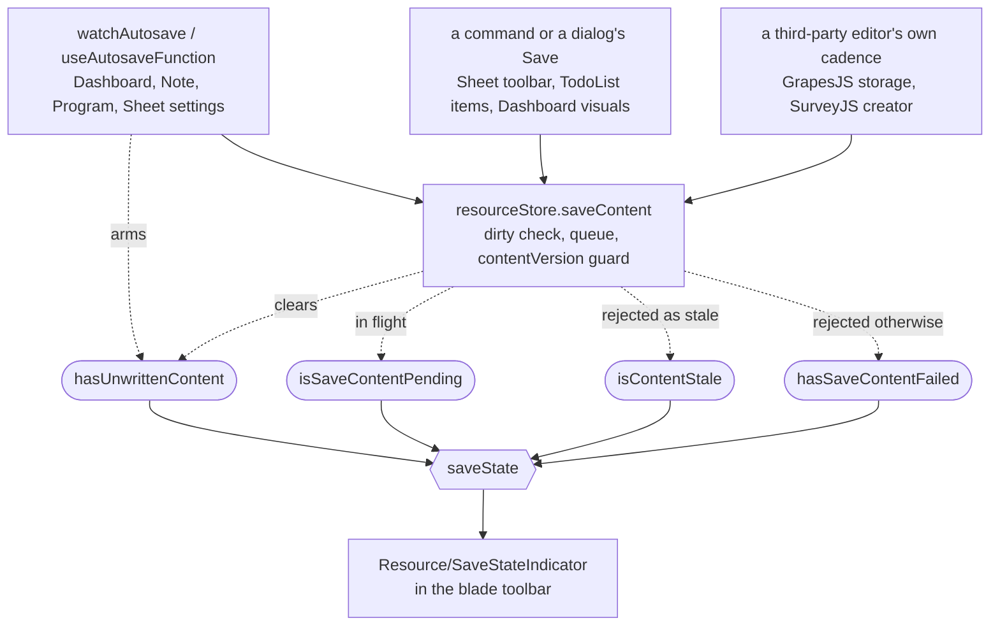

# Resource save state

Nothing in the product has a Save command for a resource's content. An edit becomes durable on its own: some types debounce a watched content ref, some persist on the command that made the change, and the two third-party editors save on a cadence the library owns. That is the right behaviour and the wrong silence — an owner who cannot see it happening looks for the button that makes it happen, and any button offered in that gap gets read as the thing that makes their work real.

So the toolbar carries a **save state** instead: one line beside the resource's commands saying whether what is on screen has reached the server, and when.

## Why there is no per-type registry

The types differ in how an edit is _triggered_, and not at all in how it is _written_. `useResourceStore().saveContent` is the single door — the debounced watcher, the Sheet toolbar command, the TodoList dialog's Save and the GrapesJS and SurveyJS storage hooks all call it, and it owns the dirty check, the queue, the `contentVersion` guard and the conflict handling for every one of them.

A map from `ResourceType` to a save mode would therefore describe a difference that stops at the trigger. It would also be the over-generalization the [capability admission rule](/docs/architecture/resources) forbids: a branch with indirection between it and its reader, added for a variation the mechanism below it has already erased. The state is derived from the door instead, once, for every type.

## The four states

`saveState` reads the flags in priority order, so the state on screen is always the most urgent thing true about the resource.

| State    | Shown as          | True when                                                             | What the owner does            |
| -------- | ----------------- | --------------------------------------------------------------------- | ------------------------------ |
| `Stale`  | Out of date       | another session's save moved `contentVersion` on                      | refresh — nothing else lands   |
| `Saving` | Saving…           | a debounce is armed, a write of _this_ resource is in flight, or both | nothing                        |
| `Failed` | Not saved         | the last write was rejected for any other reason                      | retry the edit, or copy it out |
| `Saved`  | Saved, and _when_ | none of the above                                                     | nothing                        |

**An edit the debounce is still holding counts as saving.** The debounce re-arms on every keystroke, so nothing is in flight for as long as the owner keeps typing — a state read from the write alone would call a tab full of unwritten edits `Saved`, for however long the typing lasts. That is the one lie the indicator must not tell, so `hasUnwrittenContent` is set where the edit is seen and cleared by `saveContent` itself, with the mutation's own pending flag taking over from there. Folding it into `Saving` rather than giving unwritten edits a state of their own also keeps a word off the screen that would appear and vanish between keystrokes.

**The in-flight half is asked of the resource, not of the executor.** Content saves are keyed by the resource they write, so a save issued before the blade moved on is still in flight under its own key while the next resource is loading. Read in aggregate, the mutation's pending flag would have the resource now on screen report `Saving` for work that belongs to another — and then settle to `Saved` at a moment that says nothing about it. The state asks `checkIsPending` for the loaded resource's own id, which is the same scoping every one of `saveContent`'s callbacks applies to what it writes back.

**The clear belongs to the door, not to the trigger that armed it.** A dialog's Save arms nothing and would leave a flag it never set standing; a debounce that cleared its own would clear it for a save it then refuses — one scheduled against a resource the app has since navigated away from — and so report a dropped edit as `Saved`. The door is the one place that knows the edit was actually taken, and the navigation that refused it clears the flag through the `readResource()` its own page awaits.

**It is a flag, not a count of armed debounces.** A save writes the whole content blob, so one write cleans every edit waiting on the resource however many watchers observed them — a count would claim two pending saves where there is one, and would need a per-instance guard and a disposal hook to stay honest about a number nothing reads. A pair of counters beside a ref in a store is the shape the [async sequencing rule](/docs/architecture/async-operations) names as the tell for ordering done by hand.

It is also never derived by comparing the content against what was persisted, though the store holds exactly that snapshot: deriving it reactively means serializing the whole blob on every keystroke, which is the cost the debounce exists to avoid. The flag is the cheap early signal, and `persistedContentJson` is the exact one the write itself consults.

**`Saved` carries the time.** The word on its own is a claim the owner has to take on trust, which is exactly the trust they did not have when they went looking for a Save button. `updatedAt` is what the row already tracks, so the resting state is `Saved` plus a relative time, with the absolute one on hover.

**`Stale` outranks everything** because it is the only state where the remedy is not "wait". Once the server has rejected a save as stale every retry is a guaranteed rejection, so the flag latches until the next read — the [conflict](/docs/architecture/conditional-writes) has to be resolved by reloading, and the indicator keeps saying so after the notification that raised it has been dismissed.

`Failed` exists for the same reason: a notification is a one-shot the owner dismisses, and the fact that their work is not durable outlives it.

## Where it sits

In the blade toolbar, beside the resource's commands rather than inside any one blade — content saves belong to the resource, and every blade of it writes through the same door. Narrow toolbars keep the icon and drop the words, matching the commands beside them collapsing into the overflow menu; the tooltip still spells the state out.

The indicator is a readout, never a control. Pending state that gates a _trigger_ is a different mechanism and stays where it is — `isPending` bound as `:loading`/`:disabled` on the button that fired the write ([client data](/docs/architecture/client-data#in-flight-guarding)).

## Key files

| File                                                                | Role                                                         |
| ------------------------------------------------------------------- | ------------------------------------------------------------ |
| `apps/web/app/store/resource/index.ts`                              | `saveContent`, the flags it sets and the derived `saveState` |
| `apps/web/app/composables/resource/autosave/useAutosaveFunction.ts` | the shared debounce, and the arm that makes it visible       |
| `apps/web/app/models/resource/ResourceSaveState.ts`                 | the four states                                              |
| `apps/web/app/services/resource/ResourceSaveStateDefinitionMap.ts`  | what each one looks like                                     |
| `apps/web/app/components/Resource/SaveStateIndicator.vue`           | the toolbar readout                                          |

## Notes

- The colour rides the icon rather than the text: Vuetify resolves a colour prop at runtime, where a UnoCSS class built from a state name is a class the scanner never sees.
- A save reports the resource that issued it. Saves of different resources are different single-flight keys, so one can settle after the blade has moved on — its rejection, its `contentVersion` and its persisted-content baseline all belong to the resource it was for, and every one of them is applied only while that resource is still the loaded one. Its notification is not scoped: the write failed for the owner either way.
- Recovery points are [resource snapshots](/docs/platform/resource-snapshots), a separate mechanism on a separate clock. This page answers "did my edit land"; that one answers "can I go back".
