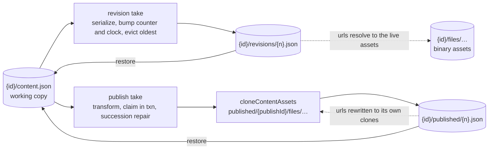
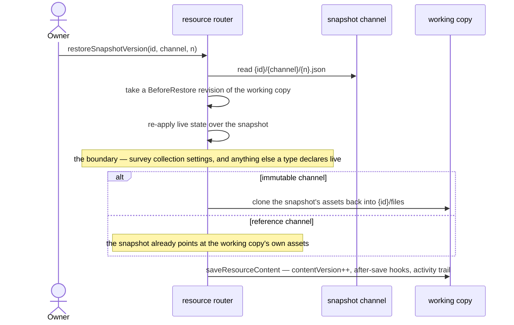

# Resource snapshots

Every resource type has restorable point-in-time versions of its working copy, whether or not it can be published. A snapshot is addressed by **channel**: `published` is what a publish writes, `revisions` is where the working copy's own recovery points live, and everything between them — the blob address, the listing, the reconstitution, the restore and the ledger — is one mechanism rather than one per channel.

A rollback reaches either channel, on any type, from a panel over the thing being restored — never a nav blade of its own, and never restricted to a deliberate publish on a publishable type. Restoring is an operation on one resource, so it belongs beside that resource rather than in a surface of its own.

## The mechanism: channels

```text
{id}/content.json                        working copy
{id}/revisions/{n}.json                  revision channel — reference kind, owner-only
{id}/published/{n}.json                  published channel — immutable kind, publicly served
{id}/published/{publishId}/files/…       the immutable channel's asset clones
{id}/files/…                             binary assets, FileAssets types only
```

`SnapshotChannelDefinitionMap` is the one place a channel says what it is: its kind, its retention, and the title its rows wear.

**A channel is an address space, not a workflow.** The two differ on six axes — kind, counter, retention, visibility, whether an unpublish sweep takes them, and whether taking one is an outward act with a public url, a view count, a notification and an activity entry. A `createSnapshot(id, channel)` driving all of that from a map would be a branch with indirection between it and its reader, which is the over-generalization the [capability admission rule](/docs/architecture/resources) forbids one level up. So the split is drawn where the operations are genuinely the same one:

| Shared by both channels                                    | Owned by each caller                                            |
| ---------------------------------------------------------- | --------------------------------------------------------------- |
| the blob address `{id}/{segment}/{n}.json`                 | **taking** a snapshot                                           |
| the counter in Postgres, and the history listing beside it | publish's transform, version claim, succession check and repair |
| **reconstitution** — read, re-apply live state, hand back  | the revision's ring-buffer eviction                             |
| restore — reconstitute, then `saveResourceContent`         | publish's activity entry, notification and view counting        |
| the ledger charge on write and release on evict            |                                                                 |

Reconstitution is the row that matters, because sharing it fixed a defect rather than saving lines — see the boundary below.

The counter lives in Postgres and is never derived from the listing: the listing answers _which snapshots exist_, the row answers _what the next version is and which one is live_, and the two are allowed to disagree, because an unpublish sweep is best-effort and retired blobs outlive the row that numbered them. Revisions take two columns on `resources` rather than a table — `revisionVersion` numbers them and `revisionTakenAt` is the clock the automatic trigger reads. A revision's reason and its one-line summary ride as blob metadata, which the listing returns.

### Two snapshot kinds

The clone is the expensive half of a snapshot, and making it a property of the channel is what makes a second channel affordable:

| Kind          | What is written                                                           | Cost                                            | Survives                                             | Used by     |
| ------------- | ------------------------------------------------------------------------- | ----------------------------------------------- | ---------------------------------------------------- | ----------- |
| **Immutable** | content + a clone of every referenced asset, urls rewritten to the clones | one storage round trip **per referenced asset** | the working copy deleting or replacing an asset      | `published` |
| **Reference** | content only, urls untouched, resolving to live `{id}/files/…`            | one blob                                        | nothing — an asset the owner deletes is gone from it | `revisions` |

Revisions take the reference kind: `{id}/files/` is only emptied by purge, which destroys the revisions in the same sweep, so the window in which one can rot is exactly "the owner deleted an asset and then rolled back past the deletion". A rolled-back revision with one broken image beats no rollback, and a per-asset clone on every revision would mean no revisions at all.

It follows that **the revision channel holds no assets**, only JSON — so `parseResourceAssetPath` needs no new segment, and the rule that `{id}/published/…` assets serve anonymously while a publication row exists cannot accidentally extend to revisions.



## The snapshot boundary

Survey draws a line through its content blob that no other part of the system knows about: `model` is snapshot state, `settings` is live state, re-read on every public read so closing a survey takes effect without re-publishing every participant link already sent.

**That line has to be declared in both directions, or restore gets it wrong**: a restore that copies the snapshot's content wholesale into the working copy carries `settings` with it, silently reopening a closed survey or flipping the response mode between Anonymous and Identified — a setting the write boundary makes authorization decisions on ([survey response modes](/docs/platform/survey-response-modes)).

So the boundary is a **two-way declaration the mechanism owns**: `ResourceLiveContentMap` says which parts of a type's content are live rather than frozen, and `reapplyLiveResourceContent` applies it on every path that reconstitutes a snapshot — the public read, the version preview, and the restore. Writing those paths apart is what lets them disagree; one shared reconstitution makes it impossible.



The revision taken before the write is what makes the mechanism **append-only**: a rollback is not a rewind but an append whose content happens to equal an earlier state, so undoing one is simply the next append. It is taken once the snapshot is known to exist — a restore that was never going to land does not spend a ring-buffer slot on its way to failing — and it is allowed to throw, because a restore whose undo silently did not happen is the defect this exists to close.

Two things sit outside the invariant: the **ring buffer** evicts the oldest revision, so append-only holds over recent history rather than all of it, and the **unpublish sweep** deletes `{id}/published/` outright. The revision channel survives an unpublish untouched, so nothing _recoverable_ goes with it.

## When a snapshot is taken

**Every trigger is the system's, never the owner's.** A recovery point that exists because somebody remembered to ask for one is not a recovery path — it is the same failure mode [no manual recovery](/docs/architecture/no-manual-recovery) rejects one layer down, and it fails exactly when the owner was too absorbed in the work to think about losing it. So there is no Save version command, and nothing in the product asks an owner to take a snapshot.

| Trigger                                    | Channel     | Rationale                                                                          |
| ------------------------------------------ | ----------- | ---------------------------------------------------------------------------------- |
| Publish command                            | `published` | the outward act, unchanged                                                         |
| Before a restore                           | `revisions` | the undo, taken by the restore itself                                              |
| Before a Sheet import                      | `revisions` | the other write that replaces a draft wholesale; the import is refused if it fails |
| First save an interval after the last one  | `revisions` | at most one per interval, so a working session leaves a handful of recovery points |
| Every other autosave                       | —           | never                                                                              |

**The interval is measured from the last revision, not from the last save.** `saveResourceContent` fires on every coalesced keystroke batch, and Sheet and Dashboard put real data in the content blob — so a per-save revision copies the whole artifact each time, charges the owner's quota while they type, and grows a listing that has no limit. Throttling is the whole of the cost control. But throttling on the _save_ clock inverts the feature: `updatedAt` moves with every autosave, so a resource being actively edited never looks idle, and the session that most deserves recovery points is the one that leaves none. `revisionTakenAt` is a clock only a revision moves, so a working session leaves one point per interval however continuously it is edited.

A resource's first content write takes none — there is no prior state to keep, and the blob a revision would copy is the one that write is creating. The take is also the one trigger that swallows its own failure: a save must never fail because a revision could not be taken. A blueprint deploy takes none either — it creates resources rather than overwriting one, so there is no draft to hand back.

## Retention

The published channel prunes nothing: publishes are deliberate and rare, and a retired public artifact is something an owner may need to point at.

Revisions are a **ring buffer** — a fixed cap in the tens, oldest evicted when a new one lands. Eviction goes through the blob deletion event like every other delete, so the evicted revision's ledger entry is released with it; a bare delete would make the ring buffer a slow quota leak nothing reconciles ([storage quotas](/docs/platform/storage-quotas)).

## Versions the owner sees

`contentVersion` is **never** shown. It is an optimistic-concurrency token that increments once per autosave, so surfacing it tells an owner their document is at v437 because they typed 437 times.

The two counters that reach the UI are different axes: **`publishVersion` is what the public sees**, **`revisionVersion` is what you can return to**. Overview's Status row shows each only where it carries information:

| Type            | State                            | Status row                                                             |
| --------------- | -------------------------------- | ---------------------------------------------------------------------- |
| Not publishable | —                                | that a restore point exists, once one does                             |
| Publishable     | never published                  | `Draft` chip, plus that a restore point exists once one does           |
| Publishable     | published, draft unchanged since | `Published` chip, `v{publishVersion}`, up to date                      |
| Publishable     | published, draft moved since     | `Published` chip, `v{publishVersion}`, and that changes are unpublished |

The last row is a comparison rather than a guess: `resource_publications.publishedContentVersion` records the `contentVersion` the publish was taken from, and `updatedAt` cannot answer it because a rename or a tag edit moves that too.

`revisionVersion` itself is never rendered — an owner picks a version by time, reason and label, never by ordinal — but it remains what the mechanism counts with.

## The rollback surface

Version history is a **panel over whichever blade is open**, not a nav blade: rollback is wanted where the damage happened, which is where every product that does this well puts it.

- **Opens from `Resource/Blade/Actions`**, because Sheet and TodoList are blade-only types with no Editor blade — the action bar is the one surface every type has. It is the only command the feature has: the history is a place you go, never a thing you maintain.
- **Deep-linkable by route** — `?versions` opens the panel, `?version={channel}|{n}` names the version being previewed, so the back button, a refresh and a shared link all land in the same place.
- **One list, two address spaces.** Both channels merge into one time-ordered timeline, because the owner has one question. `Current` is always the first row, so the list is never empty on a resource that has just been created; a `Published only` chip filters on publishable types.
- **A row is choosable**: its channel and version as a label rather than a bare ordinal, a relative time with the absolute one on hover, its reason from `SnapshotReasonTitleMap`, and a one-line summary from `SnapshotSummaryMap` — `12 items`, `3 columns · 40 rows`. The summary is computed where the snapshot is taken and carried in its blob metadata, so the listing stays one round trip for the whole history.
- **Preview in place** renders a published version through the type's own public renderer where the blade was, under a banner carrying `Restore this version` and `Back to current`. A revision has no rendered form of its own — that would be a read-only renderer per type, publishable or not — so its row restores rather than previews.
- **Restore notifies with an Undo** that restores the `BeforeRestore` revision it had just taken, naming the resource it was offered for rather than whichever is open when it is clicked. Single-use: a second fire would restore a draft the first already replaced.

A restore never re-points the publication — it produces a draft to review and re-publish, mirroring the [recycle bin](/docs/platform/recycle-bin) rule — and it lands through `saveResourceContent` like any other content write, so after-save hooks re-derive what the restored content declares and the [activity](/docs/platform/activity-log) trail records a `Restored` entry.

Because it replaces content underneath an already-open blade, the content stores re-read themselves through `ResourceContentHookMap.Reload` rather than the blade being keyed on a counter something bumps. The editor-owned types (GrapesJS, SurveyJS) register nothing — their editor owns the live document once loaded, so a tab open on one keeps the pre-restore draft until it reloads.

## Why not Azure Blob versioning

**A resource version is not a blob version.** It is `content.json` _plus the assets it references_, and Azure versions each blob on its own timeline with no cross-blob consistency point — so "restore this resource as of Tuesday" resolves to Tuesday's JSON pointing at asset blobs since replaced or deleted. Cloning the assets alongside the content is a thing the application does and the storage account cannot.

Three lesser reasons, each independently sufficient: versioning is a **blob-service property**, so enabling it for `resource-assets` enables it for every container on the account; non-current versions are **billed but invisible to the ledger**, which charges the current blob and reconciles off `BlobCreated` ([storage quotas](/docs/platform/storage-quotas)); and a version is addressed by an opaque id nothing in the app stores, lists or hands to a restore.

## Procedures

| Procedure                            | Auth                | Input                      | Purpose                                                 |
| ------------------------------------ | ------------------- | -------------------------- | ------------------------------------------------------- |
| `resource.readSnapshotHistory`       | `getOwnerProcedure` | `{ id }`                   | both channels merged, newest-first by time              |
| `resource.restoreSnapshotVersion`    | `getOwnerProcedure` | `{ channel, id, version }` | reconstitute a snapshot into the working copy           |
| `resource.saveResourceRevision`      | `getOwnerProcedure` | `{ id }`                   | the pre-import safety net, and the only take a client asks for |
| `{type}.readPublishedVersionContent` | `getOwnerProcedure` | `{ id, version }`          | owner-only read of one published snapshot, for preview  |

The channel rides with the version on every command, because a version alone names one snapshot per channel. The reason a revision carries is never a client's to name: `Automatic` is decided by the save path from a clock and `BeforeRestore` by the restore itself, so a caller choosing between them would be choosing what its own write is called.

## Key files

| File                                                                       | Role                                                          |
| -------------------------------------------------------------------------- | ------------------------------------------------------------- |
| `apps/web/shared/services/resource/SnapshotChannelDefinitionMap.ts`                 | what a channel is — kind, retention, title                    |
| `apps/web/shared/services/resource/SnapshotSummaryMap.ts`                           | the per-type one line a history row carries                   |
| `apps/web/server/services/resource/snapshot/takeResourceRevision.ts`                | the revision take, its ring buffer and its ledger charge      |
| `apps/web/server/services/resource/snapshot/readSnapshotHistory.ts`                 | a channel's prefix listing as history rows                    |
| `apps/web/server/services/resource/ResourceLiveContentMap.ts`                       | the boundary — what a type declares live                      |
| `apps/web/server/services/resource/reapplyLiveResourceContent.ts`                   | the reconstitution every snapshot read goes through           |
| `apps/web/server/trpc/routers/resource.ts`                                          | history, restore and save-version procedures                  |
| `apps/web/server/trpc/procedure/resource/createResourceProcedures.ts`               | the publish take, its version claim and its succession repair |
| `apps/web/app/components/Resource/VersionHistory/`                                  | the panel, its rows, the preview banner and the restore dialog |
| `apps/web/app/store/resource/versionHistory.ts`                                     | the timeline, the restore and its Undo                        |
| `packages/db-schema/src/schema/resources.ts`                               | `revisionVersion`, `revisionTakenAt`                          |
| `packages/db-schema/src/schema/resourcePublications.ts`                    | `publishedContentVersion`                                     |

## Notes

- After an unpublish the publish numbering restarts at 1, because unpublish deletes the publication row and publishes the prefix for deletion. That sweep is best-effort and asynchronous, so a republish can land while the old snapshots are still present — which is why the live version is read from the publication row rather than inferred from which snapshots exist.
- Purge and soft delete need no step of their own: purge takes `{id}/` wholesale, which is already every channel.
- [Named checkpoints](/docs/sheet-editor/rejected/named-checkpoints) was rejected for the Sheet editor because undo/redo already traverses prior states, and the resource-level version of the same idea is rejected in [owner-named versions](/docs/platform/rejected/owner-named-versions) — a row is chosen by its time, its reason and what it holds, none of which the owner has to supply.
- Whether a resource's edits are durable is [save state](/docs/platform/resource-save-state), not this page: version history is where an owner goes to undo, and the toolbar is where they see that there was nothing to undo in the first place.
