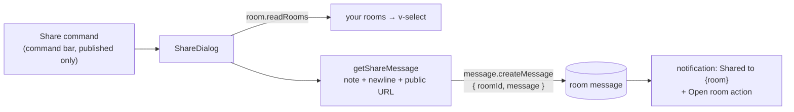

# Share to Esbabbler

A **Share** command on published resources: pick one of your rooms, add an optional note, and the public `/view/[type]/[id]` link lands there as a message. It is the first real bridge between the platform and [esbabbler](/docs/esbabbler), and it is deliberately the smallest one that works — client-side only, reusing the existing message-create path, with no new procedures and no schema.

Copying the link off the Overview blade and pasting it into a room by hand still works; this does the same thing in place.

## How it works

- **The command appears for `PublishableResourceType` only while published.** An unpublished resource has no public URL, so there is nothing to share until it has one — the command is absent, not disabled. It sits beside the publish toggle in the command bar and collapses into the `…` overflow on narrow viewports with everything else.
- **The dialog reads your rooms once per open** (it mounts only while open) into a `v-select`, with an optional note field. No rooms is an empty state pointing at esbabbler, not a disabled button with no explanation.
- **The message is sanitized HTML with an explicit anchor** — message bodies render through `v-html` and nothing in the pipeline autolinks bare text, so `getShareMessage` builds the link itself (`<a href … target="_blank">`) and wraps the escaped note above it, newlines as line breaks. It goes through the standard `message.createMessage` mutation, so RBAC, rate limits, profanity filtering, and the whole message pipeline apply unchanged; rich embeds/unfurls stay [deferred](/docs/platform/deferred/esbabbler-link-unfurl).
- **The dialog validates what it sends** — the length rule checks the composed message (note + markup + link) against the message cap, not just the raw note, so a note that fits the counter can never produce a message the server rejects.
- **Success lands in the [notifications](/docs/platform/notifications) store** with an **Open room** action.

## Key files

| File                                        | Role                                        |
| ------------------------------------------- | ------------------------------------------- |
| `app/components/Resource/ShareDialog.vue`   | room picker, note, send, empty state        |
| `app/components/Resource/Blade/Actions.vue` | the Share command (publishable + published) |
| `app/services/resource/getShareMessage.ts`  | note + link composition                     |

## Notes

- **Deliberately one direction** (platform → room). Surfacing "shared with me" inside the explorer is a different feature needing read-model thought, and is not in this cut.
- The message is the caller's own message in their own room — no special message type, no service-to-service write, no elevated permission. Deleting the resource later leaves a dead link, exactly like any pasted URL.
