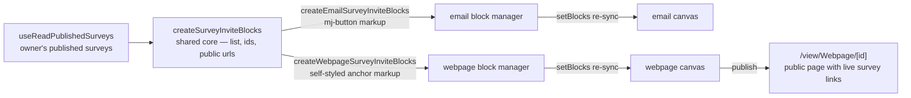

# Webpage Survey Invite Blocks

Both GrapesJS editors offer the owner's published surveys as drag-in invite-button blocks — the email editor for a send ([email personalization](/docs/platform/email-personalization)), the webpage editor for a landing page that collects responses from anyone who finds it, with zero send infrastructure.

## How it works

The two editors differ in exactly one thing: their canvas markup. Email is MJML, webpage is plain HTML. So the block-building code is a shared core producing the survey list, block identity and public URL, plus a thin per-editor wrapper supplying only its button renderer — one primitive with two flavours, never a copy.

- **Block source** — `useReadPublishedSurveys` reads the owner's surveys and keeps only the published ones: a draft survey has no public URL for a block to link. Both editors share it.
- **Block content** — a styled button linking `RoutePath.View(ResourceType.Survey, id)`. The webpage flavour carries its own inline styling, since a published page loads no stylesheet of ours. Survey names are HTML-escaped into both the block label and the button markup.
- **Re-sync** — the block category is replaced wholesale through `setBlocks` whenever the editor or the survey list changes, so no per-block bookkeeping is needed. The watch itself is shared too (`useSurveyInviteBlocks`): each editor hands it the live editor, the survey list and its own renderer, and owns none of the wiring.
- **No per-recipient identity** — there is no audience row behind an anonymous page visitor, so a webpage block is always the plain published URL. Invite tokens belong to a distribution orchestrator, not a public page.

## Key files

| File                                                                         | Role                                       |
| ---------------------------------------------------------------------------- | ------------------------------------------ |
| `packages/app/app/services/grapesjs/createSurveyInviteBlocks.ts`             | shared core — survey list to block defs    |
| `packages/app/app/services/emailEditor/createEmailSurveyInviteBlocks.ts`     | MJML button flavour                        |
| `packages/app/app/services/webpageEditor/createWebpageSurveyInviteBlocks.ts` | plain-HTML button flavour                  |
| `packages/app/app/composables/survey/useReadPublishedSurveys.ts`             | the shared block source                    |
| `packages/app/app/composables/grapesjs/useSurveyInviteBlocks.ts`             | the shared re-sync watch both editors call |
| `packages/app/app/services/grapesjs/setBlocks.ts`                            | wholesale block-category re-sync           |

## Notes

- Embedding a survey _inline_ (an iframe of the respondent page) is deliberately out: iframes inside GrapesJS canvases and published pages bring sizing and sandboxing complexity for marginal gain over a button, and the respondent page is already mobile-friendly. Revisit only on real demand.
- The full list-to-blocks behaviour is tested once against the shared core; each wrapper test asserts only its own markup flavour.
