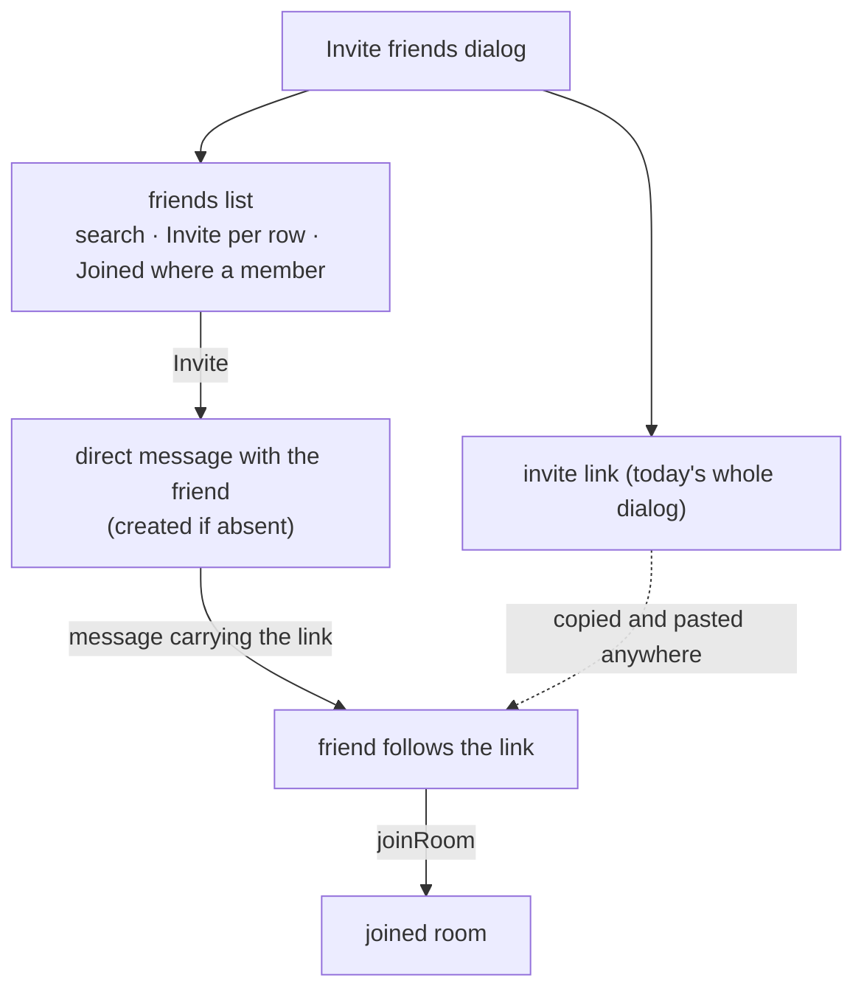

# Invite Friends Picker

The invite dialog is titled "Invite friends to {room}" and holds a link ([invites](/docs/esbabbler/invites)). Discord's dialog of the same name is the other half first: a searchable list of the sender's friends, an **Invite** beside each, and the link below it as the fallback for someone who is not a friend yet. Ours ships only the fallback, and its own comment says so. Inviting a friend today means copying the link, leaving the room, opening the direct message and pasting it — four moves the reference product makes one.

## What it adds

The dialog gains a friends list above the link. Each row is the friend's avatar and display name and one `Invite` button; a row whose friend is already a member reads `Joined` and is disabled, since a management surface exists only where its action can succeed (`ux` skill). A search field narrows the list by name, the same `useAutoSearch` stack every other search-as-you-type input uses.

`Invite` sends the invite link into the direct message with that friend as a message from the sender, creating the direct message where none exists — the same write `createDirectMessage` plus `createMessage` make today, so the join path is unchanged: the friend follows the link and `joinRoom` answers as it does for any link. Nothing is added to the invite row or its schema; the picker is a delivery surface over the link that exists.

## Why it is a feature rather than a placement fix

The `ux` ledger found the gap while sweeping invites and could not fold it in: a sweep changes no behaviour, and this adds a write path (a message the sender did not type) and a read the dialog does not make today (the friends list against the room's membership). It is one dialog and one procedure, sized for a single window.

## What is deliberately not in it

- **No invite by user id or username** — the list is the friends list, as Discord's is; a stranger is reached by the link.
- **No per-friend invite row** — the message carries the room's existing link, so revoking that link revokes every delivery of it at once, which is what a sender expects.
