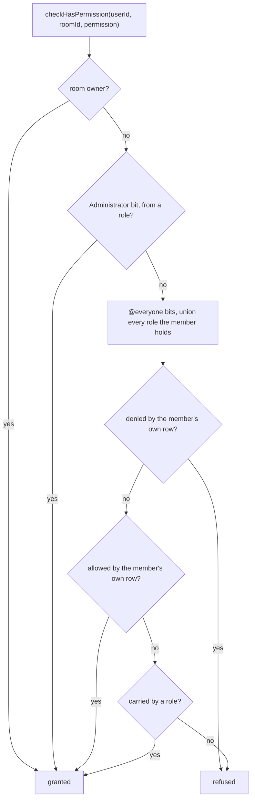

# Member Permission Overrides

Give one member a permission the rest of their roles do not carry, or take one away, without inventing a role to hold it. Today a member's permissions are exactly the union of the roles they hold plus `@everyone` ([RBAC](/docs/esbabbler/rbac)), so "let this one person manage emoji" is only expressible as a role named after a person — which then shows up in the roles list forever, and has to be remembered when the reason for it goes away.

This is the half of Discord's channel permissions we did not build. Theirs is not a list of roles: it is a list of **entries**, each a role _or_ a member, and its add control says so — `Add members or roles`. Ours says `Create role...`, which is both a different control and a smaller idea.

## What it adds

### One table, keyed by the pair it is about

`roomMemberPermissions` holds `roomId · userId · allow · deny`, unique on the pair, cascading with both. Two bitfields rather than one, because an override has **three** states per permission and a single field can only carry two: allow it, deny it, or say nothing and let the roles decide. A member with no row is the current behaviour exactly, so nothing needs backfilling.

Two fields can express a fourth state the model does not have — a bit set in both — so **`allow & deny` is always zero**, held by a `CHECK` constraint and by a write path that clears the opposite bit rather than adding to whichever field it was handed. Without that the resolution order below silently becomes the definition of a state nobody designed.

**Roles get no equivalent.** Discord needs role overwrites because its roles are server-wide and its permissions are per-channel; ours are already room-scoped, so a role override would be a second place to write the same fact.

### Resolution — the member has the last word

Deny beats allow beats roles — **but neither reaches Administrator or ownership**, both of which are answered before the row is read at all. That is Discord's rule too, and it is the one that keeps the feature from becoming a way to lock an owner out of their own room: an override is a statement about the permissions a role could have given, not about the two authorities that were never role-shaped.

### Who may write one

`ManageRoles`, and only over a member the actor outranks — the same `assertIsManageable` hierarchy check a role assignment already goes through, against the same `getRoomMemberAuthority`. Without that, `ManageRoles` becomes a way to grant yourself anything by writing your own override.

### The panel becomes a list of entries

The Roles settings panel keeps its shape and changes what fills it:

- The list holds **roles and members**, with a member's avatar where a role has its colour dot.
- `Create role...` becomes **`Add role or member`** — a picker that creates a role from a typed name, or adds an entry for a member already in the room.
- Selecting a role opens today's editor unchanged. Selecting a member opens the same permission list with a **three-state control** per row — deny, inherit, allow — where a role's is a switch. That is the one place the existing two-state switch cannot carry the model, and it is the reason to build the control rather than reuse it.
- A member entry shows what they inherit, so `inherit` reads as the concrete answer it resolves to rather than as a blank.

## Failure and teardown

An override outliving its reason is the failure mode worth designing against, and the answer is that it is visible: a member with a row appears in the entry list beside the roles, which is exactly what a person-shaped role never was. Removing the entry deletes the row and the member falls back to their roles.

Leaving a room deletes the row with the membership. A permission bit that is retired renumbers as every stored bitfield here does — read as the current shape, never migrated ([clean slate](/docs/architecture/persisted-data-latest-shape-only)).

## Key files

| File                                                                               | Change                                                   |
| :--------------------------------------------------------------------------------- | :------------------------------------------------------- |
| `packages/db-schema/src/schema.ts`                                                 | registers the new `roomMemberPermissions` table          |
| `packages/db/src/services/room/rbac/checkHasPermission.ts`                         | the resolution chain above                               |
| `packages/app/server/services/room/rbac/getRoomMemberAuthority.ts`                 | an override counts toward what a member may be given     |
| `packages/app/server/trpc/routers/role.ts`                                         | write and delete an override, behind the hierarchy check |
| `packages/app/app/components/Message/Model/Room/Settings/Type/Role/List/`          | entries rather than roles                                |
| `packages/app/app/components/Message/Model/Room/Settings/Type/Role/CreateForm.vue` | `Add role or member`                                     |
| `packages/app/app/components/Message/Model/Room/Settings/Type/Role/Permission/`    | the three-state control beside the switch                |

## Notes

The three-state control is the piece with no precedent in the app, and it is worth resisting the temptation to fake it with two switches. Discord's own affordance is one segmented control per row with the inherited value shown behind the neutral position, which reads as one decision rather than two that can contradict each other.
