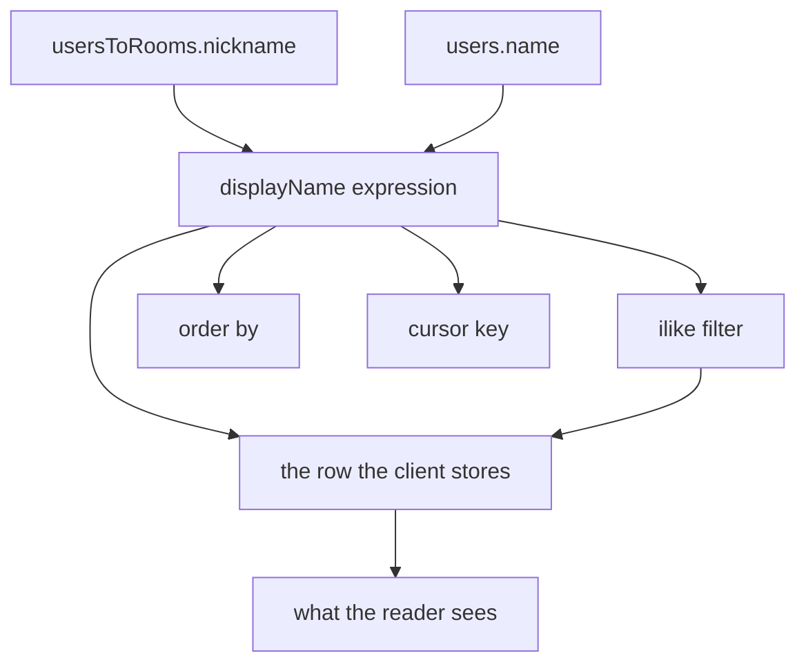

# Server-Resolved Display Names

A room calls a member whatever their nickname says ([nicknames](/docs/esbabbler/nicknames)), and a direct message calls itself after the people in it ([friends and DMs](/docs/esbabbler/friends-and-dms)). Both names are assembled on the client, after the read. Every query that has to **find** or **order** one of those names therefore runs against a different value than the one the reader is looking at.

The member list is the visible case. A room where Alice is nicknamed `Ally` renders `Ally`, and typing `Ally` into the member search returns nothing — the filter is `ilike(users.name, …)`. Typing `Alice` returns a row that says `Ally`, which reads as the wrong result rather than the right one. The same procedure backs the `@` mention list, the audit log's member picker and the search sidebar's `from:` picker, so one filter is wrong in four places.

## The rule

**A name a query has to match is a column. A name that is only rendered is a computed.** A display name is both, so it has to exist at the layer that does the matching — the database — and the client renders what the server resolved rather than resolving it a second time.



Today only the last edge exists, and it is drawn on the client — which is why the first three run on `users.name`.

## What it adds

### One expression, at the join that is already there

`readMembers` already inner-joins `usersToRoomsInMessage`, so the nickname is one column away from a query that never looks at it:

```ts
// coalesce over nullif, because "no nickname" is the empty string rather than null (nicknames doc)
export const getDisplayNameExpression = () =>
  sql<string>`coalesce(nullif(${usersToRoomsInMessage.nickname}, ''), ${users.name})`;
```

Selected as `displayName`, it becomes the filter target, the `orderBy` key and the cursor key in the same read. The client's `getDisplayName` overlay keeps its job on the **render** path — a message author resolved by `useCreator`, a mention label rewritten by `useMessageHtml` — where the user row came from somewhere other than a member read. The two must agree, which is one more reason the fallback rule is stated once and both sides quote it: `nullif` on the server is `||` on the client.

### The cursor primitive that makes it keyset-safe

`parseSortByToSql` already takes either a table or a columns record, for exactly this reason — the resource list sorts by a value that lives on the joined table. `getCursorWhere` takes only a table, so a sort key that is an expression cannot be paginated. Widening it to the same pair of overloads is the whole change, and it is the piece that stops this being a member-list special case: any list that sorts by something the join computed can then page through it.

### A member row stops pretending to be a user row

`readMembers` returns `User`, and the client fills in the rest — a second round trip to `readNicknames`, plus statuses and roles, fanned out by `readMetadata` after every page. Returning `displayName` on the row drops one of those calls outright, and gives the client's `members` computed a real sort key: it currently sorts loaded pages by `users.name` while the server paged them by `users.updatedAt`, so the alphabetical order only holds inside a page and scrolling inserts names above the ones already read. Sorting on the same expression the cursor keys on fixes the order and the search in one move.

### The row shows why it matched

The reactions dialog already renders the shape this needs — nickname as the title, the global name as a subtitle when the two differ — and Discord's member list does the same. Once the search matches both names, the subtitle is what tells a reader who typed `Alice` why a row saying `Ally` came back. The member list, the settings members panel and the `@` mention list adopt it; the mention list is also the one place that still puts the **global** name in front of the reader while the committed mention renders as the nickname.

### Direct messages get a name that exists

A direct message stores `name = ""` and `useDirectMessageName` joins the participants' names on the client. Nothing server-side can search it, which is why the quick switcher (`ctrl+k`, "Find or start a conversation") is restricted to `RoomType.Room` and never offers a DM — Discord's opens with them. The same expression, aggregated over the other participants, gives `readRooms` a `displayName` to filter and order on, and the switcher can drop the type restriction. `Searched.vue` renders `name ?? ""`, so it needs the resolved field before DMs may appear in it at all, or every DM is a blank row.

## What is deliberately unchanged

- **Bans.** Banning deletes the `usersToRooms` row, so a banned user has no nickname left to resolve — the global name is the only name there is, and the ban list's search matching it is correct rather than an oversight.
- **Friend search.** `searchUsers` has no room, so a global name is the only sensible key.
- **System messages.** `"<name> joined the room."` is baked into message content at write time. Freezing the name there is a property of message content, not of name resolution.

## Steps

1. `getDisplayNameExpression` beside the other shared query helpers, with the schema that owns the columns.
2. Widen `getCursorWhere` to a columns record, mirroring `parseSortByToSql`'s overload pair, with the cursor test that covers an aliased expression.
3. `readMembers`: select `displayName`, sort on it by default, and cursor on it paired with `users.id` — a display name is not unique, and a keyset that reads strictly past its cursor drops the row that ties with it at a page boundary. The filter matches `displayName` **or** `users.name`, since the subtitle above only has something to explain when a search for `Alice` returns `Ally`. Return type gains the field.
4. Client: drop `readNicknames` from `readMetadata`, sort `members` on `displayName`, and add the global-name subtitle to the member list, the settings panel and the mention list.
5. `readRooms`: the aggregated form — the same participant set the client joins, so every other participant and never the reader. The order goes **inside** the aggregate (`string_agg(displayName, ', ' ORDER BY displayName, users.id)`); an outer `ORDER BY` sorts the rows the query returns and leaves the order the aggregate consumed them in untouched, which is the order the name is built from. `users.id` breaks the tie, since two participants may render the same name. `readDirectMessageParticipants` returns the same resolved names in that same order and `useDirectMessageName` joins them as given, or the searched name and the rendered one drift apart the moment a participant is added. Tests: a nicknamed participant, the same room read twice, and a room gaining one. Then remove the `RoomType.Room` restriction from the quick switcher and render the resolved name in `Searched.vue`.

Step 5 is separable and lands second — steps 1–4 fix a wrong answer, step 5 adds rows that were never there.

## Key files

| File                                                                | Role                                      |
| :------------------------------------------------------------------ | :---------------------------------------- |
| `packages/app/server/trpc/routers/room/index.ts`                    | `readMembers`, `readRooms`                |
| `packages/app/server/services/pagination/cursor/getCursorWhere.ts`  | cursor key, table-only today              |
| `packages/app/app/composables/message/room/useReadMembers.ts`       | the page read and its metadata fan-out    |
| `packages/app/app/store/message/user/member.ts`                     | the `members` sort and `getMemberName`    |
| `packages/app/app/store/message/room/userToRoom.ts`                 | `getDisplayName`, the render-path overlay |
| `packages/app/app/composables/message/room/useDirectMessageName.ts` | the client-side DM name                   |
