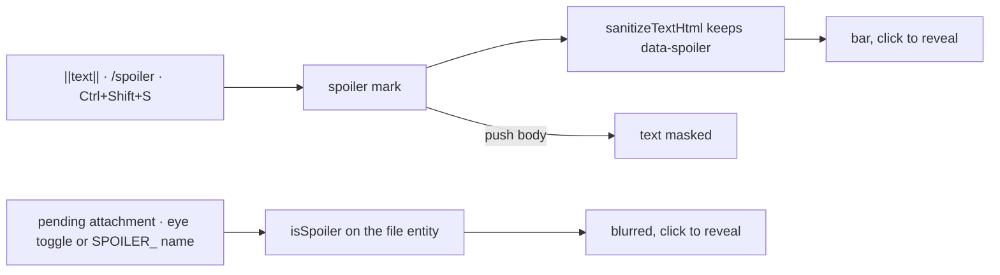

# Spoilers

A room discussing a film, a game or a book has no way to say something without saying it to everyone who scrolls past. Discord's answer is the spoiler: text wrapped in `||` bars, or a message sent through `/spoiler`, renders as a dark bar until a reader clicks it, and an attachment marked with the upload preview's eye icon is blurred behind a **SPOILER** label until it is opened. It is one of the most-used pieces of Discord's message markup, and Esbabbler, which matches Discord by default ([esbabbler](/docs/esbabbler)), has none of it.

## What it adds

### Text

- **A spoiler mark** in the composer's Tiptap schema, rendered as ``. Typing `||text||` converts the wrapped text as the closing bars are typed (a mark input rule, the way StarterKit's `**bold**` rule works); **Ctrl+Shift+S**, a formatting-toolbar button and `/spoiler <text>` apply it too. `/spoiler` joins the slash-command registry as a text-transform command like `/shrug` ([slash commands](/docs/esbabbler/slash-commands)).
- **Rendering.** A spoiler span draws as a filled bar in the muted text colour with its text transparent, `role="button"`, `tabindex="0"` and `aria-label="Spoiler, activate to reveal"`; a click, Enter or Space reveals it for that reader, in that message, until the room is left. Revealing is client state only — nothing is written.
- **The sanitizer** allows the one attribute: `sanitizeTextHtml` adds `data-spoiler` to `span`'s allowed attributes, the same way the mention and custom-emoji attributes are allowed. Link previews are not generated for a URL inside a spoiler, since the preview card would print what the bar hides.
- **Push and search.** A push body replaces spoiler text with `▇▇▇▇`, so a lock screen does not reveal it; search still matches the text, since the searcher typed it.

### Attachments

- **Mark as spoiler** is a toggle on each pending attachment in the composer, beside its remove button, and the file entity gains `isSpoiler`. An image or video renders blurred with a **SPOILER** label over it until clicked, and a spoiler image opens in the lightbox only after that first click. A file whose name starts `SPOILER_` is marked on upload, as Discord does, so a file renamed elsewhere keeps its intent.

## What is deliberately not in it

- **No "show spoiler content" setting** (Discord's always / on servers I moderate / on click). One behaviour — click to reveal — until someone asks for another.
- **No spoiler on a whole message's embeds or polls.** Text and attachments are what people hide.

## Key files

| File                                                            | Role after the change                                     |
| --------------------------------------------------------------- | --------------------------------------------------------- |
| `packages/shared/src/services/sanitizeHtml/sanitizeTextHtml.ts` | allows `data-spoiler` on `span`                           |
| `packages/db-schema/src/models/azure/table/FileEntity.ts`       | gains `isSpoiler`                                         |
| `apps/web/app/components/Message/Model/Message/File/Index.vue`  | the blurred attachment and its reveal                     |
| `apps/web/app/components/Message/Model/Message/Input/Index.vue` | the composer the mark, its input rule and the toggle join |

## Sources

- [How-To Geek — how to use spoiler tags on Discord](https://www.howtogeek.com/689297/how-to-use-spoiler-tags-on-discord/) — the `||` syntax, `/spoiler`, the eye icon on an upload and click-to-reveal (Discord's own help article refuses automated readers).
- [MarkdownTools — Discord spoiler tags](https://www.markdowntools.io/discord-spoiler) — the `SPOILER_` file-name prefix Discord detects to hide an attachment.
