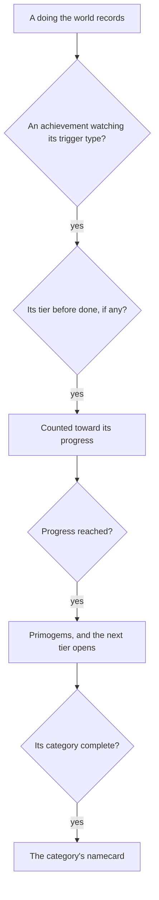

# Achievements

The game's achievements reward a player for what they have done anywhere in it: the quests, the exploring, the fishing, the combat feats and the odd discoveries. Each pays Primogems, and finishing a whole category earns its namecard. Achievements count what every other page records, so this page comes late, and waits on the [quests](/docs/proposals/genshin/quests) being advanced by the world's doings, which are most of what it watches.

## Decisions

- **Every achievement is the game's own row.** `AchievementExcelConfigData` holds each: its category (`goalId`), its trigger (`triggerConfig`, a trigger type and its parameters), the count it needs (`progress`), its reward (`finishRewardId`), the tier before it (`preStageAchievementId`) and whether it is hidden until done. `AchievementGoalExcelConfigData` holds each category and its completion reward. Titles and descriptions are the game's by text id.
- **A watcher per trigger type.** An achievement watches the one kind of doing its trigger names and counts it toward its progress. Most triggers are doings the world already records: a quest or a quest's parent finished, a chest opened, a waypoint or an area unlocked, a statue's or an offering's level, a material obtained, a fish caught. Each trigger type is wired once to the record it reads, and every achievement of that type works from then on.
- **Server-fired triggers are written one by one.** Hundreds of achievements are triggered by a scene group's notice or a combat config, which run on the game's servers and are never in the client. Each of these is written from its own description, as a check over the world's doings, when the page building its subject lands: a puzzle's with the puzzle, a combat feat's with the kits.
- **Tiers chain.** An achievement with a tier before it counts only once that tier is done, and its icon's stars show the tiers, as the game shows them.
- **Paid in Primogems, and a namecard per category.** Each achievement's reward is its reward row, and finishing every achievement of a category that has an end gives its namecard; the open-ended categories give none.
- **Kept with the player's progress**, each achievement's count and when it was done.

## How it works

## Scope and order

**Today:** the Achievements screen kind exists with nothing behind it.

**This adds, in order:**

1. **The table, the watchers and the screen**, with the quest triggers first, since the quests already advance.
2. **Exploring's triggers**: chests, waypoints, areas, statues and offerings, as those pages land.
3. **Each server-fired achievement**, with the page that builds its subject.

## Data and measures

- **Read from the game's tables:** `AchievementExcelConfigData` and `AchievementGoalExcelConfigData`, their reward rows, and their words by text id.
- **Read from the wiki:** what a server-fired achievement asks for, wherever its own words are vague.

## Key files

| File                                                        | Role after the change                      |
| :---------------------------------------------------------- | :----------------------------------------- |
| `packages/genshin-world/src/models/quest/QuestEvent.ts`     | The doings an achievement's watcher reads  |
| `packages/genshin-world/src/services/quest/advanceQuest.ts` | Beside the watchers handed the same doings |
| `packages/genshin-world/src/models/screen/ScreenKind.ts`    | `Achievements`, filled in                  |
| `packages/genshin-world/src/models/inventory/Wallet.ts`     | The Primogems an achievement pays          |

## Sources

- [Achievements](https://genshin-impact.fandom.com/wiki/Achievements), Genshin Impact Wiki: Primogems for each, a namecard for a category done, open-ended categories, and tiers shown as stars.
- [AnimeGameData](https://github.com/DimbreathBot/AnimeGameData), the community's per-patch dump: the achievement table with each one's category, trigger, progress, reward and tier, and the categories' table.
