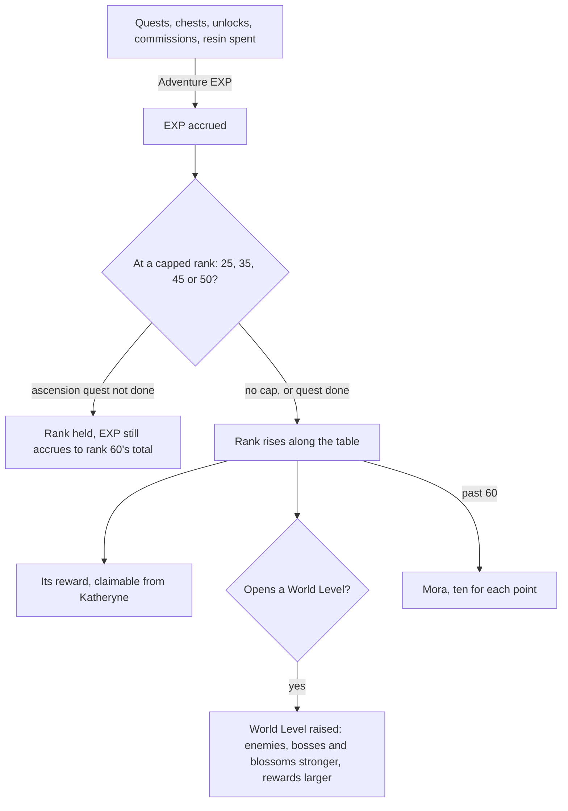

# Adventure Rank

Adventure Rank is the player's own progression, apart from any character's. It gates most of what the game opens: character and weapon ascension phases, domains, commissions, reputation, the Serenitea Pot and co-op. The World Level that follows it sets how strong the open world's enemies are and how much they give. Nothing in the world counts it yet, so the character screen's ascension waits on it, as does every system after it here. The rank itself waits on nothing; only its ascension quests wait on the quests being carried.

## Decisions

- **Ranks 1 to 60 by the game's table.** Each rank's Adventure EXP, the reward it brings and the World Level it opens are `PlayerLevelExcelConfigData`'s rows, read by a run of `genshin:assets`. EXP gained past rank 60 is paid in Mora instead, ten for each point.
- **Every source states its own EXP.** Quests, chests, Teleport Waypoints and statues unlocked, Oculi, commissions and the handbook's Experience chapters each give the Adventure EXP their own page or table sets, and spending Original Resin gives five for each one spent ([original resin](/docs/proposals/genshin/original-resin)).
- **The ascension quests hold the rank.** At 25, 35, 45 and 50 the rank waits on its ascension quest (`PlayerLevelLockExcelConfigData` names each cap and the quest that lifts it). EXP keeps accruing meanwhile, up to rank 60's total, and the rank catches up the moment the quest is done. Each quest is one of the carried [quests](/docs/proposals/genshin/quests).
- **A rank's reward is claimed from Katheryne.** Each rank's reward is its `rewardId` in `RewardExcelConfigData`, claimed by talking to Katheryne at any branch of the Adventurers' Guild, as the game hands it out.
- **The World Level follows the rank.** It rises with the rank where the lock table says, the later ones only after their ascension quest, up to 9. It raises the open world's enemies, normal bosses and ley line outcrops, and their rewards with them. From World Level 3 it can be lowered by one, and changed again only after 24 hours, as the game allows.
- **A spawn's level at each World Level is read, not guessed.** A camp in region data keeps its level at World Level 0, and the World Level raises it as the game does. `WorldLevelExcelConfigData` gives a level for each World Level, and how it raises a spawn is checked against the wiki's ranges of enemy levels before the enemies read it.
- **What a rank opens is stated by its system.** Each page here names the rank its system opens at, from the wiki's table of unlocks, since the game's own open-state table names each system only by a number. The Paimon menu's entry for a system not yet open stays disabled, as it already is for one not built.
- **Kept with the player's progress.** The rank, its EXP, the World Level and the ranks' rewards claimed are kept in the browser with the quests' progress, since the world is the person's own.

## How it works

## Scope and order

**Today:** nothing counts Adventure EXP, every enemy stands at the level its camp sets, and the character screen's ascension has no rank to check.

**This adds, in order:**

1. **The rank and its EXP**, from the table, with resin's and quests' EXP as those pages land.
2. **The World Level**, raising the enemies' levels and their drops' bands.
3. **The ascension quests' holds**, with the quests that lift them.
4. **The ranks' rewards** from Katheryne, once she stands in Mondstadt's region data.
5. **Lowering the World Level**, from the profile card, once the [menu screens](/docs/proposals/genshin/menu-screens)' open question of what the card shows is settled.

## Data and measures

- **Read from the game's tables:** `PlayerLevelExcelConfigData`, `PlayerLevelLockExcelConfigData`, `WorldLevelExcelConfigData` and the ranks' rows of `RewardExcelConfigData`.
- **Read from the wiki:** which rank opens each system.
- **Checked:** how a World Level raises a spawn's level, against the wiki's enemy level ranges per World Level.

## Key files

| File                                                             | Role after the change                               |
| :--------------------------------------------------------------- | :-------------------------------------------------- |
| `packages/genshin-world/src/services/enemy/computeEnemyStats.ts` | Reads a spawn's level raised by the World Level     |
| `packages/genshin-world/src/services/enemy/computeEnemyDrops.ts` | Rolls drops at the raised level's band              |
| `packages/genshin-world/src/models/inventory/Wallet.ts`          | The Mora paid past rank 60                          |
| `packages/genshin-world/src/services/handbook/constants.ts`      | The Experience tab's chapters, once the rank exists |
| `packages/genshin-world/src/components/Menu/Paimon/Index.vue`    | Keeps an entry disabled until its system's rank     |

## Sources

- [Adventure Rank](https://genshin-impact.fandom.com/wiki/Adventure_Rank), Genshin Impact Wiki: ranks to 60 and World Levels to 9, Adventure EXP's sources, Mora past 60, the ascension quests at 25, 35, 45 and 50 with EXP accruing meanwhile, rewards from Katheryne, what a World Level raises, lowering it from World Level 3 once in 24 hours, the enemy level ranges, and the systems each rank opens.
- [Original Resin](https://genshin-impact.fandom.com/wiki/Original_Resin), Genshin Impact Wiki: five Adventure EXP for each resin spent.
- [AnimeGameData](https://gitlab.com/Dimbreath/AnimeGameData), the community's per-patch dump: the player level, level lock and world level tables, and the open-state table that names systems only by number.
