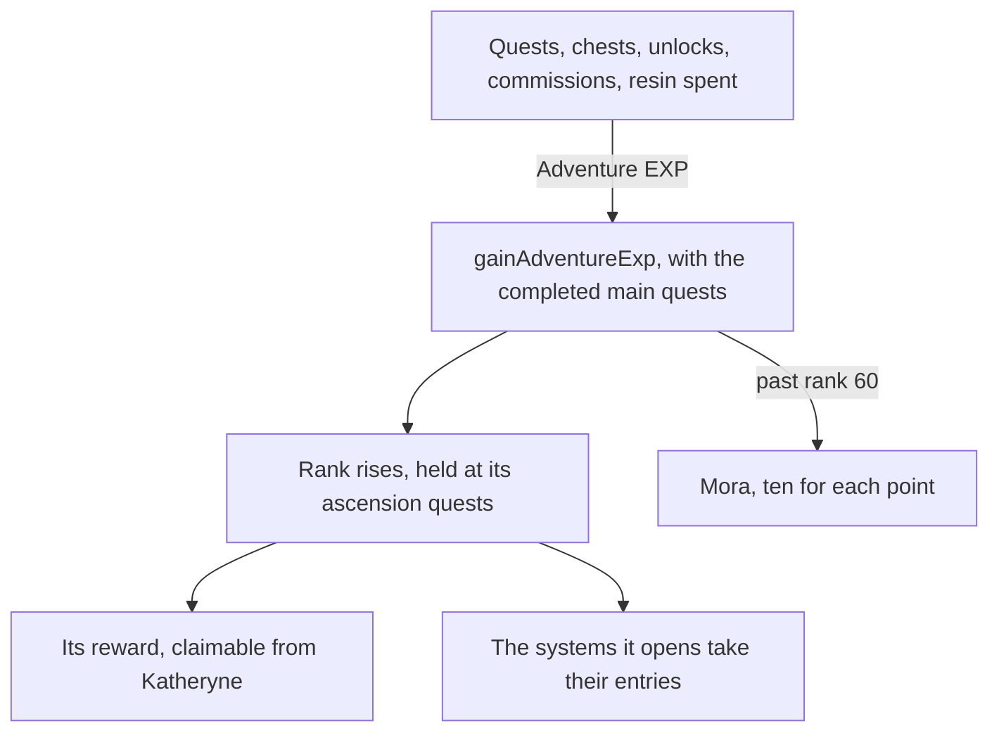

# Adventure Rank

The rank, its holds, the World Level, the enemies it raises and the profile card's values are built ([Adventure Rank](/docs/genshin/adventure-rank)). What remains reaches the player through other pages: the Adventure EXP that quests, chests, unlocks, commissions and spent resin give, the rewards each rank hands out, the systems a rank opens, and the profile card's World Level lowering. Each waits on its own page, so each is built there.

## Decisions

- **Every source states its own EXP.** Quests, chests, Teleport Waypoints and statues unlocked, Oculi, commissions and the handbook's Experience chapters each give Adventure EXP their own page or table sets, and spending Original Resin gives five for each one spent ([original resin](/docs/proposals/genshin/original-resin)). Each source's page adds it through `gainAdventureExp`, which takes the completed main quests and returns the Mora a gain past rank 60 pays.
- **A rank's reward is claimed from Katheryne.** Each rank's reward is its `rewardId` in `RewardExcelConfigData`, claimed by talking to Katheryne at any branch of the Adventurers' Guild, as the game hands it out.
- **What a rank opens is stated by its system.** Each page names the rank its system opens at, from the wiki's table of unlocks, since the game's own open-state table names each system only by a number. The Paimon menu's entry for a system not yet open stays disabled, as it already is for one not built.
- **The lowering's button sits in the card's World Level row, drawn only when the change is allowed.** It shows "Lower World Level" at the unlocked minimum (World Level 3) and above, and "Revert World Level" once lowered, through the game's own keys. Its place is provisional until the English client's menu is measured. A press inside the 24-hour cooldown changes nothing, as `toggleWorldLevelLowering` returns the adjustment unchanged.
- **The adjustment is saved as a required slice with its moment as an ISO string.** `worldLevelAdjustment` holds `isLowered` and `changedAt`, the latter left out until the player first changes it. A guest's save merges by the copy changed later.
- **Kept with the player's progress.** The rank, its EXP, the World Level and the ranks' rewards claimed are kept with the quests' progress, since the world is the person's own. The save already holds the EXP and the quests' progress ([save data](/docs/genshin/save-data)), so a gain is kept once the session holds the EXP live rather than carrying the saved value.
- **The EXP is live in the session, its first source a statue's first unlock.** The world's session holds the Adventure EXP, reads the standing from it and the main quests the carried quests have finished, and pays a gain's Mora past rank 60 into the wallet. Its first source is the one already paying: a statue's first unlock, whose transport point's row holds 50 Adventure EXP beside its Primogems (`generated/transPoints/scene3.json`).
- **Bosses and ley line outcrops stand at the World Level.** Their enemies and rewards follow the World Level as the wiki gives them, on the pages that build them.
- **The profile card's lowering is what is left of it.** The card already shows the rank, the EXP's bar toward the next rank and the World Level from the standing. The bar fills as the [adventure rank](/docs/genshin/adventure-rank) page sets out, where the EXP already runs past the next rank's total (`computeAdventureRankProgress`). The World Level's tooltip is to lower it by one from World Level 3 through `toggleWorldLevelLowering`. Its words are the game's own manual keys, found with `genshin:text find`: `UI_WORLDLEVEL_ADJUST_TITLE` ("Change World Level"), `UI_WORLDLEVEL_DOWN_BUTTON` ("Lower World Level"), `UI_WORLDLEVEL_UP_BUTTON` ("Revert World Level"), and `UI_WORLDLEVEL_ADJUST_DOWN_TIPS` and `UI_WORLDLEVEL_ADJUST_UP_TIPS` for what each change does.

## How it works

## Scope and order

**Still to build, in order:**

1. **The lowering's tooltip panel**: the game's tips (`UI_WORLDLEVEL_ADJUST_DOWN_TIPS` and `UI_WORLDLEVEL_ADJUST_UP_TIPS`), the cooldown hint (`UI_WORLDLEVEL_ADJUST_CD_HINT`) and the title (`UI_WORLDLEVEL_ADJUST_TITLE`) are added to `GameTextKey` once the panel draws them; the button already lowers and restores through `toggleWorldLevel`.
2. **The other Adventure EXP sources, as their pages land.** Each calls `gainWorldAdventureExp`; the quests carried by the [quests](/docs/proposals/genshin/quests) page feed the holds as they complete.
3. **Katheryne's rewards.** Waits on Katheryne standing among Mondstadt's residents in region data, which the [resident schedules](/docs/proposals/genshin/resident-schedules) build: none of her name's text ids is a resident's yet.
4. **The Paimon menu's rank gates**, as the systems' pages open.

**No backfill is owed:** the `worldLevelAdjustment` slice is a required key, but on 2026-10-09 neither `devstesposter001` nor `prodstesposter001` holds a `genshin-assets` container (`az storage container list`), so no stored save predates it.

## Data and measures

- **Read from the game's tables:** the ranks' rows of `RewardExcelConfigData`, read when Katheryne lands.
- **Read from the wiki:** which rank opens each system.

## Key files

| File                                                          | Role after the change                                                        |
| :------------------------------------------------------------ | :--------------------------------------------------------------------------- |
| `packages/genshin-world/src/components/Menu/Paimon/Index.vue` | Keeps an entry disabled until its system's rank, and draws the card's values |
| `packages/genshin-world/src/services/handbook/constants.ts`   | The Experience tab's chapters, once the EXP sources exist                    |
| `packages/genshin-world/src/data/regions/mondstadt.json`      | Katheryne's place among Mondstadt's residents, for the rewards               |

## Sources

- [Adventure Rank](https://genshin-impact.fandom.com/wiki/Adventure_Rank), Genshin Impact Wiki: rewards from Katheryne at each rank, and the systems each rank opens.
- [Original Resin](https://genshin-impact.fandom.com/wiki/Original_Resin), Genshin Impact Wiki: five Adventure EXP for each resin spent.
- [AnimeGameData](https://github.com/DimbreathBot/AnimeGameData), the community's per-patch dump: `RewardExcelConfigData`, the table the ranks' rewards are read from.
