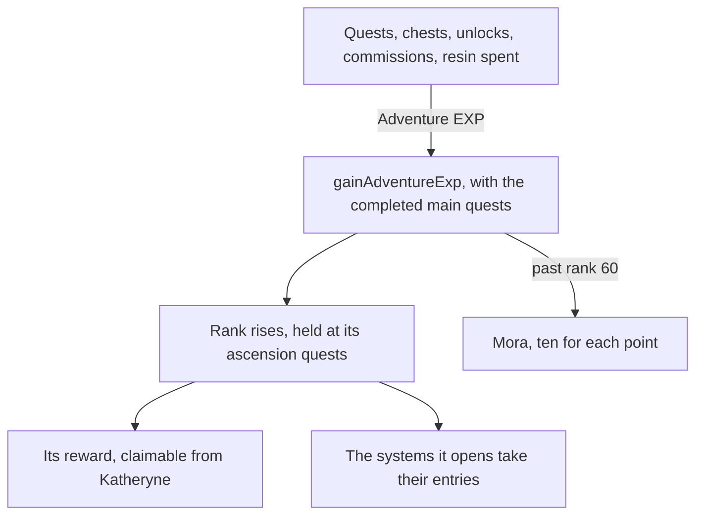

# Adventure Rank

The rank, its holds, the World Level, the enemies it raises and the profile card's values are built ([Adventure Rank](/docs/genshin/adventure-rank)). What remains reaches the player through other pages: the Adventure EXP that quests, chests, unlocks, commissions and spent resin give, the rewards each rank hands out, the systems a rank opens, and the profile card's World Level lowering. Each waits on its own page, so each is built there.

## Decisions

- **Every source states its own EXP.** Quests, chests, Teleport Waypoints and statues unlocked, Oculi, commissions and the handbook's Experience chapters each give Adventure EXP their own page or table sets, and spending Original Resin gives five for each one spent ([original resin](/docs/proposals/genshin/original-resin)). Each source's page adds it through `gainAdventureExp`, which takes the completed main quests and returns the Mora a gain past rank 60 pays.
- **A rank's reward is claimed from Katheryne.** Each rank's reward is its `rewardId` in `RewardExcelConfigData`, claimed by talking to Katheryne at any branch of the Adventurers' Guild, as the game hands it out.
- **What a rank opens is stated by its system.** Each page names the rank its system opens at, from the wiki's table of unlocks, since the game's own open-state table names each system only by a number. The Paimon menu's entry for a system not yet open stays disabled, as it already is for one not built.
- **Kept with the player's progress.** The rank, its EXP, the World Level and the ranks' rewards claimed are kept in the browser with the quests' progress, since the world is the person's own. The quests' progress is not kept yet, so this waits on it.
- **Bosses and ley line outcrops stand at the World Level.** Their enemies and rewards follow the World Level as the wiki gives them, on the pages that build them.
- **The profile card's lowering is what is left of it.** The card already shows the rank, the EXP's bar toward the next rank and the World Level from the standing. The bar fills as the [adventure rank](/docs/genshin/adventure-rank) page sets out, where the EXP already runs past the next rank's total (`computeAdventureRankProgress`). The World Level's tooltip is to lower it by one from World Level 3 through `toggleWorldLevelLowering`; the words for that tooltip are not in the game text yet, so the lowering waits on them.

## How it works

## Scope and order

1. **The Adventure EXP sources, as their pages land.** Each calls `gainAdventureExp` with the main quests done. The quests carried by the [quests](/docs/proposals/genshin/quests) page feed the holds as they complete.
2. **Katheryne's rewards**, once she stands in Mondstadt's region data, which holds no residents yet.
3. **The profile card's lowering**, once its tooltip's words are in the game text, and the rank's persistence once the quests' progress is kept.
4. **The Paimon menu's rank gates**, as the systems' pages open.

## Data and measures

- **Read from the game's tables:** the ranks' rows of `RewardExcelConfigData`, read when Katheryne lands.
- **Read from the wiki:** which rank opens each system.

## Key files

| File                                                          | Role after the change                                                        |
| :------------------------------------------------------------ | :--------------------------------------------------------------------------- |
| `packages/genshin-world/src/components/Menu/Paimon/Index.vue` | Keeps an entry disabled until its system's rank, and draws the card's values |
| `packages/genshin-world/src/services/handbook/constants.ts`   | The Experience tab's chapters, once the EXP sources exist                    |
| `packages/genshin-world/src/data/regions/mondstadt.json`      | Katheryne's place among Mondstadt's residents, for the rewards               |

## Sources

- [Adventure Rank](https://genshin-impact.fandom.com/wiki/Adventure_Rank), Genshin Impact Wiki: rewards from Katheryne at each rank, and the systems each rank opens.
- [Original Resin](https://genshin-impact.fandom.com/wiki/Original_Resin), Genshin Impact Wiki: five Adventure EXP for each resin spent.
- [AnimeGameData](https://github.com/DimbreathBot/AnimeGameData), the community's per-patch dump: `RewardExcelConfigData`, the table the ranks' rewards are read from.
