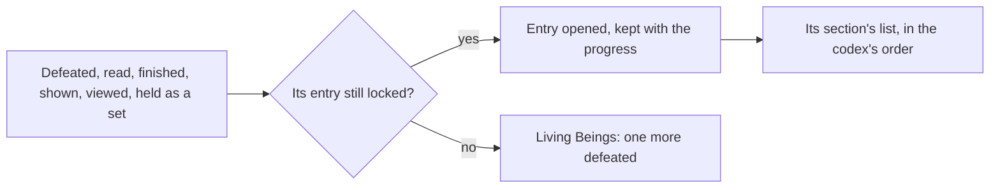

# Archive

The Archive's seven sections, their entries read from the game's codex tables, the bag's opening of Equipment and Materials, and the unlock after the quest it opens after are built, as the [Archive](/docs/genshin/archive) page sets out. What remains is what the other sections open by doings the world does not have yet.

## Decisions

- **An entry opens when its thing is first met.** A tutorial when shown; a viewpoint when taken in; a quest when finished; a book when read; an enemy or an animal when first defeated; an artifact set once all its pieces have been held. Opened entries are kept with the player's progress.
- **Living Beings counts kills.** Each enemy's and animal's entry shows how many have been defeated, and its model turns on the screen as the game's does, drawn by the [characters](/docs/genshin/characters) reader once its model is built.
- **A viewpoint is taken in where it stands.** Each viewpoint is a place in the world that, reached, offers to be viewed, which opens its entry with its picture as the game does; its picture is drawn by the world from its place, never the game's image.

## How it works

## Scope and order

**This adds, in order:**

1. **Living Beings' kills**, once a monster's name is read from a source the dump lacks and the wildlife's kills count.
2. **Travel Log**, as the quest page finishes quests and counts them.
3. **Books**, once a book can be read.
4. **Tutorials**, once their names are read and a tip is shown.
5. **Geography's viewpoints**, at their places.
6. **Artifact sets**, once the bag keeps each artifact's set, so that all five pieces can be counted.

## Data and measures

- **Each viewpoint's place:** from the scene points where it is one, or the spawned places' fit where it is not.
- **Each monster's name:** the dump's monster rows name no text, so a name table or a text source is needed before the monsters can be listed and counted.

## Key files

| File                                                            | Role after the change                                 |
| :-------------------------------------------------------------- | :---------------------------------------------------- |
| `packages/genshin-world/src/components/World/Enemies/Index.vue` | The defeat that counts toward a living being's entry  |
| `packages/genshin-world/src/models/inventory/ItemDefinition.ts` | Carries an artifact's set, which the bag does not yet |
| `scripts/src/services/genshinAssets/enemies/writeEnemyKinds.ts` | Already reads the living beings' codex                |

## Sources

- [Archive](https://genshin-impact.fandom.com/wiki/Archive), Genshin Impact Wiki: entries opened when first obtained or defeated, artifact sets once every piece is held, kill counts and turning models, and Geography's viewpoints.
- [AnimeGameData](https://github.com/DimbreathBot/AnimeGameData), the community's per-patch dump: the codex tables the built sections read, and the view codex whose places the viewpoints are placed by.
