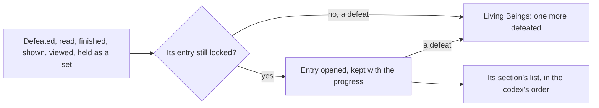

# Archive

The Archive's seven sections, their entries read from the game's codex tables, the bag's opening of Equipment and Materials, and the unlock after the quest it opens after are built, as the [Archive](/docs/genshin/archive) page sets out. What remains is what the other sections open by doings the world does not have yet.

## Decisions

- **An entry opens when its thing is first met.** A tutorial when shown; a viewpoint when taken in; a quest when finished; a book when read; an enemy or an animal when first defeated; an artifact set once all its pieces have been held. Opened entries are kept with the player's progress.
- **Living Beings counts kills.** Each enemy's entry shows how many have been defeated, and each animal's waits on the wildlife's strike, and its model turns on the screen as the game's does, drawn by the [characters](/docs/genshin/characters) reader once its model is built.
- **An artifact set opens from the artifacts held, not the bag's entries.** A player's artifact is an `Artifact`, which already carries its `setId` and `slot`, so the set is read off the artifact and the bag needs no set id. A set's Equipment entry opens the first time the artifacts held cover as many slots of it as it has pieces, five, or one for a one-piece set, as `packages/genshin-world/src/data/items/reliquarySets.json` lists them; set ids there are the Equipment entries' own. It stays open, as every entry does. Counting the pieces held at one time rather than every piece ever held keeps the save unchanged, and differs from the game only where a piece was destroyed before the set's last was found.
- **A viewpoint is placed by its scene group.** Each `ViewCodexExcelConfigData` row names its viewpoint by `groupId` and `configId`, which only the scene group export places; the official map's Viewpoint label (85) places 224 points with no name to join them by, so it is not used.
- **A viewpoint is taken in where it stands.** Each viewpoint is a place in the world that, reached, offers to be viewed, which opens its entry with its picture as the game does; its picture is drawn by the world from its place, never the game's image.

## How it works



## Scope and order

**This adds, in order:**

1. **Artifact sets, as a rule.**

   ```text
   packages/genshin-world/src/services/archive/openArchiveArtifactSets.ts
   ```

   - `openArchiveArtifactSets.ts`: given the progress, the artifacts held (`Pick<Artifact, "setId" | "slot">`) and each set's piece count read from `data/items/reliquarySets.json` (`pieceItemIds.length` by `id`), the progress with the Equipment entry of every set whose held artifacts cover that many distinct slots opened, leaving the progress given as it was, as `openArchiveEntries` does. The rule is handed the Equipment entries' ids too, since sets 15004 and 15012 have none and open nothing.
   - The proof: `openArchiveArtifactSets.test.ts` beside it holds four slots of a five-piece set and leaves it locked, adds the fifth and opens it, opens the one-piece set 15009 on one circlet, and keeps an entry already open when its pieces are gone.
   - Its caller is wherever the player's artifacts change, which the first artifact drop brings.

2. **Wildlife's Living Beings**, once an animal is struck and its kills count.
3. **Tutorials' opening**, once a tip is shown.
4. **Geography's viewpoints**, at their places, once the scene group export the other machine is making places each view codex row's group.

## Data and measures

- **Each viewpoint's place:** from the scene points where it is one, or the spawned places' fit where it is not.
- **Books placed in the world:** the reader and the unlock are built, but no world drop is a volume's material yet, so a volume is picked up only once the world places the books (the pick up is `pickUpWorldDrop`'s branch in the as-built page).

## Key files

| File                                                                | Role after the change                                |
| :------------------------------------------------------------------ | :--------------------------------------------------- |
| `packages/genshin-world/src/components/World/Enemies/Index.vue`     | The defeat that counts toward a living being's entry |
| `packages/genshin-world/src/services/archive/openArchiveEntries.ts` | Opens entries, beside which the artifact sets open   |
| `scripts/src/services/genshinAssets/enemies/writeEnemyKinds.ts`     | Already reads the living beings' codex               |

## Sources

- [Archive](https://genshin-impact.fandom.com/wiki/Archive), Genshin Impact Wiki: entries opened when first obtained or defeated, artifact sets once every piece is held, kill counts and turning models, and Geography's viewpoints.
- [AnimeGameData](https://github.com/DimbreathBot/AnimeGameData), the community's per-patch dump: the codex tables the built sections read, and the view codex whose places the viewpoints are placed by.
