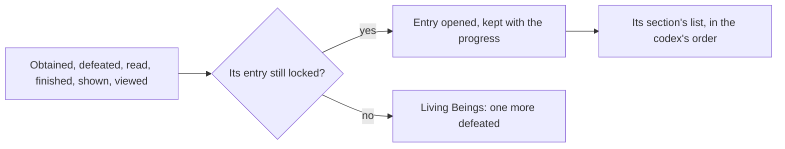

# Archive

The Archive is the game's encyclopedia of what a player has met: every weapon and artifact set held, every enemy and animal defeated, every tutorial seen, every viewpoint found, every quest finished and book read, and every material obtained. An entry is locked until its thing is first met, so the Archive is a record of the player's whole journey. The screen kind exists already with nothing behind it. It reads what the other pages record, so it waits on the [quests](/docs/proposals/genshin/quests) and on the [wildlife](/docs/proposals/genshin/wildlife), whose kills fill Living Beings beside the [enemies](/docs/genshin/enemies)'.

## Decisions

- **Seven sections, each from the game's own codex.** Equipment lists weapons from `WeaponCodexExcelConfigData` and artifact sets from `ReliquaryCodexExcelConfigData`; Living Beings lists enemies and wildlife from `AnimalCodexExcelConfigData`, which the enemies' run already reads; Books from `BooksCodexExcelConfigData` and `BookSuitExcelConfigData`; Materials from `MaterialCodexExcelConfigData`; Geography's viewpoints from `ViewCodexExcelConfigData`; Travel Log's quests from `QuestCodexExcelConfigData`; and Tutorials from `PushTipsCodexExcelConfigData`. Each entry's words and order are the table's.
- **An entry opens when its thing is first met.** A weapon or a material when obtained; an artifact set once all its pieces have been; an enemy or an animal when first defeated; a book when read; a quest when finished; a tutorial when shown; a viewpoint when taken in. Opened entries are kept with the player's progress.
- **Living Beings counts kills.** Each enemy's and animal's entry shows how many have been defeated, and its model turns on the screen as the game's does, drawn by the [characters](/docs/genshin/characters)' reader once its model is built.
- **A viewpoint is taken in where it stands.** Each viewpoint is a place in the world that, reached, offers to be viewed, which opens its entry with its picture as the game does; its picture is drawn by the world from its place, never the game's image.
- **Unlocked after its quest.** The Archive opens once its quest is done, as the game opens it, and the Paimon menu's entry stays disabled until then.

## How it works

## Scope and order

**Today:** the Archive's screen kind is a placeholder.

**This adds, in order:**

1. **The screen and its sections**, from the codex tables.
2. **Equipment and Materials**, opened by the bag.
3. **Living Beings**, opened and counted by defeats.
4. **Travel Log, Books and Tutorials**, as quests, books and tutorials land.
5. **Geography's viewpoints**, at their places.

## Data and measures

- **Read from the game's tables:** the codex tables named above and their words by text id.
- **Placed by the game's data:** each viewpoint's place, from the scene points where it is one, or the spawned places' fit where it is not.

## Key files

| File                                                                | Role after the change                  |
| :------------------------------------------------------------------ | :------------------------------------- |
| `packages/genshin-world/src/models/screen/ScreenKind.ts`            | `Archive`, filled in                   |
| `packages/genshin-world/src/services/enemy/damageEnemy.ts`          | A defeat, counted toward its entry     |
| `packages/genshin-world/src/services/inventory/addInventoryItem.ts` | An item obtained, opening its entry    |
| `scripts/src/services/genshinAssets/enemies/writeEnemyKinds.ts`     | Already reads the living beings' codex |

## Sources

- [Archive](https://genshin-impact.fandom.com/wiki/Archive), Genshin Impact Wiki: its unlock after its quest, its sections, entries opened when first obtained or defeated, artifact sets once every piece is held, kill counts and turning models, and Geography's viewpoints.
- [AnimeGameData](https://gitlab.com/Dimbreath/AnimeGameData), the community's per-patch dump: the weapon, artifact, animal, book, material, view and quest codex tables.
