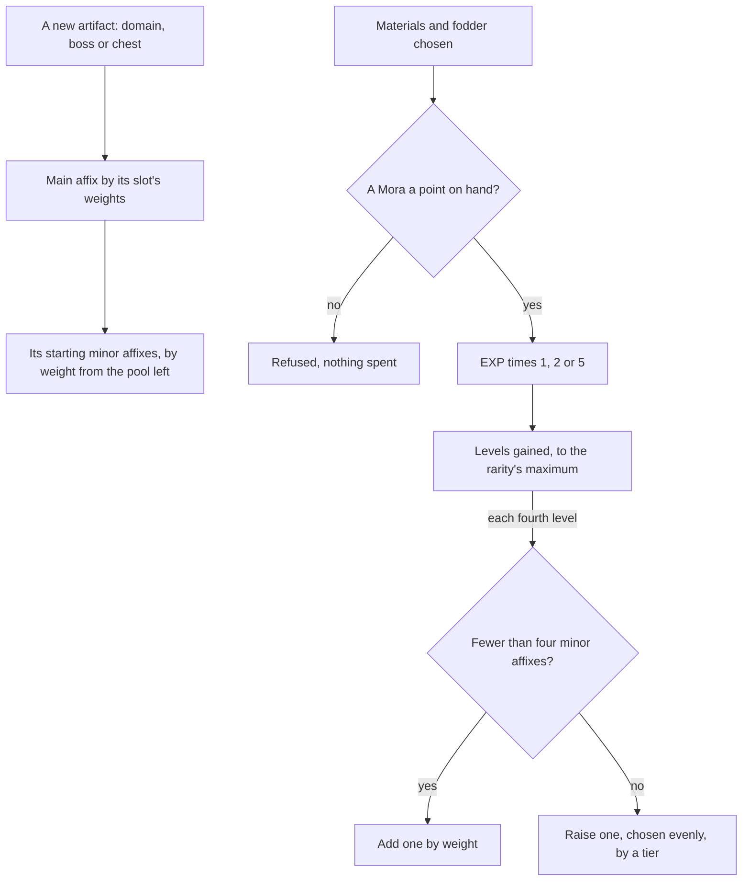

# Artifact enhancement

An artifact's attributes are already summed: its main affix at its rarity and level, its minor affixes, and its set's unconditional bonuses ([character attributes](/docs/genshin/character-attributes)). What is left is how an artifact comes to have them: how a new one is rolled when a domain, a boss or a chest gives it, how enhancing raises it, and the four-piece bonuses that act only in combat, which act through the [character kits](/docs/proposals/genshin/character-kits) and so wait on them.

## Decisions

- **A new artifact is rolled by the game's rules.** Its main affix is drawn from its slot's pool, and its minor affixes from the pool left once the main affix and those already drawn are taken out. Flat and percentage attributes count apart, so a Plume of Death may roll ATK% but never flat ATK. Each draw is weighted as the wiki's distribution tables give it, since the client holds the pools (`ReliquaryMainPropExcelConfigData`, `ReliquaryAffixExcelConfigData`) but not their weights.
- **A minor affix's value is one of its tiers, drawn evenly.** `ReliquaryAffixExcelConfigData` holds each minor affix's tiers for each rarity's depot, and every roll, the first or an upgrade, takes one of them with equal chance.
- **How many it starts with is the table's.** `ReliquaryExcelConfigData` gives each piece's rarity, its maximum level, how many minor affixes it starts with and the levels a new one is added at, and its base Artifact EXP as fodder.
- **Every fourth level adds or raises one.** At each fourth level, an artifact with fewer than four minor affixes gains one from the pool, and one with four raises one of them, chosen evenly, by a tier.
- **Artifact EXP costs a Mora a point.** Materials give their EXP, and a fodder artifact its rarity's base plus 80% of what it was levelled with, the recovered share costing no Mora. Each enhancement's EXP is multiplied by 1 at 90%, 2 at 9% or 5 at 1%, as the wiki gives the bonus, drawn from the world's seeded random source.
- **A set's conditional bonus is a module.** A two or four-piece bonus that waits on combat, such as a burst used or a reaction triggered, is written as a small module over the kits' shared effects, its numbers the set table's, as a weapon's passive is. Its unconditional attributes stay what the sum already reads.
- **A worn or locked artifact is never fodder.** Locking keeps one from being consumed, and the wearer's pieces are always kept.

## How it works

## Scope and order

**Today:** an artifact is its set, slot, rarity, level, main affix and minor affixes, summed into its wearer's attributes; nothing makes or enhances one.

**This adds, in order:**

1. **Rolling a new artifact**, which the [domains](/docs/proposals/genshin/domains), [bosses](/docs/proposals/genshin/bosses) and [chests](/docs/proposals/genshin/chests) call when they give one.
2. **Enhancing**, with its EXP, Mora and bonus.
3. **Locking**, kept with the artifact.
4. **Each set's conditional bonus**, a module as the set is carried.

## Data and measures

- **Read from the game's tables:** `ReliquaryExcelConfigData`, `ReliquaryMainPropExcelConfigData`, `ReliquaryAffixExcelConfigData` and the level table the stats run already reads, and the sets' conditional numbers from `ReliquarySetExcelConfigData`'s affixes.
- **Read from the wiki:** the main and minor affixes' weights, and the chance of four starting minor affixes where the table gives the range alone.
- **Measured:** nothing.

## Key files

| File                                                                           | Role after the change                             |
| :----------------------------------------------------------------------------- | :------------------------------------------------ |
| `packages/genshin-world/src/models/artifact/Artifact.ts`                       | Gains its EXP and its lock                        |
| `packages/genshin-world/src/models/artifact/ArtifactSetData.ts`                | Gains its conditional bonuses' numbers            |
| `packages/genshin-world/src/services/artifact/getArtifactSetAttributeLines.ts` | Keeps the unconditional lines, beside the modules |
| `packages/genshin-world/src/models/inventory/Wallet.ts`                        | The Mora enhancing spends                         |
| `scripts/src/services/genshinAssets/stats/writeStatTables.ts`                  | Writes the artifact, main and minor affix tables  |

## Sources

- [Artifact](https://genshin-impact.fandom.com/wiki/Artifact), Genshin Impact Wiki: a main affix and up to four minor affixes, enhancing with Artifact EXP and Mora, and the next tier every fourth level.
- [Artifact: Distribution](https://genshin-impact.fandom.com/wiki/Artifact/Distribution), Genshin Impact Wiki: weighted main and starting minor affixes, the pool without the main affix and those drawn, flat and percentage counted apart, and values and upgrades drawn evenly.
- [Artifact EXP](https://genshin-impact.fandom.com/wiki/Artifact_EXP), Genshin Impact Wiki: a Mora a point, a fodder's base plus 80% of its own, and the bonus of two or five times.
- [AnimeGameData](https://gitlab.com/Dimbreath/AnimeGameData), the community's per-patch dump: the artifact, main and minor affix tables, which hold the pools and tiers but not the weights.
