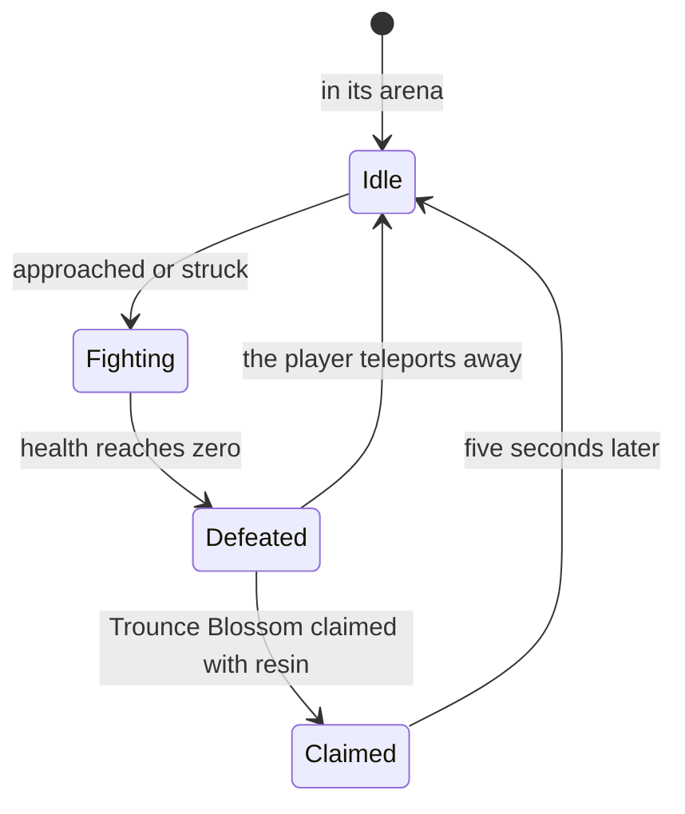

# Bosses

Bosses are the enemies whose reward is claimed rather than dropped. A normal boss gives the material each character ascends with, and a weekly boss the material talents need past level 6, so the character screen's ascension and the [talents](/docs/proposals/genshin/talents) lean on them. The [enemies](/docs/genshin/enemies) already place a boss's camp, respawn it at once and drop nothing for it, leaving its reward to its blossom; this page is that blossom and the fight before it. It waits on [Original Resin](/docs/proposals/genshin/original-resin)'s claim, the [domains](/docs/proposals/genshin/domains)' scenes the trounce domains are, and the [character kits](/docs/proposals/genshin/character-kits) that fight them.

## Decisions

- **A normal boss waits in its arena.** It stands idle at its arena's centre until a player comes too close or strikes it, as the wiki describes, which the enemies' notice already models. A few are fought only after a world quest's step or a simple puzzle, named with their camp.
- **Each boss fights by its own moves.** A boss's attacks, phases and shields are a module per boss over the enemies' step, its states, its notice and its leash kept as they are. Each module is written from the wiki's page of that boss, and its timings measured off recordings, as the controller's are. Bosses resist displacement, carry high interruption resistance and are never frozen by Frozen: the first two are the boss's poise type, and the last an immunity [combat](/docs/genshin/combat)'s Frozen learns to check.
- **A normal boss leaves a Trounce Blossom.** Its reward, Adventure EXP, Mora, Companionship EXP, its own ascension material and artifacts by World Level, is claimed for 40 resin. The boss comes back five seconds after the claim; left unclaimed, it stays defeated until the player teleports away, as the game does, which replaces the enemies' respawn "at once" for a boss.
- **A weekly boss waits in its trounce domain.** Its domain opens once the Archon or story quest that introduces it is done, every day of the week, and is entered as any [domain](/docs/proposals/genshin/domains) is. Andrius alone is fought in the open world. From Adventure Rank 40, a locked one can be challenged from the handbook alone.
- **A weekly claim is once a week.** Each weekly boss's reward is claimed once a week, 30 resin for the first three weekly bosses claimed that week and 60 for any after. The count starts again at the weekly reset, Monday at 04:00 in the reader's own time zone, as the enemies' daily reset is the reader's own.
- **What a weekly boss gives.** Its talent materials, Adventure EXP, Mora, Companionship EXP, ascension gems and artifacts by World Level, with a 12% chance of a billet for forging and a 33% chance of a Dream Solvent, as the wiki gives them. Its highest difficulty's first clear also gives one of each of its materials, claimed in the handbook.

## How it works

## Scope and order

**Today:** a boss's camp respawns at once and drops nothing, its reward left to a blossom nothing spawns; every enemy fights by the same generic step.

**This adds, in order:**

1. **The Trounce Blossom and its claim**, with the respawn after it, for the first normal boss in Mondstadt.
2. **The first boss's own moves**, then each boss's as its region is built.
3. **Weekly bosses**, in their trounce domains, with the weekly count and the weekly reset.
4. **The handbook's quick challenge and first-clear rewards.**

## Data and measures

- **Read from the game's tables:** each boss's kind from the monster table, which the enemies' run already reads, the trounce domains from the dungeon table, and the claims' reward rows.
- **Read from the wiki:** each boss's moves and phases, and its rolled drops by World Level.
- **Measured:** each boss's attacks' timings, ranges and speeds, off recordings of the fight, provisional until then.

## Key files

| File                                                                   | Role after the change                                 |
| :--------------------------------------------------------------------- | :---------------------------------------------------- |
| `packages/genshin-world/src/services/enemy/stepEnemy.ts`               | Hands a boss's moves to its module, its states kept   |
| `packages/genshin-world/src/services/enemy/computeEnemyRespawnTime.ts` | A boss back five seconds after its claim, not at once |
| `packages/genshin-world/src/services/enemy/computeEnemyDrops.ts`       | Still nothing for a boss, its reward the blossom's    |
| `packages/genshin-world/src/services/enemy/EnemyKindTraitsMap.ts`      | Each boss's poise type and immunities                 |
| `scripts/src/services/genshinAssets/enemies/writeEnemyKinds.ts`        | Writes the bosses' kinds as it writes every camp's    |

## Sources

- [Normal Bosses](https://genshin-impact.fandom.com/wiki/Normal_Bosses), Genshin Impact Wiki: arenas near waypoints, idle until approached, immune to Frozen and resistant to displacement, the Trounce Blossom for 40 resin and its rewards, and the respawn five seconds after a claim or only on teleporting away.
- [Weekly Bosses](https://genshin-impact.fandom.com/wiki/Weekly_Bosses), Genshin Impact Wiki: trounce domains opened by quests, Andrius in the open world, the quick challenge from Adventure Rank 40, the rewards with the billet's and Dream Solvent's chances, and the highest difficulty's first-clear reward.
- [Domains](https://genshin-impact.fandom.com/wiki/Domains), Genshin Impact Wiki: a weekly reward once a week, 30 resin for the first three and 60 after, refreshed at the weekly reset.
- [Daily Reset](https://genshin-impact.fandom.com/wiki/Daily_Reset), Genshin Impact Wiki: the weekly reset on Monday at 04:00.
