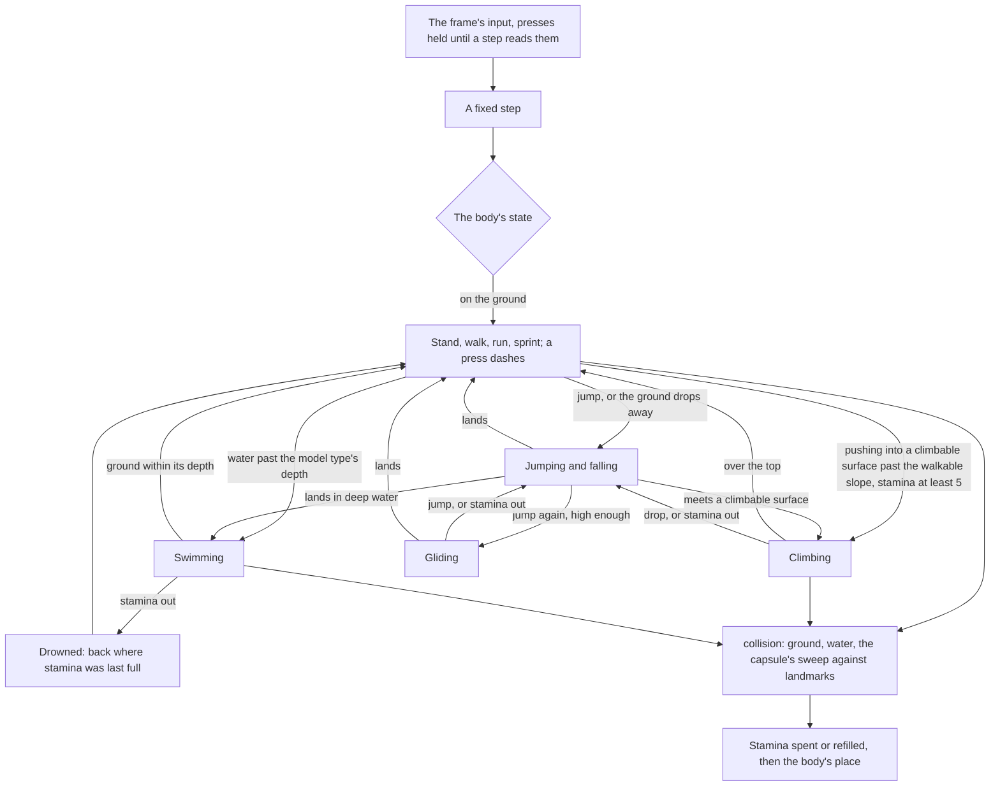

# Character controller

This page builds on the [free camera](/docs/genshin/free-camera), whose fixed-step loop, input and ground query it moves a body with. Today the world is flown. This page makes it walked. The game moves a character through a handful of states with a few keys, and one shared stamina pool limits the states that cost effort. This page moves a body through those states.

## Decisions

- **A kinematic body, moved by queries.** No rigid-body engine is added, for the reasons [exploring](/docs/proposals/genshin/exploring) settles. The body is a capsule the size of its model type's collider. Each step asks `collision` where the body may go: the ground's height and normal under it, the water's level, and a sweep of the capsule against the landmarks' meshes. `collision` gains that sweep here, as a shape cast through a bounding volume hierarchy built once per landmark. The body is the first caller exploring said would bring it.
- **The game's states, and only those.** The body stands, walks, runs or sprints on the ground, with a dash on the sprint key's press. It jumps and falls in the air, and opens a glider by jumping again once high enough. It climbs a surface too steep to walk on that `collision` reports climbable, since some, such as a domain's walls, are not at any angle, with a climb jump and a drop. It swims in water deeper than its model type's threshold, with a swim dash. Each step reads the input and what lies under and before the body, then moves to the next state by the gates in the diagram below.
- **Stepped at the world's fixed step, before the floating origin.** The body is advanced by the engine's `simulation` loop at the step the free camera runs on, registered ahead of the floating origin's shift as the free camera is. So a run covers the same ground at any frame rate, and the terrain reads where the body now stands. The input is read once a frame. A press (jump, dash, drop) is held by `input` from its key-down until a step consumes it, so a tap shorter than a frame is never lost.
- **The game's keys.** The keys are the game's defaults for PC and a controller. Move is on W, A, S and D and the left stick, relative to the camera's facing. Jump is Space, or A on a controller. Sprint is Left Shift, the right mouse button or the right bumper: a press dashes and a hold sprints. Left Ctrl switches between walking and running, and X (B on a controller) drops from a climb. `input` grows from the free camera's move and look to these bindings. The free camera keeps rising on Space and falling on Shift, now read from the jump and sprint bindings on the same keys.
- **Every number from the game, by the most exact source.** The controller sets no number itself. That covers the walk, run, sprint and swim speeds, the dash's distance, the jump's height and the fall's gravity, and the glide's forward speed and sink. It also covers the climb's speed and its jump, the step the body walks up, the steepest walkable slope, the depth where swimming starts, and the height a glider may open at. Each is read in the order [parity](/docs/genshin/parity) ranks sources:
  1. The game's locomotion clips, exported and decoded by `clips`, where a clip carries the body's root motion.
  2. The character's configuration in the community's data dump. Its field names are obfuscated, so a value is named only by matching it to a reading from another source.
  3. A recording. The body's path is read off it by where the exports' landmarks land, as the [recreation passes](/docs/proposals/genshin/recreation-passes)' motion pass reads motion no clip holds. Windrise's fitted statue and oak are the first landmarks a timed run passes.
- **A table per model type.** The game's playable characters use five model types, and the distances they sprint and jump differ by type, so the controller's numbers are a map keyed by model type. A type is filled when it is measured, never copied from another.
- **Stamina as the game's data gives it.** The pool is shared by the party and starts at 100. It refills at 25 a second once 1.5 seconds pass with no stamina action, and not at all while swimming. A dash costs 18 and sprinting 18 a second. A climb jump costs 25, each swimming stroke 4, and a swim dash 2 and then 10.2 a second. Gliding costs 3 a second while moving, and climbing needs 5 to start. These are the wiki's published readings. Each is written beside the key of the reference it is taken from and checked against the configuration in the dump wherever the value is found there. Two have no reading to take: the wiki gives the glide's cost as approximate and the climb's as unknown. Both are measured from a recording of the meter draining.
- **The maximum stays at 100.** In the game, offerings at the Statues of The Seven raise it as far as 240. The world has no offerings, so it keeps the starting pool, and offerings raise it the game's way when a page adds them.
- **Running out is the game's.** An action that costs stamina stops when the pool is empty: a sprint drops to a run, a climb lets go and falls, and a glide closes. In deep water the party drowns and is returned to the place where its stamina was last full, as the game returns it. How each stop looks is read off the recordings.

## How it works



The numbers are named work before any state is built. Each one becomes an investigation in the controller's reference, in the topic for its part: locomotion or stamina. Every investigation names its source, the reading and its outcome, and stays an open question until it is answered. Published recordings are searched first. The user records only what nothing published shows, from a clip spec of what to do second by second (the `genshin-parity` skill). The capsule's size per model type is read from the character's collider in the exports.

## Scope and order

**Today:** the free camera flies the world, and nothing stands, walks or spends stamina. `collision` answers the ground and the water only.

**This adds, in order:**

1. **The references.** The locomotion clips are found and decoded, the dump's values matched and the recordings' readings taken, for the first model type, before any constant is written.
2. **The bindings.** Jump, sprint, the walk switch and the drop are added to `input`, with each press held until a step reads it.
3. **The body on the ground.** Standing, walking, running, sprinting, the dash, the jump and the fall, plus the capsule's sweep against the landmarks.
4. **Climbing, gliding and swimming**, one at a time, each once the ground holds.
5. **Stamina**, its meter's numbers and running out.

Each state is approved by its own measure against the readings, as the motion pass judges any motion. A run between two landmarks takes the recording's time within that recording's noise. A jump's apex stands at the clip's height. A unit test then holds each measure, so no later state retunes it.

## What this does not propose

- **Fall damage, health, or anything of combat.** That covers plunging and charged attacks too. Nothing has health until combat, so a fall from any height lands.
- **Movement a character or a nation changes**: alternate sprints and movement talents, Fontaine's diving and its aquatic stamina, Natlan's Nightsoul movement, and gadgets and wind currents. Each comes with the page that adds its character, region or gadget.
- **The model and its animation**, which are [characters](/docs/proposals/genshin/characters)', and the camera behind the body, which is the [follow camera](/docs/proposals/genshin/follow-camera)'s.
- **Touch.** The [touch controls](/docs/genshin/touch-controls)' stick and jump button feed the same input the controller reads.

## Key files

| File                                                           | Role after the change                                               |
| :------------------------------------------------------------- | :------------------------------------------------------------------ |
| `packages/genshin-engine/src/input/createInput.ts`             | Reads the game's bindings, holding each press until a step reads it |
| `packages/genshin-engine/src/models/input/InputState.ts`       | Gains jump, sprint, the walk switch and the drop                    |
| `packages/genshin-engine/src/index.ts`                         | Exports the controller and its stamina                              |
| `packages/genshin-world/src/services/constants.ts`             | The fixed step, now the body's as well as the free camera's         |
| `packages/genshin-world/src/components/World/Screen/Index.vue` | Mounts the character in place of the free camera                    |

New files:

```text
packages/genshin-engine/src/locomotion/createCharacterController.ts
packages/genshin-engine/src/locomotion/createStamina.ts
packages/genshin-engine/src/collision/createLandmarkCollider.ts
packages/genshin-world/src/components/World/Character/Index.vue
packages/genshin-world/src/components/World/Character/Index.reference.ts
packages/genshin-world/src/components/World/Character/Locomotion.reference.ts
packages/genshin-world/src/components/World/Character/Stamina.reference.ts
packages/genshin-world/src/services/world/locomotion/ModelTypeLocomotionMap.ts
```

## Sources

- [Stamina](https://genshin-impact.fandom.com/wiki/Stamina), Genshin Impact Wiki: the shared pool, its 100 to start and 240 at most, its refill of 25 a second after 1.5 seconds, and each action's cost, with climbing's marked unknown.
- [Sprinting](https://genshin-impact.fandom.com/wiki/Sprint), Genshin Impact Wiki: a dash and a second of sprint at 18 each, and the distance covered differing by model type.
- [Climbing](https://genshin-impact.fandom.com/wiki/Climbing), Genshin Impact Wiki: any surface short of upside down, the climb jump, and the fall when stamina runs out.
- [Gliding](https://genshin-impact.fandom.com/wiki/Gliding), Genshin Impact Wiki: the glider opened by jumping in mid-air once high enough, closed by jumping again, and its cost approximated from player testing.
- [Swimming](https://genshin-impact.fandom.com/wiki/Swimming), Genshin Impact Wiki: deep water's threshold varying with the character's height.
- [Fallen Character](https://genshin-impact.fandom.com/wiki/Fallen_Character), Genshin Impact Wiki: drowning when stamina runs out in water, and the respawn where stamina was last full.
- [Model Type](https://genshin-impact.fandom.com/wiki/Model_Type), Genshin Impact Wiki: the five playable model types, and movement differing between them.
- [Controls](https://genshin-impact.fandom.com/wiki/Controls), Genshin Impact Wiki: the default keyboard and controller bindings for moving, jumping, sprinting, walking and dropping.
- [AnimeGameData](https://gitlab.com/Dimbreath/AnimeGameData), the community's dump of the game's data: the characters' configurations under `BinOutput/Avatar`, their field names obfuscated.
- [three-mesh-bvh](https://github.com/gkjohnson/three-mesh-bvh), Garrett Johnson: the bounding volume hierarchy and its `shapecast` the capsule's sweep runs on.

## Open questions

- **Which model type is measured and walked first?** The controller is filled one model type at a time, and its first build needs one before [characters](/docs/proposals/genshin/characters) chooses a character.
