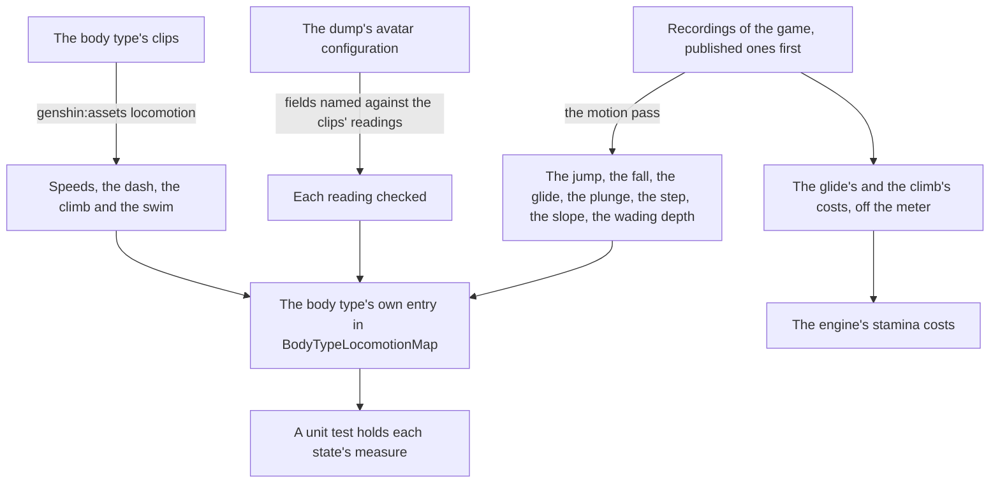

# Character controller

The [character controller](/docs/genshin/character-controller) walks the world today: a kinematic capsule moves through the game's movement states on its stamina, in fixed steps, against the ground and the landmarks. Every speed, height and threshold it moves by is provisional, one table every body type shares. This page reads each of them off the game.

## Decisions

- **Every number from the game, by the most exact source.** The controller sets no number of its own. Each is read in the order [parity](/docs/genshin/parity) ranks sources:
  1. The game's locomotion clips, exported and read for their root motion by `genshin:assets locomotion`: the walk, run and sprint speeds, the dash's speed and seconds, the climb's speed, the climb jump's height and seconds, the swim and swim dash speeds and drowning's seconds. The glide's and the jump's clips do not move the body.
  2. The character's configuration in the community's data dump, under `BinOutput/Avatar`. Its field names are obfuscated, so a value is named only by matching it to a reading from another source.
  3. A recording, the body's path read off it by where the exports' landmarks land, as the [recreation passes](/docs/proposals/genshin/recreation-passes)' motion pass reads motion no clip holds: the jump's height and the fall's gravity, the glide's forward speed and its sink, the plunge's speed, the step, the steepest slope still walkable, the depth a body wades to, the height a glider opens at, and how fast a body slides down ground too steep to stand on.
- **A table per body type, never copied.** A body type takes its own entry in `BodyTypeLocomotionMap` once it is measured, and moves by the provisional table until then. The capsule's size per type is read from the character's collider in the exports.
- **The costs the wiki leaves open are read off the meter.** The glide's 3 a second is the wiki's approximation and the climb's cost unknown; both, and whether a still body treading water strokes, are read from a recording of the meter draining.
- **Only a climbable surface is climbed.** The body climbs a surface too steep to walk on only where `collision` reports it climbable, since some, such as a domain's walls, are not at any angle; today it climbs any wall.

## How it works

The readings are named work before any constant changes. Each is an open question in the character's reference (`World/Character`'s `Index.reference.ts`), in the topic for its part, locomotion or stamina, and becomes an investigation there, with its source, the reading and its outcome, once it is answered. Published recordings are searched first; the user records only what nothing published shows, from a clip spec of what to do second by second (the `genshin-parity` skill).

## Scope and order

**Today:** the medium female body moves by its own clips' speeds, dash, climb, swim and drowning, and by the provisional table for the rest; every other body type moves by the provisional table.

**This adds, in order:**

1. **The recordings**: a timed run between Windrise's statue and oak, a jump and a fall from a ledge, a glide and its plunge, a climb and its climb jump, a swim into deep water and out, and the meter as it drains on a wall, in a glide and while treading water, published ones first.
2. **The other body types**, each in turn.

Each state is approved by its own measure against the readings, as the motion pass judges any motion: a run between two landmarks takes the recording's time within that recording's noise, and a jump's apex stands at the recording's height. A unit test then holds each measure, so no later state retunes it.

## What this does not propose

- **Fall damage, health, or anything of combat.** The plunge's attack and charged attacks are [combat](/docs/genshin/combat)'s.
- **Movement a character or a nation changes**: alternate sprints and movement talents, Fontaine's diving and its aquatic stamina, Natlan's Nightsoul movement, and gadgets and wind currents. Each comes with the page that adds its character, region or gadget.
- **The model and its animation**, which are [characters](/docs/genshin/characters)'.

## Key files

| File                                                                            | Role after the change                                      |
| :------------------------------------------------------------------------------ | :--------------------------------------------------------- |
| `packages/genshin-world/src/services/world/locomotion/BodyTypeLocomotionMap.ts` | Each measured body type's own entry                        |
| `packages/genshin-world/src/services/world/locomotion/constants.ts`             | The provisional table, left for the types still unmeasured |
| `packages/genshin-engine/src/locomotion/constants.ts`                           | The glide's and the climb's measured costs                 |
| `packages/genshin-world/src/components/World/Character/Locomotion.reference.ts` | Each reading of the body's numbers                         |
| `packages/genshin-world/src/components/World/Character/Stamina.reference.ts`    | Each reading of the meter                                  |

## Sources

- [Stamina](https://genshin-impact.fandom.com/wiki/Stamina), Genshin Impact Wiki: each action's cost, the climb's marked unknown.
- [Gliding](https://genshin-impact.fandom.com/wiki/Gliding), Genshin Impact Wiki: the glide's cost approximated from player testing.
- [Model Type](https://genshin-impact.fandom.com/wiki/Model_Type), Genshin Impact Wiki: the five playable model types, and movement differing between them.
- [AnimeGameData](https://gitlab.com/Dimbreath/AnimeGameData), the community's dump of the game's data: the characters' configurations under `BinOutput/Avatar`, their field names obfuscated.
