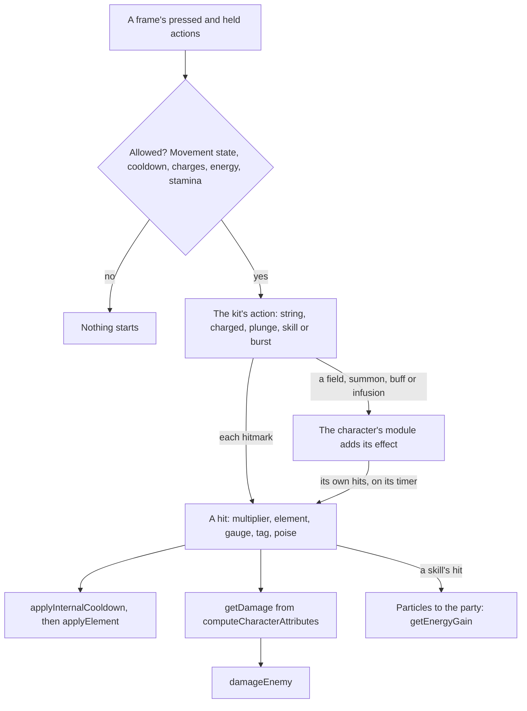

# Character kits

Combat's rules are built ([combat](/docs/genshin/combat)): auras, reactions in the game's priority, the damage formula, the internal cooldown, shields and energy. What lands a hit under those rules is a character's kit, the three combat talents and the passives every character carries. Nothing has a kit yet, so nothing in the world strikes. This page is the framework every kit is written on, and it comes first among the game's systems because talents, constellations, weapons' and artifacts' effects, and every challenge after them act through it. It builds on [character attributes](/docs/genshin/character-attributes), whose sums price a hit, and on the [character controller](/docs/genshin/character-controller), whose body a kit acts from.

## Decisions

- **A kit is data plus one module.** Every kit has the same shape: a normal attack's string of hits, a charged attack, a plunge, an Elemental Skill, an Elemental Burst and the passives. What a character alone does, such as Bennett's field that heals and raises ATK or a summon that strikes on a timer, is a small module per character over shared effects: a hit, a field, a summon, a buff, an infusion, a heal and a shield. A new character is a run of the reader and one module, never a change to the framework. The game keeps that behaviour in its ability configs (`BinOutput/Ability/Temp/AvatarAbilities` in the community's dump), but every key and type name in them is scrambled, so reading them would mean decompiling a scripting system rather than reading a table. Each module is written instead from the talent's own description and the wiki's notes on it.
- **The tables' numbers are read, never typed.** `genshin:assets stats` gains the kits. `AvatarSkillDepotExcelConfigData` gives which skills a character has: the normal attack, the skill, the burst, the passives each ascension phase opens and the constellations. `AvatarSkillExcelConfigData` gives each skill's cooldown, energy cost and charges. `ProudSkillExcelConfigData` gives each talent level's multipliers (`paramList`) with their labels by text id (`paramDescList`), so "1-Hit DMG" is the game's own words and its value the game's own number.
- **The measured numbers are the wiki's.** The client holds a hit's element gauge, its internal cooldown tag and group, its poise damage and a skill's particles only in the scrambled configs. The gauge, the tag and group and the particles are taken from the wiki's tables of them (Elemental Gauge Theory's character data, Internal Cooldown's data, and each skill page's particle note) and written beside the character's module, each value citing its page. No table read lists every attack's poise damage, so each is provisional until a source for it is found.
- **A hit goes through combat as built.** A kit's hit is priced by `getDamage` from the attacker's `computeCharacterAttributes` and the talent's multiplier at its level. Its element is counted by `applyInternalCooldown` and applied by `applyElement`, its damage and poise reach the enemy through `damageEnemy`, and its particles become the party's energy through `getEnergyGain`. No kit computes damage of its own.
- **Actions are a state machine on the fixed step.** Pressing the normal attack advances the string while the last hit's window is open, and the string starts again once it closes. Holding it is the charged attack, which costs the weapon's stamina as the wiki lists it: 20 for a sword, 25 for a polearm, 50 for a catalyst, 40 a second for a claymore, and none for a bow's aimed shot. Pressing it in the air, high enough above the ground, is a plunge: a low plunge when it lands from 2.4 metres or less, a high plunge from higher. `E` is the skill, pressed or held, on its cooldown and its charges. `Q` is the burst, at full energy, which it empties. The step reads the body's movement state, so no attack starts while climbing, swimming or gliding, and a dash or a jump cancels an action only once its cancel frame has passed.
- **An attack aims as the game's does.** It goes at the selected enemy, the nearest in front within reach, which the game marks with an arrow; with none selected, straight ahead. The bow's `R` aims instead, as the controls already bind it.
- **Catalysts and bows as the game deals them.** A catalyst's every attack deals its element, a bow's only its charged shot, and every other weapon physical damage unless an infusion changes it.
- **The first kit is the Traveler's, at talent level 1, until the kits run reads every character's.** Its numbers are the wiki's for Lumine's Foreign Ironwind: five strikes of 44.5%, 43.4%, 53.0%, 58.3% and 70.8% ATK with poise 40.5, 39.6, 48.6, 54 and 64.8; a charged attack of 55.9% and 72.2% for 20 stamina, poise 50.6 each; a plunge's collision of 63.9% with poise 25, and a low and a high plunge of 128% and 160%, poise 100 and 150, both blunt. The normal and charged attacks share the Normal Attack tag under the standard internal cooldown, and the plunges apply under none. Until the Traveler resonates with a statue the skill and burst are placeholders shaped as the Anemo Traveler's: the skill one hit of Palm Vortex's 176% on a 5 second cooldown, the burst one hit of Gust Surge's 80.8% for 60 energy on a 15 second cooldown, each dealing the character's element at 1U, so the elementless Traveler deals physical damage. Its skill gives no particles until the kits run reads them.
- **A hit reaches what its cylinder holds.** Every hit area is a cylinder as the wiki's Area of Effect tables give them, a radius, a fan angle in front and a height, taken as centred on the body's feet since the wiki names no base. A hit lands on each enemy whose capsule the cylinder reaches: within the radius plus the capsule's, within half the fan plus the capsule's angular width, and overlapping in height. Palm Vortex's is the wiki's, 6 metres at 100 degrees and 2 high; the plunge's collision 1 metre all round, as the wiki gives it; the rest are provisional until the attack clips and a recording measure them.
- **Targeting is the wiki's score.** At each action's start the body turns to the enemy scoring highest within the action's targeting zone, 0.7 × (1 − distance ÷ radius) + 0.3 × (1 − angle ÷ 180°), times 0.2 for one more than 2 metres above or below, a dead enemy never scored. Every sword's normal and charged attacks target within 5 metres and 6 high, Palm Vortex within 15 and 10. The view, current-target and priority coefficients wait for a camera's frustum, a kept target and a boss.
- **An action holds the body still, and a jump or a dash cancels it at once** until the cancel frames are measured. Normal and charged attacks start on foot, the skill and burst on foot or in the air; leaving those states ends the action.
- **A sword's charged attack follows a strike.** Holding the attack past a provisional 0.3 seconds turns the string's next strike into the charged attack once the current one ends, and only with the full 20 stamina left; a press during a strike queues the next, and the string starts again 0.5 seconds after a strike ends unpressed, both provisional.
- **The plunge strikes on its way down and as it lands.** Every 0.3 seconds while plunging, the collision hits what stands within a metre, and the landing is a low plunge from a drop of 2.4 metres or less, a high one past it, as the wiki gives both.
- **Each member's skill and burst cooldowns run at the fight's fixed step, off the field too**, and stand still while a screen holds the world.
- **Enemies' particles reach every member standing.** Each particle a struck enemy drops gives each standing member of the deployed team `getEnergyGain`'s energy, up to its burst's cost; a fallen member takes none, as it has lost its energy.
- **An enemy's strike lands on the body through the same formula.** Its ATK times a provisional multiplier of 1, physical, through `getDamage` with the member on the field's DEF and its resistance, a playable character's base being 0%; the damage over the member's Max HP is the share `damagePartyMember` takes.
- **A fallen team respawns at the nearest statue.** Once `checkIsPartyDown` holds, `reviveParty` brings the team back at 35% and the world screen's `jumpTo` lands it at the nearest jump landmark by `computeJumpPose`, or where it fell when none is loaded. A drown calls `drownParty`, which may down the team the same way.
- **An enemy holds its elements and its internal cooldowns.** Each `Enemy` carries an `ElementalState` advanced at the enemies' fixed step, and its internal cooldowns keyed by attacker and tag. Electro-Charged's and Burning's ticks decay their auras but deal no damage until combat prices them by the character who triggered them.
- **Hits are drawn plainly.** An enemy's capsule takes a hit tint for 0.15 seconds after a hit, and a small flash stands at the capsule's middle for 0.1 seconds, until effects are matched.

## How it works



## Scope and order

**Today:** combat's rules price a hit on one target, the body moves through its states, enemies take damage and poise through `damageEnemy`, and the attack, skill, burst and aim bindings are read with nothing behind them.

**This adds, in order:**

1. **The action state machine and the shared effects**, with the Traveler's normal attack, charged attack and plunge as the first kit, since the Traveler is the one character in the tables today.
2. **The kits' run**, writing every character's skills, cooldowns, costs and talent multipliers beside the stats it already writes.
3. **The Traveler's skill and burst** for the element a statue gives them, then one module per character as the [characters](/docs/genshin/characters) page draws each.
4. **Passives**, each written with its character's module and opened by the phase its table names.

## Data and measures

- **Read from the game's tables:** `AvatarSkillDepotExcelConfigData`, `AvatarSkillExcelConfigData` and `ProudSkillExcelConfigData` from the dump the stats run already reads, and each talent's name, description and labels from the text map by their own ids.
- **Read from the wiki:** each hit's gauge, internal cooldown tag and group, and each skill's particles, per character.
- **Still to find:** a source for every attack's poise damage.
- **Measured:** when each hit lands in its action (its hitmark) and when the next action may cancel it, read off the character's own animation clips once `genshin:assets clips` decodes them, or off a recording at 60 frames a second where a clip marks no event, and the least height a plunge starts from, which the wiki does not give. Until then each is a provisional constant with its character's module.

## What this does not propose

- **Talent levels and constellations.** The kit reads its talent levels and constellations; raising them is the [talents](/docs/proposals/genshin/talents) and [constellations](/docs/proposals/genshin/constellations) pages'.
- **The effects drawn.** A slash's trail, a field's circle and a burst's animation are the character's motion and the world's effects, matched in the [recreation passes](/docs/proposals/genshin/recreation-passes).

## Key files

| File                                                                                   | Role after the change                                          |
| :------------------------------------------------------------------------------------- | :------------------------------------------------------------- |
| `packages/genshin-world/src/services/combat/damage/getDamage.ts`                       | Prices every hit a kit lands                                   |
| `packages/genshin-world/src/services/combat/internalCooldown/applyInternalCooldown.ts` | Counts each kit hit under its tag and group                    |
| `packages/genshin-world/src/services/combat/energy/getEnergyGain.ts`                   | The party's energy from a skill's particles                    |
| `packages/genshin-world/src/services/enemy/damageEnemy.ts`                             | Takes a kit's damage and poise                                 |
| `packages/genshin-world/src/models/character/CharacterData.ts`                         | Gains the character's skills, cooldowns, costs and multipliers |
| `scripts/src/services/genshinAssets/stats/writeStatTables.ts`                          | Writes the kits' tables beside the stats                       |
| `packages/genshin-engine/src/input/InputActionBindingMap.ts`                           | The attack, skill, burst and aim bindings the kits read        |
| `packages/genshin-world/src/components/World/Character/Index.vue`                      | Steps the character on the field's kit with its body           |

New files:

```text
packages/genshin-world/src/models/kit/
packages/genshin-world/src/services/kit/stepKit.ts
packages/genshin-world/src/services/kit/effects/
packages/genshin-world/src/services/kit/characters/
```

## Sources

- [Foreign Ironwind](https://genshin-impact.fandom.com/wiki/Foreign_Ironwind), [Palm Vortex](https://genshin-impact.fandom.com/wiki/Palm_Vortex) and [Gust Surge](https://genshin-impact.fandom.com/wiki/Gust_Surge), Genshin Impact Wiki: the Traveler's multipliers, stamina, poise, tags and blunt plunges, and the Anemo skill's and burst's cooldowns and energy.
- [Area of Effect](https://genshin-impact.fandom.com/wiki/Area_of_Effect), [Targeting](https://genshin-impact.fandom.com/wiki/Targeting) and [Targeting/Data](https://genshin-impact.fandom.com/wiki/Targeting/Data), Genshin Impact Wiki: the hit cylinders, the targeting score and its altitude limit, and the swords' targeting zone.
- [Plunging Attack](https://genshin-impact.fandom.com/wiki/Plunging_Attack), [Resistance](https://genshin-impact.fandom.com/wiki/Resistance) and [Fallen Character](https://genshin-impact.fandom.com/wiki/Fallen_Character), Genshin Impact Wiki: the plunge's collision every 0.3 seconds within a metre, a playable character's 0% base resistance, and the fallen team's respawn.
- [Talent](https://genshin-impact.fandom.com/wiki/Talent), Genshin Impact Wiki: the three combat talents, the ascension and passive talents, their buttons, the selected enemy's arrow, and the talent level multipliers.
- [Normal Attack](https://genshin-impact.fandom.com/wiki/Normal_Attack), Genshin Impact Wiki: a string of strikes, the charged and plunging attacks under one talent, and which weapons deal their element.
- [Charged Attack](https://genshin-impact.fandom.com/wiki/Charged_Attack) and [Plunging Attack](https://genshin-impact.fandom.com/wiki/Plunging_Attack), Genshin Impact Wiki: the stamina each weapon's charged attack costs, and the low and high plunge either side of 2.4 metres.
- [Elemental Skill](https://genshin-impact.fandom.com/wiki/Elemental_Skill) and [Elemental Burst](https://genshin-impact.fandom.com/wiki/Elemental_Burst), Genshin Impact Wiki: the skill's cooldown, charges and press or hold, and the burst's energy cost and cooldown.
- [Elemental Gauge Theory: Character Data](https://genshin-impact.fandom.com/wiki/Elemental_Gauge_Theory/Character_Data) and [Internal Cooldown: Data](https://genshin-impact.fandom.com/wiki/Internal_Cooldown/Data), Genshin Impact Wiki: each ability's gauge, and each attack's tag and group.
- [Exploration](https://genshin-impact.fandom.com/wiki/Exploration), Genshin Impact Wiki: no combat while climbing, gliding or swimming.
- [AnimeGameData](https://gitlab.com/Dimbreath/AnimeGameData), the community's per-patch dump: the skill, skill depot and proud skill tables the run reads, and the ability configs whose scrambled names rule out reading behaviour from them.
