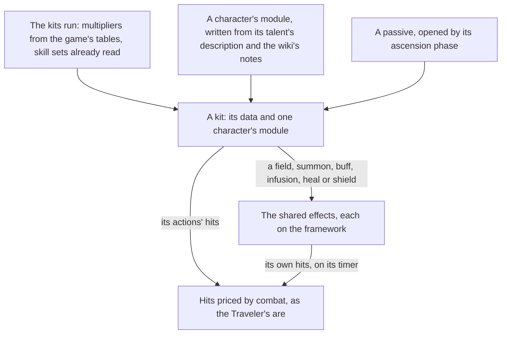

# Character kits

The Traveler's first kit is built on [combat](/docs/genshin/combat): its five strikes, charged attack and plunges land their hits on the enemies in reach, its skill and burst are placeholders, and every character on the roster fights with that kit until the kits run gives each its own. This page is the framework those are written on. The skill sets each character's table holds, and the targeting a kit's action turns to, are built, as [character kits](/docs/genshin/character-kits) records. What is left is the talent multipliers, the element a statue gives the Traveler, the shared effects and each character's module, and the passives. It comes before the rest of the game's systems that act through a kit, such as talents, constellations, weapons' and artifacts' effects, and every challenge after them. It builds on [character attributes](/docs/genshin/character-attributes), whose sums price a hit, and on the [character controller](/docs/genshin/character-controller), whose body a kit acts from.

## Decisions

- **A kit is data plus one module.** Every kit has the same shape: a normal attack's string of hits, a charged attack, a plunge, an Elemental Skill, an Elemental Burst and the passives. What a character alone does, such as Bennett's field that heals and raises ATK or a summon that strikes on a timer, is a small module per character over shared effects: a hit, a field, a summon, a buff, an infusion, a heal and a shield. A new character is a run of the reader and one module, never a change to the framework. The game keeps that behaviour in its ability configs (`BinOutput/Ability/Temp/AvatarAbilities` in the community's dump), but every key and type name in them is scrambled, so reading them would mean decompiling a scripting system rather than reading a table. Each module is written instead from the talent's own description and the wiki's notes on it.
- **The tables' numbers are read, never typed.** The skill sets are read: `AvatarSkillDepotExcelConfigData` gives each character's sets, and `AvatarSkillExcelConfigData` each skill's cooldown, energy cost and charges, as [character kits](/docs/genshin/character-kits) records. `ProudSkillExcelConfigData`, which gives each talent level's multipliers (`paramList`) with their labels by text id (`paramDescList`), is read beside the dump from the repository's revision the dump matches, as [talents](/docs/genshin/talents) reads its costs, so the multipliers wait only on a kit reading them. The Traveler's kit reads them now, from the table the stats run writes, and each other module reads its own from the same table.
- **The measured numbers are the wiki's, gcsim's, or a recording's.** The client holds a hit's element gauge, its internal cooldown tag and group, its poise damage and a skill's particles only in the scrambled configs. The gauge, the tag and group and the particles are taken from the wiki's tables of them (Elemental Gauge Theory's character data, Internal Cooldown's data, and each skill page's particle note) and written beside the character's module, each value citing its page. Poise is gcsim v2.47.2's where gcsim gives it: the plunges' 100 low and 150 high, and no poise on the Traveler's Anemo skill or burst, which hit with none. Each strike's poise, the charged attack's and the plunge collision's are in no source yet, so each stays provisional until one is found.
- **The Traveler's skill and burst take the element its statue gives.** Once the Traveler resonates with a Statue of The Seven, its skill and burst deal that element at 1U, which the placeholders do not yet do. The table has one set per element form, so the statue's element picks the set and its cooldowns and energy cost; that picking waits for the [statues page](/docs/proposals/genshin/statues-of-the-seven), which holds the resonance. Until then the Traveler has no element, and its placeholders deal none. The skill's particles are the wiki's, not the table's, as above.
- **Catalysts and bows as the game deals them.** A catalyst's every attack deals its element, a bow's only its charged shot, and every other weapon physical damage unless an infusion changes it. A bow's `R` aims instead of targeting, as the controls already bind it.
- **Targeting's further coefficients wait.** The wiki's score is the distance, the angle and the altitude, as built. Its view, current-target and priority coefficients wait for a camera's frustum, a kept target and a boss.
- **Passives are one shape too.** Each passive is written with its character's module and opened by the ascension phase its table names, so a character's passives add to its kit without a change to the framework.
- **Hits, a heal and a hit's own element are built ahead of a kit.** The Traveler's kit uses a hit, and a heal and a hit's element are small enough to sit with the party's damage, as built. A field, summon, buff, infusion or shield is built by the first module that needs it, never before, since no combat state holds one yet.

## How it works



## Scope and order

**Today:** the Traveler's normal attack, charged attack and plunges, and its placeholder skill and burst, run on the framework's action state machine and land their hits on combat. The Traveler's kit reads its multipliers from the generated talent table, and its hits can deal their own element. Every other character on the roster fights with the Traveler's kit until its own module is written. Each character's skill sets and talent multipliers are read beside the stats, and only the Traveler's kit reads them.

**This adds, in order:**

1. **The Traveler's skill and burst** for the element a statue gives them, once the [statues page](/docs/proposals/genshin/statues-of-the-seven) holds the resonance, then one module per character as the [characters](/docs/genshin/characters) page draws each.
2. **The shared effects still unbuilt**, each built by the first module that uses it: a field, a summon, a buff, an infusion and a shield.
3. **Passives**, each written with its character's module and opened by the phase its table names.
4. **The other characters' modules**, in the dump's order, each over the same effects and its multipliers from the table. Only the Traveler's exists.

## Data and measures

- **Read from the game's tables:** the skill sets and their skills, as built, and each talent's multipliers with their labels' text ids from `ProudSkillExcelConfigData`. Still to read: each talent's name and description by their text ids.
- **Checked against the dump's `paramList` (level 1), the Traveler's Anemo form is in groups 730 and 731 (strikes, plunges and collision the same on both forms, the charged attack's first hit too), 732 (Palm Vortex, `paramList[2]` 1.76) and 739 (Gust Surge, `paramList[0]` 0.808).** The strikes' 0.44462, 0.4343, 0.52976, 0.58308 and 0.70778 match `TRAVELER_KIT` to the wiki's rounding, as do the charged attack's 0.559 (`[5]`), the collision's 0.639324 (`[8]`), and the plunges' 1.278377 and 1.596762 (`[9]` and `[10]`). The charged attack's second hit, 0.722, is 0.7224 in group 731 and 0.60716 in group 730, so it is read from 731's form. The kits' talent table names this form for the Traveler: `characterTalentKits.json` takes the Anemo set by default (`TRAVELER_DEFAULT_ELEMENT`), groups 730 or 731 by the avatar, 732 and 739. Choosing another set by the element a statue gives is still to build, and waits on the statues page.
- **Read from the wiki:** each hit's gauge, internal cooldown tag and group, and each skill's particles, per character. Diluc's, Bennett's and Mona's are read, as the [character kits](/docs/genshin/character-kits) page records; the rest wait on their modules.
- **Read from gcsim v2.47.2 (MIT):** the Traveler's plunge poise, in its [pyro plunge](https://github.com/genshinsim/gcsim/blob/v2.47.2/internal/characters/traveler/common/pyro/plunge.go) file, and the Anemo skill and burst's, which gcsim sets to none.
- **Still to find:** a source for each strike's, the charged attack's and the plunge collision's poise damage. gcsim's Anemo attack file has none.
- **Measured:** when each hit lands in its action (its hitmark) and when the next action may cancel it. The extracted Traveler attack clips carry no events, so the hitmarks come off the Recordings owed list's `world-attacks.mkv` and `world-skill-burst.mkv`. The least height a plunge starts from is what the wiki does not give, so it waits on `world-attacks.mkv` too. Until then each is a provisional constant with its character's module.

## What this does not propose

- **Talent levels and constellations.** The kit reads its talent levels and constellations; raising them is the [talents](/docs/proposals/genshin/talents) and [constellations](/docs/proposals/genshin/constellations) pages'.
- **The effects drawn.** A slash's trail, a field's circle and a burst's animation are the character's motion and the world's effects, matched in the [recreation passes](/docs/proposals/genshin/recreation-passes).

## Key files

| File                                                                | Role after the change                    |
| :------------------------------------------------------------------ | :--------------------------------------- |
| `packages/genshin-engine/src/input/InputActionBindingMap.ts`        | The aim binding a bow's kit reads        |
| `packages/genshin-world/src/services/kit/characters/travelerKit.ts` | `TRAVELER_KIT`, the Traveler's Anemo kit |

New files, as the modules come:

```text
packages/genshin-world/src/services/kit/characters/
```

## Sources

- [Talent](https://genshin-impact.fandom.com/wiki/Talent), Genshin Impact Wiki: the three combat talents, the ascension and passive talents, their buttons, the selected enemy's arrow, and the talent level multipliers.
- [Normal Attack](https://genshin-impact.fandom.com/wiki/Normal_Attack), Genshin Impact Wiki: which weapons deal their element, and a catalyst's and a bow's attacks.
- [Elemental Skill](https://genshin-impact.fandom.com/wiki/Elemental_Skill) and [Elemental Burst](https://genshin-impact.fandom.com/wiki/Elemental_Burst), Genshin Impact Wiki: the skill's cooldown, charges and press or hold, and the burst's energy cost and cooldown.
- [Elemental Gauge Theory: Character Data](https://genshin-impact.fandom.com/wiki/Elemental_Gauge_Theory/Character_Data), Genshin Impact Wiki: each ability's gauge, and each attack's tag and group.
- [gcsim v2.47.2](https://github.com/genshinsim/gcsim/tree/v2.47.2/internal/characters/traveler/common), MIT: the Traveler's plunge poise and its Anemo skill and burst's frames.
- [AnimeGameData](https://github.com/DimbreathBot/AnimeGameData), the community's per-patch dump: the skill and skill depot tables the sets are read from, the proud skill table the multipliers wait for, and the ability configs whose scrambled names rule out reading behaviour from them.
