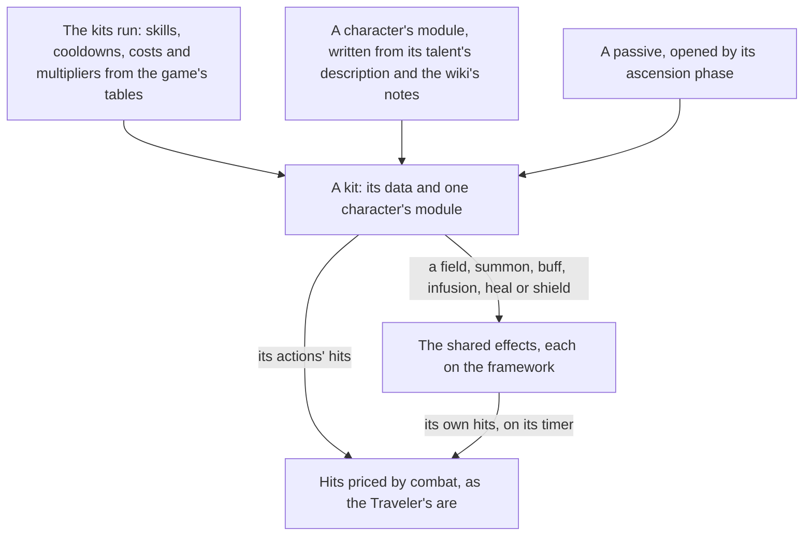

# Character kits

The Traveler's first kit is built on [combat](/docs/genshin/combat): its five strikes, charged attack and plunges land their hits on the enemies in reach, its skill and burst are placeholders, and every character on the roster fights with that kit until the kits run gives each its own. This page is the framework those are written on. It comes before the rest of the game's systems that act through a kit, such as talents, constellations, weapons' and artifacts' effects, and every challenge after them. It builds on [character attributes](/docs/genshin/character-attributes), whose sums price a hit, and on the [character controller](/docs/genshin/character-controller), whose body a kit acts from.

## Decisions

- **A kit is data plus one module.** Every kit has the same shape: a normal attack's string of hits, a charged attack, a plunge, an Elemental Skill, an Elemental Burst and the passives. What a character alone does, such as Bennett's field that heals and raises ATK or a summon that strikes on a timer, is a small module per character over shared effects: a hit, a field, a summon, a buff, an infusion, a heal and a shield. A new character is a run of the reader and one module, never a change to the framework. The game keeps that behaviour in its ability configs (`BinOutput/Ability/Temp/AvatarAbilities` in the community's dump), but every key and type name in them is scrambled, so reading them would mean decompiling a scripting system rather than reading a table. Each module is written instead from the talent's own description and the wiki's notes on it.
- **The tables' numbers are read, never typed.** `genshin:assets stats` gains the kits. `AvatarSkillDepotExcelConfigData` gives which skills a character has: the normal attack, the skill, the burst, the passives each ascension phase opens and the constellations. `AvatarSkillExcelConfigData` gives each skill's cooldown, energy cost and charges. `ProudSkillExcelConfigData` gives each talent level's multipliers (`paramList`) with their labels by text id (`paramDescList`), so "1-Hit DMG" is the game's own words and its value the game's own number. Until the kits run, the Traveler's numbers are the wiki's, typed beside its kit.
- **The measured numbers are the wiki's.** The client holds a hit's element gauge, its internal cooldown tag and group, its poise damage and a skill's particles only in the scrambled configs. The gauge, the tag and group and the particles are taken from the wiki's tables of them (Elemental Gauge Theory's character data, Internal Cooldown's data, and each skill page's particle note) and written beside the character's module, each value citing its page. No table read lists every attack's poise damage, so each is provisional until a source for it is found.
- **The Traveler's skill and burst take the element its statue gives.** Once the Traveler resonates with a Statue of The Seven, its skill and burst deal that element at 1U, which the placeholders do not yet do. The skill also gives the party its particles, which the kits run reads from the same tables.
- **Catalysts and bows as the game deals them.** A catalyst's every attack deals its element, a bow's only its charged shot, and every other weapon physical damage unless an infusion changes it. A bow's `R` aims instead of targeting, as the controls already bind it.
- **Targeting's further coefficients wait.** The wiki's score is the distance, the angle and the altitude for now. Its view, current-target and priority coefficients wait for a camera's frustum, a kept target and a boss.
- **Passives are one shape too.** Each passive is written with its character's module and opened by the ascension phase its table names, so a character's passives add to its kit without a change to the framework.

## How it works



## Scope and order

**Today:** the Traveler's normal attack, charged attack and plunges, and its placeholder skill and burst, run on the framework's action state machine and land their hits on combat. Every character on the roster fights with the Traveler's kit until the kits run reads each one's own.

**This adds, in order:**

1. **The shared effects**, a hit, a field, a summon, a buff, an infusion, a heal and a shield, with the Traveler's kit written on them.
2. **The kits' run**, writing every character's skills, cooldowns, costs and talent multipliers beside the stats it already writes.
3. **The Traveler's skill and burst** for the element a statue gives them, then one module per character as the [characters](/docs/genshin/characters) page draws each.
4. **Passives**, each written with its character's module and opened by the phase its table names.

## Data and measures

- **Read from the game's tables:** `AvatarSkillDepotExcelConfigData`, `AvatarSkillExcelConfigData` and `ProudSkillExcelConfigData` from the dump the stats run already reads, and each talent's name, description and labels from the text map by their own ids.
- **Read from the wiki:** each hit's gauge, internal cooldown tag and group, and each skill's particles, per character.
- **Still to find:** a source for every attack's poise damage.
- **Measured:** when each hit lands in its action (its hitmark) and when the next action may cancel it, read off the character's own animation clips with `genshin:assets timings`, whose Traveler clips the roadmap queues, or off a recording at 60 frames a second where a clip marks no event. The least height a plunge starts from is what the wiki does not give, so it too waits on a recording. Until then each is a provisional constant with its character's module.

## What this does not propose

- **Talent levels and constellations.** The kit reads its talent levels and constellations; raising them is the [talents](/docs/proposals/genshin/talents) and [constellations](/docs/proposals/genshin/constellations) pages'.
- **The effects drawn.** A slash's trail, a field's circle and a burst's animation are the character's motion and the world's effects, matched in the [recreation passes](/docs/proposals/genshin/recreation-passes).

## Key files

| File                                                           | Role after the change                                          |
| :------------------------------------------------------------- | :------------------------------------------------------------- |
| `packages/genshin-world/src/models/character/CharacterData.ts` | Gains the character's skills, cooldowns, costs and multipliers |
| `scripts/src/services/genshinAssets/stats/writeStatTables.ts`  | Writes the kits' tables beside the stats                       |
| `packages/genshin-engine/src/input/InputActionBindingMap.ts`   | The aim binding a bow's kit reads                              |

New files:

```text
packages/genshin-world/src/services/kit/effects/
packages/genshin-world/src/services/kit/characters/
```

## Sources

- [Talent](https://genshin-impact.fandom.com/wiki/Talent), Genshin Impact Wiki: the three combat talents, the ascension and passive talents, their buttons, the selected enemy's arrow, and the talent level multipliers.
- [Normal Attack](https://genshin-impact.fandom.com/wiki/Normal_Attack), Genshin Impact Wiki: which weapons deal their element, and a catalyst's and a bow's attacks.
- [Elemental Skill](https://genshin-impact.fandom.com/wiki/Elemental_Skill) and [Elemental Burst](https://genshin-impact.fandom.com/wiki/Elemental_Burst), Genshin Impact Wiki: the skill's cooldown, charges and press or hold, and the burst's energy cost and cooldown.
- [Elemental Gauge Theory: Character Data](https://genshin-impact.fandom.com/wiki/Elemental_Gauge_Theory/Character_Data), Genshin Impact Wiki: each ability's gauge, and each attack's tag and group.
- [AnimeGameData](https://gitlab.com/Dimbreath/AnimeGameData), the community's per-patch dump: the skill, skill depot and proud skill tables the run reads, and the ability configs whose scrambled names rule out reading behaviour from them.
