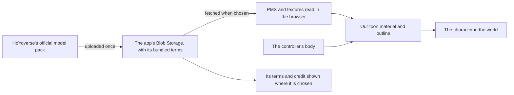

# Characters

This page builds on the [character controller](/docs/proposals/genshin/character-controller), whose body a character is drawn on, and the engine's toon materials and outlines. HoYoverse publishes MMD models of its characters for fans, so the world can show the game's own characters without our drawing them and without anything taken from the game's files.

## Decisions

- **The official models are hosted, in Blob Storage.** Each character's official model pack, its PMX and textures, is uploaded to the app's own Blob Storage and served from there, never committed to the repository: a pack runs to tens of megabytes, which every clone would carry for good, and Blob Storage is already how the app serves its media ([Azure services](/docs/architecture/azure-services)). Hosting the official MMD files is settled, as an exception to the area's rule that every asset is authored here ([Genshin](/docs/proposals/genshin)): the packs are HoYoverse's own fan release, never anything read out of the game's files, while the world stays generated.
- **Each model keeps its own terms beside it.** The terms text bundled with a model is uploaded with it and shown wherever the model is chosen, since the wording varies slightly by character and only the bundled copy is the model's own. The credit the terms carry, the copyright being miHoYo's, is shown with it.
- **Within what the terms forbid otherwise.** No commercial use of the models, and none of the uses the terms list (adult, extreme religious, gore, personal attacks), which the platform's own rules already forbid.
- **Everything else that ships is ours.** The PMX and texture reading, the toon material, the outline and the posing are our code in the engine; the model's data is read at run time from Blob Storage.
- **The character is drawn on the controller's body.** It stands where the body stands and faces where it faces. Its motion is fitted to the game's own locomotion clips in the [recreation passes](/docs/proposals/genshin/recreation-passes)' motion pass, so only the fitted parameters ship, never a motion file; how far and how fast the body moves is the controller's, and how it is seen is the [follow camera](/docs/proposals/genshin/follow-camera)'s.

## How it works

## Scope

**Today:** the controller's body moves through the world with nothing drawn on it.

**This adds:**

1. **The model's reading**, PMX and its textures, in the engine.
2. **The hosted packs**, each uploaded with its bundled terms, and the terms and credit shown where a character is chosen.
3. **The character in the world**, on the toon material and outline, on the controller's body.

## Sources

- The terms bundled with each official model, read secondhand so far from fan sites reproducing them (3dnchu.com, fnoji.com); each pack's own terms file is read when it is uploaded.
