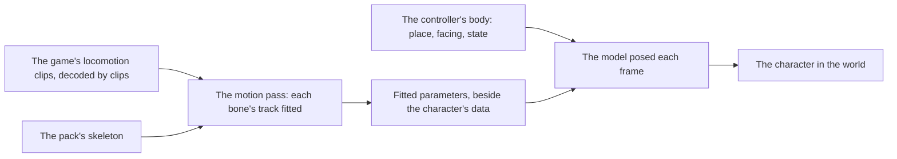

# Characters

This page builds on [characters](/docs/genshin/characters) as built: a character's official model pack is read from the app's Blob Storage by the engine's own PMX reader and drawn at rest on the toon ramp, at the origin of whatever holds it. It also builds on the [character controller](/docs/genshin/character-controller), whose body a character is drawn on. What is left is the character's place, its motion, its scale and where its terms are shown.

## Decisions

- **The character is drawn on the controller's body.** It stands where the body stands, between the body's last two steps as a frame blends them, and faces where it faces. The model already faces -z at its holder's origin, as the body's yaw of none does, so the body's world component holds the model and moves itself, and nothing turns the model on its own.
- **Its motion is fitted to the game's own locomotion clips** in the [recreation passes](/docs/proposals/genshin/recreation-passes)' motion pass, so only the fitted parameters ship, never a motion file. How far and how fast the body moves is the controller's, and how it is seen is the [follow camera](/docs/genshin/follow-camera)'s.
- **Its scale is the game's.** MMD's unit stands at the community's reckoning of eight centimetres until the game's own model of the character measures it: that model's height in the exports over the PMX's height in units.
- **Its terms are shown where it is chosen.** The terms view already reads and shows a pack's terms with their credit; the screens that choose a character, the party's, mount it beside the character.

## How it works

## Scope

**Today:** a character's model is read and drawn at rest at its holder's origin, at MMD's reckoned scale, the Traveler standing where Windrise starts, and nothing moves it.

**This adds:**

1. **The character on the body**, once the controller's body is mounted in the world: the body's component holds the character's model.
2. **Its motion.** The motion pass reads the character's locomotion clips, exported from the game's blocks under `~/Esposter/genshin-parity/extracted/` and decoded by `genshin:assets clips` once the character's component names their pattern, and the pack's model. It writes the fitted parameters as data beside the character's in `genshin-world`. Each bone's track is judged against its clip's, as the motion pass judges any track. It goes to the [compute queue](/docs/genshin/roadmap) once its inputs are named (below).
3. **Its scale**, measured from the game's own model of the character, replacing MMD's reckoned unit.
4. **Its terms where it is chosen**, on the party's screens.

## Open questions

- **Which character is fitted first, and from which clips?** The motion pass needs one pack uploaded and the game's names for that character's locomotion clips, the same first model type the controller's open question asks for.
- **What the fitted parameters are.** A clip fitted as each bone's rotation over a loop of a few samples, or as a few gait parameters per state that a pose is computed from; the motion pass's measure decides which ships.

## Sources

- The terms bundled with each official model, read secondhand so far from fan sites reproducing them (3dnchu.com, fnoji.com); each pack's own terms file is read when it is uploaded.
