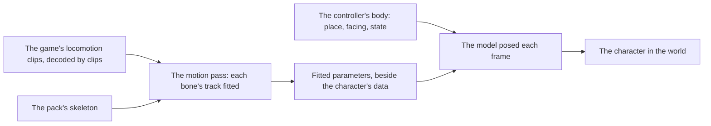

# Characters

This page builds on [characters](/docs/genshin/characters) as built: the engine reads a character's official model pack from the app's Blob Storage with its own PMX reader and draws it at rest on the toon ramp, at the origin of whatever holds it. It also builds on the [character controller](/docs/genshin/character-controller), whose body a character is drawn on. What is left is the character's place, its motion, its scale and where its terms are shown.

## Decisions

- **The character is drawn on the controller's body.** It stands where the body stands, between the body's last two steps as a frame blends them, and faces where it faces. The model already faces -z at its holder's origin, as the body's yaw of none does, so the body's world component holds the model and moves itself, and nothing turns the model on its own.
- **Its motion is fitted to the game's own locomotion clips** in the [recreation passes](/docs/proposals/genshin/recreation-passes)' motion pass, so only the fitted parameters ship, never a motion file. How far and how fast the body moves is the controller's, and how it is seen is the [follow camera](/docs/genshin/follow-camera)'s.
- **Its scale is the game's.** MMD's unit stands at the community's reckoning of eight centimetres until the game's own model of the character measures it: that model's height in the exports over the PMX's height in units.
- **The Traveler is fitted first.** The world plays the Traveler (`TRAVELER_CHARACTER_ID`, 10000007, the medium female body), whose `Ani_Avatar_Girl_` clips the controller already reads for its speeds, so its standing, walk, run and sprint cycles in `00/00035183.blk` are the first clips the motion pass fits.
- **Its terms are shown where it is chosen.** The terms view already reads and shows a pack's terms with their credit; the screens that choose a character, the party's, mount it beside the character.

## How it works

## Scope

**Today:** a character's model is read and drawn at rest at its holder's origin, at MMD's reckoned scale, held by the controller's body in Windrise's scene (`World/Windrise/Index.vue`), so it stands and faces where the body does, and nothing poses it.

**This adds:**

1. **The Traveler's locomotion clips decoded**, the motion pass's first input.
   - `scripts/src/models/genshinAssets/shared/DerivedAssetComponent.ts` gains `Traveler = "traveler"`, and `DerivedAssetComponentMap` its entry: `clipPattern: "^Ani_Avatar_Girl_(Standby|WalkCycle|RunCycle|SprintCycle)$"`, `roots: []` and `screen: "WorldScreen"`, with a comment naming the clips' block, `00/00035183.blk` in the asset index. `DerivedAssetLandmarkMap` takes an empty `Traveler` entry, since it holds one for every component.
   - Run `pnpm -C scripts genshin:assets clips traveler` with the game closed. It prints each clip's seconds and, for each curve, the bone path it animates and its range.
   - Write `packages/genshin-world/src/components/Character/Model/Index.reference.ts` in the shape of `World/Character/Locomotion.reference.ts`: the four clips with their block and seconds, the bone paths their curves move, which is the skeleton the fit maps the pack's bones onto, and the run that read them.
   - The entry is data and the printout is its proof, so no unit test is owed.
2. **Its motion.** The motion pass reads the character's locomotion clips, exported from the game's blocks under `~/Esposter/genshin-parity/extracted/` and decoded by `genshin:assets clips` once the character's component names their pattern, and the pack's model. It writes the fitted parameters as data beside the character's in `genshin-world`. Each bone's track is judged against its clip's, as the motion pass judges any track. It goes to the [compute queue](/docs/genshin/roadmap) once its inputs are named (below), and waits on the Traveler's official pack under `~/Esposter/genshin-parity/characters/10000007/`, which the user downloads from HoYoverse's release.
3. **Its scale**, measured from the game's own model of the character, replacing MMD's reckoned unit. The Traveler's model prefab is `Avatar_Girl_Sword_PlayerGirl_Model`, whose Animator the asset index places in `00/02666572.blk`; it becomes the Traveler component's root once its game object's path ID is read from that block, and the scale needs the pack's height as well.
4. **Its terms where it is chosen**, on the party's screens, once the [party](/docs/proposals/genshin/party) builds Party Setup's.

## Open questions

- **What the fitted parameters are.** A clip fitted as each bone's rotation over a loop of a few samples, or as a few gait parameters per state that a pose is computed from; the motion pass's measure decides which ships.

## Sources

- Each official model's bundled terms, as the [characters](/docs/genshin/characters) page cites them.
