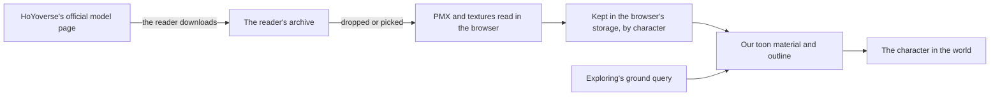

# Characters

This page builds on [exploring](/docs/proposals/genshin/exploring), whose free camera a character replaces, and the engine's toon materials and outlines. HoYoverse publishes MMD models of its characters for fans, so the world can show the game's own characters without our drawing them and without anything taken from the game's files.

## Decisions

- **Within the models' terms, the models are never re-hosted.** The terms bundled with each model forbid commercial use and redistribution (二次配布), and they vary slightly by character. Serving a copy from this site would be redistribution, so no model file is committed, uploaded or served. A reader downloads the model from HoYoverse's official page themselves and gives the file to the page, which reads it in their browser alone.
- **The reader's own copy stays in their browser.** A dropped or picked archive is read in the browser and kept in its own storage, keyed by the character, so it is given once; nothing of it is sent to the server, and clearing it is one control.
- **Everything that ships is ours.** The PMX and texture reading, the toon material, the outline and the posing are our code in the engine; the model's own data is read at run time from the reader's copy. Prohibited uses in the terms (adult, extreme religious, gore, personal attacks) are uses the platform's own rules already forbid.
- **The terms text is shown, not restated.** The terms file bundled with the reader's model is shown beside it when it is first given, since the wording varies by character and only the bundled copy is the model's own.
- **The character stands where the camera's ground point stood.** It is placed on the ground query exploring adds and faces the camera's heading. Its motion is fitted to the game's own locomotion clips in the [recreation passes](/docs/proposals/genshin/recreation-passes)' motion pass, so only the fitted parameters ship, never a motion file; walking, running and the follow camera are the character controller's, the next play feature's page.
- **No model, no character.** Without a copy the world stays on the free camera, and the page says where the official models are downloaded.

## How it works

## Scope

**Today:** nothing stands in the world; exploring's free camera is the only presence.

**This adds:**

1. **The model's reading**, PMX and its textures, in the engine.
2. **The reader's copy**, given once, kept in the browser, with the bundled terms shown.
3. **The character in the world**, on the toon material and outline, standing at the ground point.

## Not yet

- **Walking, running and the follow camera**, which the character controller's page adds once a character stands.

## Sources

- The terms bundled with each official model, read secondhand so far from fan sites reproducing them (3dnchu.com, fnoji.com); the official page and a bundled terms file are to be read before the build starts.
