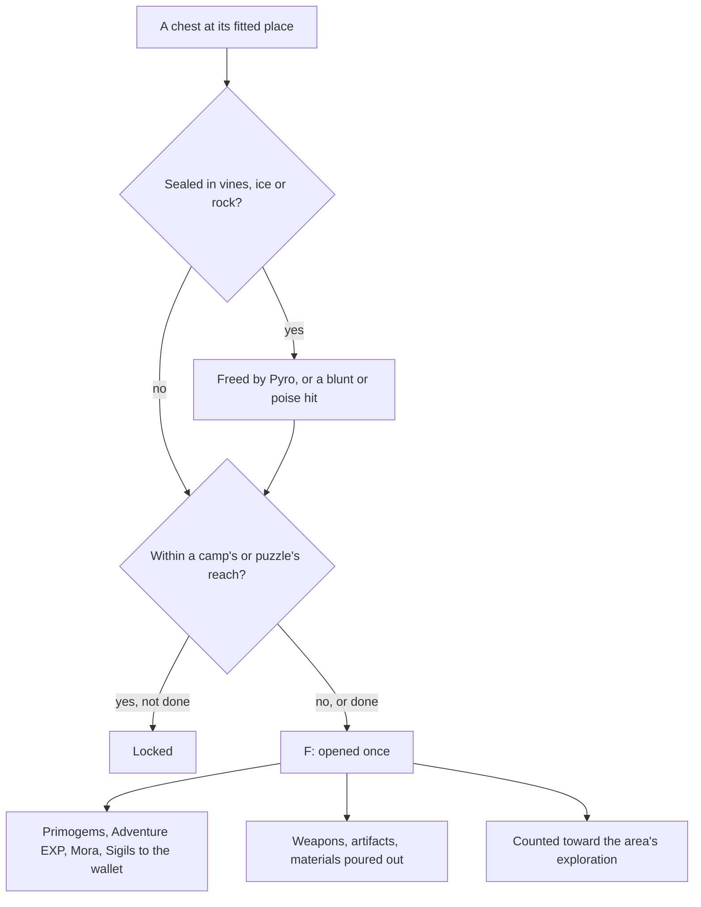

# Chests

Chests are the open world's main reward for exploring it, and the most of what an area's exploration progress counts. They stand in the world everywhere a player might look, as the game's servers spawn them, so their places are the [spawned places](/docs/proposals/genshin/spawned-places)' and this page waits on them. A chest is opened through the [interaction](/docs/proposals/genshin/interaction) prompts.

## Decisions

- **Five kinds.** Common, Exquisite, Precious, Luxurious and Remarkable, each a kind of place the official map marks and the fit writes into region data with its kind. Remarkable chests stand only in the regions the wiki names, and give furnishing blueprints and five Primogems alone.
- **Opened with F, rewarded two ways.** Its Primogems, Adventure EXP, Mora and Sigils go straight to the wallet and the bag. Its weapons, artifacts and Character EXP materials pour out as drops to pick up, as the enemies' drops are, or go straight to the bag where the chest stands somewhere a drop would fall away. Each kind's reward is the wiki's chest reward table, since what a chest rolls is drawn by the game's servers, and an artifact it gives is rolled by the [artifact enhancement](/docs/proposals/genshin/artifact-enhancement) page's rules.
- **A locked chest waits on what is beside it.** As the wiki describes, a locked chest opens once the enemies near it are defeated or the puzzle near it is solved. Which camp or puzzle locks which chest is the game's servers' and listed nowhere per chest, so a chest is locked by the camp or the [puzzle](/docs/proposals/genshin/puzzles) whose reach it stands in, the reading closest to the rule the wiki gives, and stands unlocked where it stands in none.
- **Hidden chests are dug up.** A chest the map marks as buried offers Dig when the player stands at its place, and appears when dug.
- **Sealed chests are freed first.** A chest sealed in Dendro vines or ice is freed by Pyro, and one sealed in rock by a blunt attack or one that deals poise damage, through [combat](/docs/genshin/combat)'s hits.
- **A chest opens once.** Opened chests never come back, kept with the player's progress, and each counts once toward its area's exploration progress and its region's chest achievements.

## How it works

## Scope and order

**Today:** the world holds no chest; the bag and wallet take what is given.

**This adds, in order:**

1. **Common chests** in Windrise's area, opened and rewarded.
2. **The other kinds**, and the locks by camps.
3. **Digging and seals.**
4. **Locks by puzzles**, once the puzzles stand.

## Data and measures

- **Read from the wiki:** each kind's rewards by Adventure Rank, and the regions holding Remarkable chests.
- **Read from the game's tables:** `ChestLevelSetConfigData`'s chest levels by an area's level, which the rewards' bands follow.
- **Measured:** the reach a camp or a puzzle locks within, against the chests the map marks beside them, and how a chest opens, read off a recording of one.

## Key files

| File                                                                           | Role after the change                           |
| :----------------------------------------------------------------------------- | :---------------------------------------------- |
| `packages/genshin-world/src/models/world/LandmarkKind.ts`                      | Gains each chest kind                           |
| `packages/genshin-world/src/services/interaction/computeInteractionPrompts.ts` | Lists a chest in reach to open, and Dig         |
| `packages/genshin-world/src/models/enemy/DroppedItem.ts`                       | What a chest pours out, as an enemy's drops are |
| `packages/genshin-world/src/services/inventory/addInventoryItem.ts`            | What goes straight to the bag                   |
| `packages/genshin-world/src/models/inventory/Wallet.ts`                        | The Primogems and Mora a chest gives            |

## Sources

- [Chest](https://genshin-impact.fandom.com/wiki/Chest), Genshin Impact Wiki: the five kinds and where each is found, locks by nearby enemies and puzzles, dug chests, chests sealed in vines, ice and rock and what frees each, rewards sent straight to the inventory or poured out, Remarkable chests' regions and blueprints, and each kind's rewards.
- [AnimeGameData](https://gitlab.com/Dimbreath/AnimeGameData), the community's per-patch dump: the chest level table.
