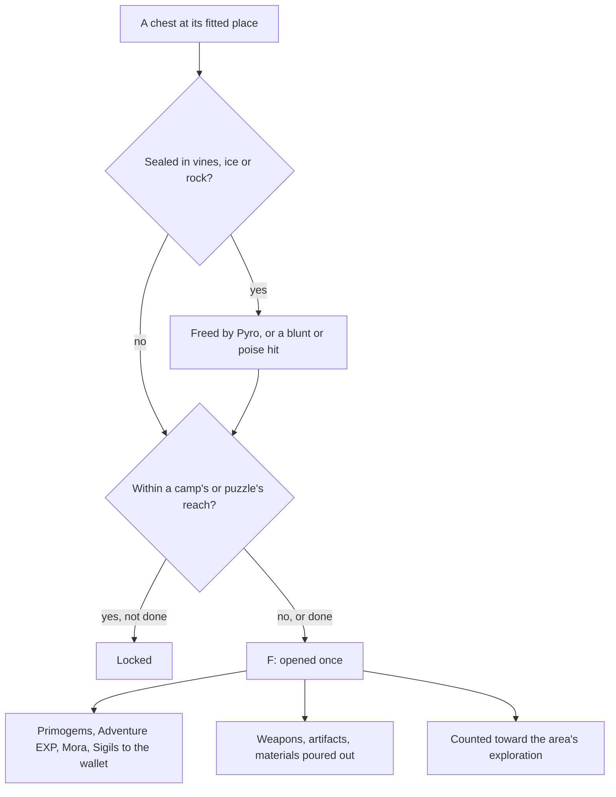

# Chests

Chests are the open world's main reward for exploring it, and the most of what an area's exploration progress counts. Their places are built: the official map's chests stand fitted in each region's data, as the [as-built page](/docs/genshin/chests) records. What is left is what a chest does when it is opened, which the [interaction](/docs/proposals/genshin/interaction) prompts carry, and the locks, digging and seals that hold some of them shut.

## Decisions

- **Opened with F, rewarded two ways.** Its Primogems, Adventure EXP, Mora and Sigils go straight to the wallet and the bag. Its weapons, artifacts and Character EXP materials pour out as drops to pick up, as the enemies' drops are, or go straight to the bag where the chest stands somewhere a drop would fall away. Each kind's reward is the wiki's chest reward table, since what a chest rolls is drawn by the game's servers, and an artifact it gives is rolled by the [artifact enhancement](/docs/proposals/genshin/artifact-enhancement) page's rules.
- **A locked chest waits on what is beside it.** As the wiki describes, a locked chest opens once the enemies near it are defeated or the puzzle near it is solved. Which camp or puzzle locks which chest is the game's servers' and listed nowhere per chest, so a chest is locked by the camp or the [puzzle](/docs/proposals/genshin/puzzles) whose reach it stands in, the reading closest to the rule the wiki gives, and stands unlocked where it stands in none.
- **Hidden chests are dug up.** A chest the map marks as buried offers Dig when the player stands at its place, and appears when dug.
- **Sealed chests are freed first.** A chest sealed in Dendro vines or ice is freed by Pyro, and one sealed in rock by a blunt attack or one that deals poise damage, through [combat](/docs/genshin/combat)'s hits. The map's sealed label does not say which seal a place holds, so which one each place holds is measured, not read.
- **A dug or freed place's tier is unsettled.** The map gives a buried or a sealed place no tier, and no tiered chest stands within reach of one to read it off. What a dug or freed place holds is settled by a recording of one, and until then a dug or freed place is left unrewarded, a provisional call.
- **A chest's levels follow its zone.** The game's chest levels are 1, 6, 11, 16, 21 and 26, each starting at its own zone level, from the community's table of chest levels by zone. A chest's reward band is the one its area's level falls in, once the wiki's reward table lands to be banded.
- **A chest opens once.** Opened chests never come back, kept with the player's progress, and each counts once toward its area's exploration progress and its region's chest achievements.

## How it works

## Scope and order

**Built:** the chests' places, the seven kinds written per region as the [as-built page](/docs/genshin/chests) describes.

**This adds, in order:**

1. **Common chests in Windrise's area, opened and rewarded.** It waits on the wiki's reward table for the Common kind and on the reach a chest opens within.
2. **The other tiers, and the locks by camps.**
3. **Digging and seals**, once a recording settles what a dug or freed place holds and which seal each sealed place wears.
4. **Locks by puzzles**, once the puzzles stand.

## Data and measures

- **Waiting on the wiki:** each kind's rewards by Adventure Rank, and the regions holding Remarkable chests. The wiki's chest page could not be read from the build's network, so the reward table is not yet settled.
- **Read from the game's tables:** `ChestLevelSetConfigData`'s chest levels by zone, which the reward bands follow once the reward table lands.
- **Measured:** the reach a camp or a puzzle locks within, against the chests the map marks beside them, how a chest opens, read off a recording of one, which seal each sealed place holds, and what a dug or freed place gives.

## Key files

| File                                                                           | Role after the change                                                 |
| :----------------------------------------------------------------------------- | :-------------------------------------------------------------------- |
| `packages/genshin-world/src/services/interaction/computeInteractionPrompts.ts` | Lists a chest in reach to open, and Dig                               |
| `packages/genshin-world/src/models/enemy/DroppedItem.ts`                       | What a chest pours out, as an enemy's drops are                       |
| `packages/genshin-world/src/services/inventory/addInventoryItem.ts`            | What goes straight to the bag                                         |
| `packages/genshin-world/src/models/inventory/Wallet.ts`                        | The Primogems and Mora a chest gives                                  |
| `packages/genshin-world/src/generated/chests/`                                 | The placed chests the opening and the locks read, built by the places |

## Sources

- [Chest](https://genshin-impact.fandom.com/wiki/Chest), Genshin Impact Wiki: the five kinds and where each is found, locks by nearby enemies and puzzles, dug chests, chests sealed in vines, ice and rock and what frees each, rewards sent straight to the inventory or poured out, Remarkable chests' regions and blueprints, and each kind's rewards. Not yet read: the page was out of reach from the build's network.
- [AnimeGameData](https://gitlab.com/Dimbreath/AnimeGameData), the community's per-patch dump: the chest level table, `ChestLevelSetConfigData`.
