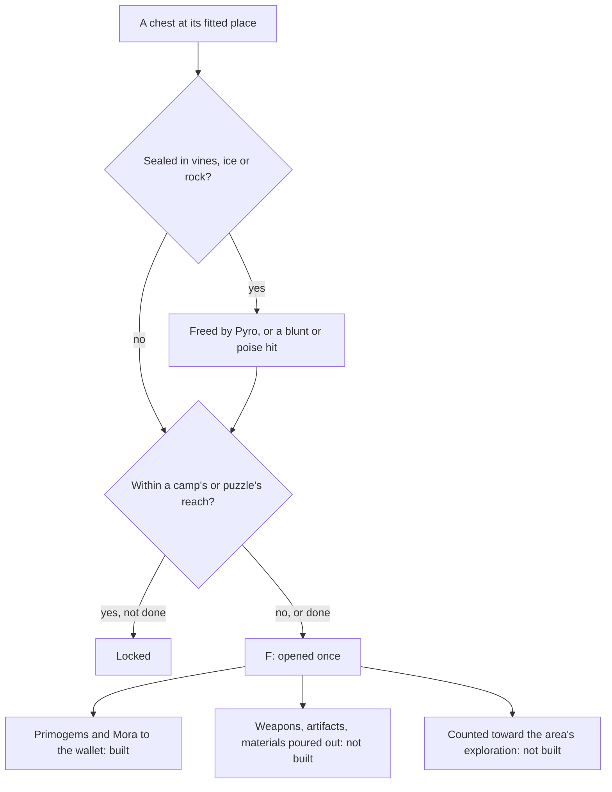

# Chests

Chests are the open world's main reward for exploring it, and the most of what an area's exploration progress counts. Their places are built, and an opened Common, Exquisite or Precious chest pays its wallet share, as the [as-built page](/docs/genshin/chests) records. What is left is what else an opening gives, the locks, digging and seals that hold some of them shut, and the join that makes an opened chest count toward the achievements.

## Decisions

- **Opened with F, rewarded two ways.** Its Primogems, Adventure EXP, Mora and Sigils go straight to the wallet and the bag. Its weapons, artifacts and Character EXP materials pour out as drops to pick up, as the enemies' drops are, or go straight to the bag where the chest stands somewhere a drop would fall away. The wallet part is built. The drops' pools are the wiki's: each tier's weapons, the artifact sets it can give, and its Character EXP materials by star. An artifact a chest gives is rolled by the [artifact enhancement](/docs/proposals/genshin/artifact-enhancement) page's rules.
- **A locked chest waits on what is beside it.** As the wiki describes, a locked chest opens once the enemies near it are defeated or the puzzle near it is solved. Which camp or puzzle locks which chest is listed nowhere per chest, so a chest is locked by the camp or the [puzzle](/docs/proposals/genshin/puzzles) whose reach it stands in, the reading closest to the rule the wiki gives, and stands unlocked where it stands in none.
- **Hidden chests are dug up.** A chest the map marks as buried offers Dig when the player stands at its place, and appears when dug.
- **Sealed chests are freed first.** A chest sealed in Dendro vines or ice is freed by Pyro, and one sealed in rock by a blunt attack or one that deals poise damage, through [combat](/docs/genshin/combat)'s hits. The map's sealed label does not say which seal a place holds, so which one each place holds is measured, not read.
- **A dug or freed place's tier is unsettled.** The map gives a buried or a sealed place no tier, and no tiered chest stands within reach of one to read it off. What a dug or freed place holds is settled by a recording of one, and until then a dug or freed place is left unrewarded, a provisional call.
- **Luxurious and Remarkable are unrewarded for now.** The wiki gives a Luxurious chest its Primogems and Adventure EXP but leaves its Mora unstated, and a Remarkable chest outside Tsurumi Island gives 5 Primogems and blueprints, Tsurumi's only its blueprints. Both wait until their rewards are settled, and until then they stay unopened.
- **The reward ranges are the wiki's, not banded by Adventure Rank.** The wiki's chest reward table lists one range per tier, so no Adventure Rank band is read from it. The chest levels by zone (1, 6, 11, 16, 21 and 26) are read from the game's tables, and the Primogems of the high zone-level areas differ from the default. Which areas those are needs the region outlines, so a chest's band waits on them.
- **A chest opens once.** Opened chests never come back, kept with the player's progress, and each counts once toward its area's exploration progress and its region's chest achievements.

## How it works

## Scope and order

**Built:** the chests' places, the seven kinds written per region as the [as-built page](/docs/genshin/chests) describes; and the opening of a Common, Exquisite or Precious chest, its Primogems and Mora rolled into the wallet once.

**This adds, in order:**

1. **Common chests in Windrise's area, opened and rewarded in full.** The wallet's share is built for every tier. What is left is the drops, and the area: the places name no catalogue area, which needs the region outlines the exploration progress reads, so the Windrise's chests cannot yet be told from the rest of Mondstadt's.
2. **The other rewards and tiers.** Adventure EXP and Sigils, which the wallet does not hold yet; Luxurious and Remarkable, once their Mora and blueprints are settled.
3. **The locks by camps.** Waits on the reach a camp locks a chest within, measured.
4. **Digging and seals**, once a recording settles what a dug or freed place holds and which seal each sealed place wears.
5. **Locks by puzzles**, once the puzzles stand.
6. **The join to the achievements and the exploration progress.** An opened chest moves the 66 chest achievements and its area's doings only once it is joined to the game's own chest records (below).

## Data and measures

- **Read from the wiki:** each tier's Primogem and Mora ranges (built), and the drop pools: the weapons each tier rolls, the artifact sets, and the Character EXP materials by star. The pools are not yet encoded.
- **Not on the wiki:** Luxurious's Mora.
- **Read from the game's tables:** `ChestLevelSetConfigData`'s chest levels by zone (above). `GadgetExcelConfigData` names 270 gadgets of the `Chest` type, the chest templates such as `70210001`.
- **The join is not made.** A placed chest has the map's point id and no game id, while the achievements' `TRIGGER_OPEN_WORLD_CHEST` lists its chests as `;`-joined template ids, with a second list of what appear to be region group ids, and the exploration doings name their chests by their own numbers. Joining a placed chest to its template and group needs the game's scene data, which the AnimeGameData dump carries per scene and is reachable from the build's network. Until that join exists no opened chest moves an achievement or an area's exploration, and a script that makes it is the next data step.
- **Measured:** the reach a camp or a puzzle locks within, against the chests the map marks beside them, how a chest opens, read off a recording of one, which seal each sealed place holds, what a dug or freed place gives, and the spread of each reward within its range.

## Key files

| File                                                                           | Role after the change                                                 |
| :----------------------------------------------------------------------------- | :-------------------------------------------------------------------- |
| `packages/genshin-world/src/services/interaction/computeInteractionPrompts.ts` | Lists a chest in reach to open, and Dig                               |
| `packages/genshin-world/src/services/chest/openChest.ts`                       | Opens a chest once and rolls its wallet share, built                  |
| `packages/genshin-world/src/services/chest/ChestKindRewardMap.ts`              | Each tier's Primogem and Mora ranges, built                           |
| `packages/genshin-world/src/models/enemy/DroppedItem.ts`                       | What a chest pours out, as an enemy's drops are                       |
| `packages/genshin-world/src/services/inventory/addInventoryItem.ts`            | What goes straight to the bag                                         |
| `packages/genshin-world/src/models/inventory/Wallet.ts`                        | The Primogems and Mora a chest gives, built                           |
| `packages/genshin-world/src/generated/chests/`                                 | The placed chests the opening and the locks read, built by the places |

## Sources

- [Chest](https://genshin-impact.fandom.com/wiki/Chest), Genshin Impact Wiki: the five kinds and where each is found, locks by nearby enemies and puzzles, dug chests, chests sealed in vines, ice and rock and what frees each, rewards sent straight to the inventory or poured out, Remarkable chests' regions and blueprints, and each kind's rewards. Read through the wiki's parse API with a Referer, as the genshin-persona readers do.
- [AnimeGameData](https://github.com/DimbreathBot/AnimeGameData), the community's per-patch dump: the chest level table, `ChestLevelSetConfigData`, and the gadget table, `GadgetExcelConfigData`.
