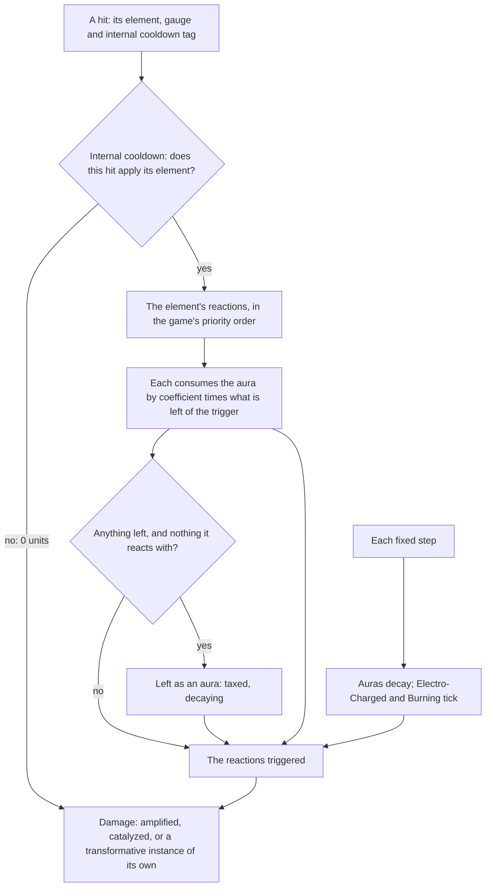

# Combat

Genshin's combat is a small set of rules the whole game shares. An elemental attack leaves its element on the target as an aura, which decays. A second element meets the aura and triggers a reaction, which consumes part of it by a fixed rule. A hit's damage is one formula over the attacker's stats and the target's level and resistance. These rules are the game's own, documented by its community to the decimal, and they are the same for every character and enemy. So they are built once, as pure functions over plain state, before any character or enemy that uses them.

## Decisions

- **Rules belong to the world, not the engine.** The engine knows no rule of the game, as it knows no place. Combat lives in `genshin-world`, under `services/combat` and `models/combat`, as plain TypeScript with no Vue, no three.js and no input.
- **Elemental gauge theory, as the community documents it.** An attack applies a number of gauge units of its element. Left as an aura it is taxed to 0.8 of that and decays linearly over 2.5 seconds a unit plus 7. A reaction consumes the aura by its coefficient times the trigger's gauge. Every number is the [Genshin Impact Wiki](https://genshin-impact.fandom.com/wiki/Elemental_Gauge_Theory)'s and the [KeqingMains Theorycrafting Library](https://library.keqingmains.com/combat-mechanics/elemental-effects/elemental-gauge-theory)'s, which agree.
- **The game's reaction priority, as data.** When an element meets several auras at once, the game tries its reactions in a fixed order, and what is left of the trigger after one goes on to the next. That order is one table keyed by the applied element, so a reaction is added or reordered in one place.
- **The coexisting auras the game keeps.** Electro and Hydro coexist as Electro-Charged, which ticks every second. Quicken is its own aura beside Dendro or Electro, and Aggravate and Spread consume neither. Burning keeps a Burning aura over the Pyro and Dendro beneath it. Freeze sits over the Cryo or Hydro under it and decays faster the longer it holds.
- **The damage formula in full.** Base damage is the talent multiplier times the stat, plus any flat bonus. It is multiplied by one plus the damage bonus, the critical multiplier, the enemy's defence by level, its resistance (with the negative and above-75% branches), and an amplifying reaction's multiplier. Transformative reactions use the level multiplier table instead and ignore defence.
- **Public tables are constants.** The level multiplier table and the Crystallize shield's are published facts, not anything exported from the game, so they are written as constants.
- **Each rule tested against a worked example from its source.** Every function is held to a number the wiki or the library works out, so a test fails only when the rule is wrong.

## How it works

## Scope and order

**Today:** nothing in the world has an element, health or damage.

**This adds:**

1. Elements and auras: application, the aura tax, decay, the coexisting auras and Freeze.
2. Reactions: amplifying, transformative, Crystallize and the catalyze bonus, each with the gauge it consumes.
3. The damage formula.
4. The internal cooldown on applying an element.
5. Shields and their absorption.
6. Energy from particles and orbs.

## What this does not propose

- **Characters' kits.** Talent multipliers, each ability's gauge and internal cooldown tag, and its particles are a character's data, added with the [characters](/docs/proposals/genshin/characters) that use them.
- **Anything drawn or pressed.** Hit detection, the reaction's text and the aura's icon belong to the controller, the enemies and the HUD, which call into these rules.

## Key files

| File                                           | Role after the change                                                    |
| :--------------------------------------------- | :----------------------------------------------------------------------- |
| `packages/genshin-world/src/models/Element.ts` | The seven elements, shared by the loading screen, the enemies and combat |

## Sources

- [Elemental Gauge Theory](https://genshin-impact.fandom.com/wiki/Elemental_Gauge_Theory), Genshin Impact Wiki: the aura tax, the aura's duration and decay, reapplication, and each reaction's coefficient.
- [Elemental Gauge Theory: Advanced Mechanics](https://genshin-impact.fandom.com/wiki/Elemental_Gauge_Theory/Advanced_Mechanics), Genshin Impact Wiki: Swirl's gauge, Freeze's gauge and duration, Shatter, Quicken's aura and Burning's.
- [Simultaneous Reaction Priority](https://genshin-impact.fandom.com/wiki/Elemental_Gauge_Theory/Simultaneous_Reaction_Priority), Genshin Impact Wiki: the order an applied element tries its reactions in.
- [Damage](https://genshin-impact.fandom.com/wiki/Damage), Genshin Impact Wiki: the general formula, defence, resistance, and the amplifying, transformative and catalyze formulas.
- [Elemental Reaction: Level Scaling](https://genshin-impact.fandom.com/wiki/Elemental_Reaction/Level_Scaling), Genshin Impact Wiki: the level multiplier and the Crystallize shield's base by level.
- [Internal Cooldown](https://genshin-impact.fandom.com/wiki/Internal_Cooldown/Data), Genshin Impact Wiki: the ICD tag and type, the reset interval and the gauge sequence.
- [Shield](https://genshin-impact.fandom.com/wiki/Shield), Genshin Impact Wiki: absorption by element and shield strength.
- [Energy](https://genshin-impact.fandom.com/wiki/Energy), Genshin Impact Wiki: particles and orbs by element, off-field shares and Energy Recharge.
- [Elemental Gauge Theory](https://library.keqingmains.com/combat-mechanics/elemental-effects/elemental-gauge-theory) and [Transformative Reactions](https://library.keqingmains.com/combat-mechanics/elemental-effects/transformative-reactions), KeqingMains Theorycrafting Library: the decay rate, Electro-Charged's ticks, and the Dendro Core's lifetime and limit.
