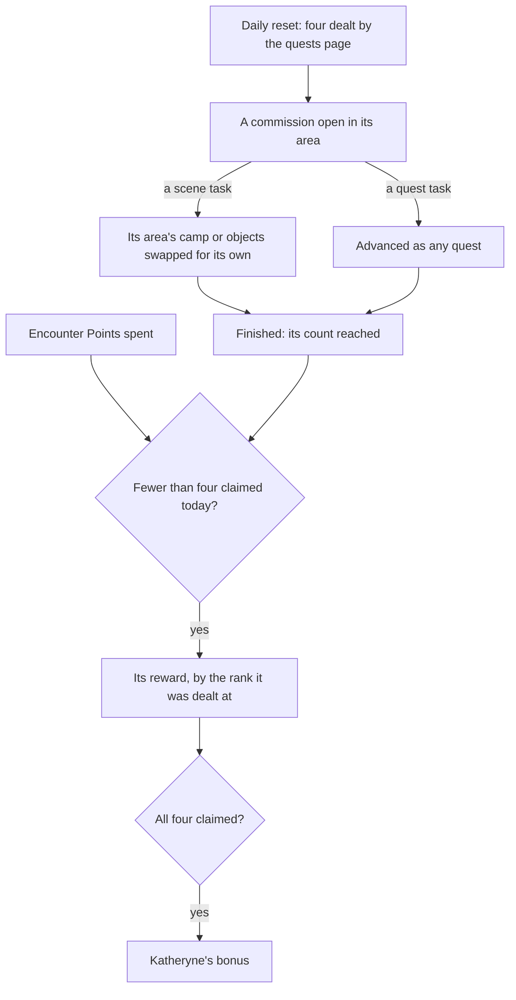

# Commissions

Every day the game deals four commissions from the areas a player has reached, which the [quests](/docs/proposals/genshin/quests) proposal already decides: when they are dealt, how many, and from which pool. This page is what a commission is once dealt, what it gives, and the bonus that ends the day. It waits on the quests being served and advanced, and on the [Adventure Rank](/docs/proposals/genshin/adventure-rank) that opens commissions and scales their rewards.

## Decisions

- **A commission is the game's own daily task.** `DailyTaskExcelConfigData` holds every commission: its region and pool, its kind, its place by a named scene point, the radius it begins and ends in, how it is finished and how far (`finishType`, `finishProgress`, such as eight enemies defeated), and its reward. A scene task swaps its area's camp or objects for its own (`oldGroupVec` for `newGroupVec`) while it is open, so a commission replaces the enemies, objects and chests that stood there until it is done and the area reloads. A task with a quest is one of the carried quests, read by the quest reader as any quest is.
- **A commission is blocked where a quest stands.** One whose place or resident is held by another quest in progress is never dealt, as the game blocks it.
- **Four rewards a day.** Each commission done gives its reward by the Adventure Rank it was dealt at, from its reward table and the wiki's table of them, and no more than four are claimed a day. Commissions open at Adventure Rank 12 and the quest that introduces them; each region's join the pool once its quest is done.
- **Katheryne's bonus.** Once all four rewards are claimed, talking to Katheryne at any branch of the Adventurers' Guild gives the day's bonus: 20 Primogems, 500 Adventure EXP until rank 60, Mora and Companionship EXP by Adventure Rank, and an Adventure Treasure Pack, as the wiki lists them.
- **Encounter Points claim a reward.** Quests, chests and certain items give Encounter Points, which claim a commission's reward without doing it; the commission can still be done, for nothing more.
- **The handbook shows the day's four.** The Adventurer Handbook's Commissions tab lists them with the preferred region, as the game shows them.
- **Kept with the player's progress**, and every unfinished one replaced at the next daily reset.

## How it works

## Scope and order

**Today:** the quests' model, progression and screen are built, and the quests proposal deals four commissions a day with nothing yet to deal.

**This adds, in order:**

1. **The daily tasks read**, Mondstadt's pool first, by a run beside the quest reader.
2. **Scene tasks**, swapping their area's camp while open.
3. **Rewards and Katheryne's bonus.**
4. **Encounter Points** and the handbook's Commissions tab.

## Data and measures

- **Read from the game's tables:** `DailyTaskExcelConfigData`, `DailyTaskRewardExcelConfigData` and `DailyTaskLevelExcelConfigData`, the named scene points the tasks stand at, and the quests a quest task names.
- **Read from the wiki:** each commission's reward by Adventure Rank, where the reward table names a drop the client never receives.
- **Placed by the spawned places:** the camps and objects a scene task swaps in, which the table names by the game's scene groups, stand where the [spawned places](/docs/proposals/genshin/spawned-places) fit them, the task's own named point beside them.

## Key files

| File                                                              | Role after the change                                |
| :---------------------------------------------------------------- | :--------------------------------------------------- |
| `packages/genshin-world/src/models/quest/QuestKind.ts`            | The commission kind its tasks are dealt under        |
| `packages/genshin-world/src/services/quest/advanceQuest.ts`       | Advances a commission's quest task as any quest's    |
| `packages/genshin-world/src/models/enemy/EnemyCamp.ts`            | A scene task's camp, swapped in for its area's own   |
| `packages/genshin-world/src/services/handbook/constants.ts`       | The Commissions tab, filled with the day's four      |
| `packages/genshin-world/src/components/Handbook/Screen/Index.vue` | Draws the day's commissions and the preferred region |

## Sources

- [Commission](https://genshin-impact.fandom.com/wiki/Commission), Genshin Impact Wiki: four a day from the pool of the areas lit, commissions replacing their area's enemies and objects, blocked by a quest holding their place, the preferred region, Encounter Points, the unlock at rank 12 and each region's quest, four rewards a day by rank, and Katheryne's bonus.
- [AnimeGameData](https://gitlab.com/Dimbreath/AnimeGameData), the community's per-patch dump: the daily task table with each task's place, radius, finish, reward and swapped groups.
