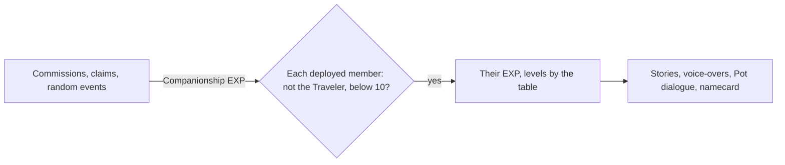

# Companionship

Every character but the Traveler has a Friendship Level, from 1 to 10, raised by Companionship EXP earned while they are in the party. It is how a player comes to read a character's stories and hear their voice-overs, and how they earn the character's namecard. Its EXP comes from the [commissions](/docs/proposals/genshin/commissions) and the [Original Resin](/docs/proposals/genshin/original-resin) claims, so this page waits on both, and what it opens is shown on the [character screen](/docs/proposals/genshin/character-screen)'s Profile tab.

## Decisions

- **Every member of the deployed party earns it in full.** Companionship EXP goes whole to each character in the deployed team, fallen ones too, never split, and never to the Traveler or a character already at level 10.
- **Each source states its own.** Commissions give their share by Adventure Rank, the day's bonus its own, ley line outcrops, domains, normal and weekly bosses theirs on a claim, and random events theirs up to ten a day, as the wiki lists them; each page gives its own.
- **Levels by the game's table.** Each level's EXP is `AvatarFettersLevelExcelConfigData`'s.
- **Each level opens what the game opens.** Level 2 to 6 open the character's stories in turn and their voice-overs tied to Friendship, level 4 and 7 a dialogue when they are a companion in the Serenitea Pot, and level 10 their namecard. A story or line that also waits on a quest waits on both. The stories and lines are the game's own by text id ([game text](/docs/genshin/game-text)), which `FettersExcelConfigData` and `FetterStoryExcelConfigData` file under each character.
- **Kept with each character.**

## How it works

## Scope and order

**Today:** the party is kept and nothing counts its members' friendship.

**This adds, in order:**

1. **The level and its EXP**, with the first source that gives it.
2. **The Profile tab's stories and voice-overs**, opened by level, once the character screen draws the tab.
3. **The namecard at 10**, with a profile to show it.

## Data and measures

- **Read from the game's tables:** `AvatarFettersLevelExcelConfigData`, `FettersExcelConfigData` and `FetterStoryExcelConfigData`, with their open conditions.

## Key files

| File                                                               | Role after the change                       |
| :----------------------------------------------------------------- | :------------------------------------------ |
| `packages/genshin-world/src/models/character/Character.ts`         | Gains its Friendship Level and EXP          |
| `packages/genshin-world/src/models/party/Party.ts`                 | The deployed team, whose members earn it    |
| `packages/genshin-world/src/components/Character/Screen/Index.vue` | The Profile tab, opening what a level opens |

## Sources

- [Companionship EXP](https://genshin-impact.fandom.com/wiki/Companionship_EXP), Genshin Impact Wiki: the full amount to every party member, the fallen too, never the Traveler, and each source's amounts.
- [Friendship Level](https://genshin-impact.fandom.com/wiki/Friendship_Level), Genshin Impact Wiki: what each level from 1 to 10 opens, stories and voice-overs also waiting on quests, and no EXP past 10.
- [AnimeGameData](https://github.com/DimbreathBot/AnimeGameData), the community's per-patch dump: the friendship levels' EXP and the stories and voice-overs filed under each character.
