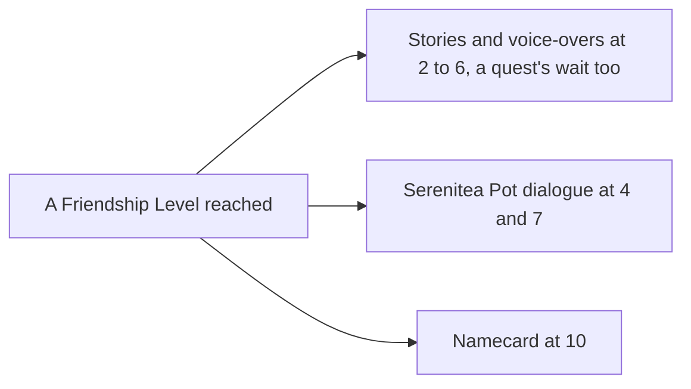

# Companionship

The Friendship Level and the EXP that raises it are built, with the Original Resin claims as their first source, as the [companionship](/docs/genshin/companionship) page sets out. This proposal keeps what a level opens and the sources still waiting on their own pages.

## Decisions

- **Each source states its own.** Commissions give their share by Adventure Rank, the day's bonus its own, and random events theirs up to ten a day, as the wiki lists them. Each source's page gives its amounts; none is set here.
- **Each level opens what the game opens.** Level 2 to 6 open the character's stories in turn and their voice-overs tied to Friendship, level 4 and 7 a dialogue when they are a companion in the Serenitea Pot, and level 10 their namecard. A story or line that also waits on a quest waits on both. The stories and lines are the game's own by text id ([game text](/docs/genshin/game-text)), which `FettersExcelConfigData` and `FetterStoryExcelConfigData` file under each character.
- **Settled while building the level.** The levels are the dump's `AvatarFettersLevelExcelConfigData`, each row's EXP the cost to leave its level, so the top row is never spent and level 10 totals 29,100, the wiki's figure. A character keeps its total EXP and the level is read from it. The first claim amounts are provisional at the low end of each wiki range, measured by the Recordings owed clips.

## How it works

## Scope and order

**Built:** the level, its total EXP, the party's grant and the Original Resin claims' amounts, as the [companionship](/docs/genshin/companionship) page shows.

**This adds, in order:**

1. **The Profile tab's voice-overs**, opened by level as the stories are, once the [character profile](/docs/genshin/character-profile) lists them. Its stories are built.
2. **The namecard at 10**, with a profile to show it.
3. **The commissions and random events' EXP.** The commissions' claim returns its Companionship EXP item, and routing it to the [friendship grant](/docs/genshin/companionship) is the claim caller's, built in the [commissions](/docs/proposals/genshin/commissions) proposal's routing step. Random events have no page yet.

## Data and measures

- **Read from the game's tables:** `FettersExcelConfigData` for the voice-overs and `FetterStoryExcelConfigData` for the stories, with their open conditions. The levels are already read.
- **Provisional:** each claim kind's Companionship EXP, until the Recordings owed clips show what a claim gives.

## Key files

| File                                                               | Role after the change                       |
| :----------------------------------------------------------------- | :------------------------------------------ |
| `packages/genshin-world/src/components/Character/Screen/Index.vue` | The Profile tab, opening what a level opens |

## Sources

- [Friendship Level](https://genshin-impact.fandom.com/wiki/Friendship_Level), Genshin Impact Wiki: what each level from 1 to 10 opens, stories and voice-overs also waiting on quests, and no EXP past 10.
- [Companionship EXP](https://genshin-impact.fandom.com/wiki/Companionship_EXP), Genshin Impact Wiki: the commissions' and random events' amounts, which their pages take.
- [AnimeGameData](https://github.com/DimbreathBot/AnimeGameData), the community's per-patch dump: the stories and voice-overs filed under each character in the fetter tables.
