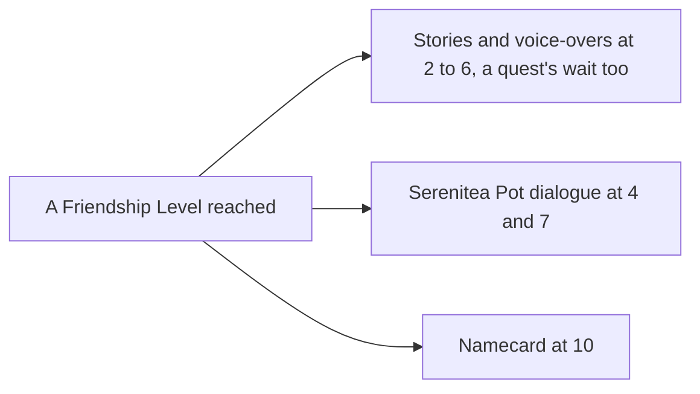

# Companionship

The Friendship Level and the EXP that raises it are built, with the Original Resin claims as their first source, as the [companionship](/docs/genshin/companionship) page sets out. This proposal keeps what a level opens and the sources still waiting on their own pages.

## Decisions

- **The namecard's name shows now, its description waits.** The name is read from the name records the stat tables already share, so the view needs no record of its own; the description and art are left, each published to the hosted game data with the rest of its words when it is built.
- **Each source states its own.** Commissions give their share by Adventure Rank, the day's bonus its own, and random events theirs up to ten a day, as the wiki lists them. Each source's page gives its amounts; none is set here.
- **Each level opens what the game opens.** Level 2 to 6 open the character's stories in turn and their voice-overs tied to Friendship, level 4 and 7 a dialogue when they are a companion in the Serenitea Pot, and level 10 their namecard. A story or line that also waits on a quest waits on both. The stories and lines are the game's own by text id ([game text](/docs/genshin/game-text)), which `FettersExcelConfigData` and `FetterStoryExcelConfigData` file under each character.
- **The namecard is a material the game's tables join to the character.** `FetterCharacterCardExcelConfigData`, which AnimeGameData holds and the dump lacks, names each character's Friendship 10 reward (`avatarId`, `fetterLevel` 10, `rewardId`). `RewardExcelConfigData` gives that reward's one item, and `MaterialExcelConfigData` holds the item as a `MATERIAL_NAMECARD` with its name, description, `icon` and `picPath`: Amber's reward 241001 is item 210003, `UI_NameCardIcon_Ambor`. No namecard table is owed.
- **The namecards share the levels' file.** The `friendship/friendship` record holds the levels and the namecards together, fetched by key, rather than a record of its own for the namecards, each reader parsing only the field it returns.
- **A namecard is held by the level, never stored.** A character at Friendship Level 10 holds its namecard, read from its total EXP as the level is, so the save keeps nothing new and the two cannot disagree.
- **A namecard is shown by its words, never its picture.** Its art is the game's texture, which is never served, so the view sets its name on a plate of our own, its description waiting with the art on the static-data host; the extracted art is a reference only, and no extraction gates the view.
- **Settled while building the level.** The levels are the dump's `AvatarFettersLevelExcelConfigData`, each row's EXP the cost to leave its level, so the top row is never spent and level 10 totals 29,100, the wiki's figure. A character keeps its total EXP and the level is read from it. The first claim amounts are provisional at the low end of each wiki range, measured by the Recordings owed clips.

## How it works

## Scope and order

**Built:** the level, its total EXP, the party's grant, the Original Resin claims' amounts, and the namecard a level 10 holds with its name on the Profile tab, as the [companionship](/docs/genshin/companionship) page shows.

**This adds, in order:**

1. **The Serenitea Pot dialogue at 4 and 7**, with the [Serenitea Pot](/docs/proposals/genshin/serenitea-pot)'s companions, whose talk it is. Waits on the companions being invited. The fetter tables hold no condition naming the pot (`FettersExcelConfigData` has only the level, quest, birthday, promotion and transit conditions), so the lines are looked up in `DialogExcelConfigData` and `NpcExcelConfigData` once that exists.
2. **The commissions and random events' EXP.** The commissions' claim returns its Companionship EXP item, and routing it to the [friendship grant](/docs/genshin/companionship) is the claim caller's, built in the [commissions](/docs/proposals/genshin/commissions) proposal's routing step. Random events have no page yet.

## Data and measures

- **Provisional:** each claim kind's Companionship EXP, until the Recordings owed clips show what a claim pays out.

## Key files

| File                                                                       | Role after the change                       |
| :------------------------------------------------------------------------- | :------------------------------------------ |
| `packages/genshin-world/src/components/Character/Screen/Index.vue`         | The Profile tab, opening what a level opens |
| `packages/genshin-world/src/components/Character/Profile/Index.vue`        | The namecard's name, read with the stories  |
| `packages/genshin-interface/src/components/CharacterMenuProfile/Index.vue` | The namecard's name plate under the list    |

## Sources

- [Friendship Level](https://genshin-impact.fandom.com/wiki/Friendship_Level), Genshin Impact Wiki: what each level from 1 to 10 opens, stories and voice-overs also waiting on quests, and no EXP past 10.
- [Companionship EXP](https://genshin-impact.fandom.com/wiki/Companionship_EXP), Genshin Impact Wiki: the commissions' and random events' amounts, which their pages take.
- [AnimeGameData](https://github.com/DimbreathBot/AnimeGameData), the community's per-patch dump: the stories and voice-overs filed under each character in the fetter tables.
