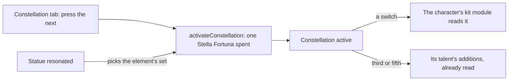

# Constellations

The table, the activation, the talent levels the third and fifth add, and the Stella Fortuna a wish brings are built, as the [constellations](/docs/genshin/constellations) page records. What is left is the Constellation tab's press, which the drawn tab is ready for; each constellation's effect, which waits on the [character kits](/docs/proposals/genshin/character-kits); and the Traveler's element sets, which wait on their sources.

## Decisions

- **Each constellation's effect is written in its character's kit module.** A switch is a small module over the kit's shared effects, reading its numbers from the table's `paramList`, as a character's own module reads its talents. Each is written from its constellation's description and the wiki's notes on it, the same as the module it joins.
- **The Traveler's sets come by element.** The statue a Traveler resonates with picks the set, and each set's source unlocks it: Archon Quests, Souvenir Shops, Adventure Rank rewards for Anemo, Statue of The Seven levels for Electro, Dendro, Hydro and Cryo, and Natlan's tribe reputation for Pyro, as the wiki lists them. Each comes with the page that builds its source.
- **The Constellation tab activates from the character screen.** It lists the six with their state and presses the activation. Its look is the character screen's.
- **The tab asks before it presses.** As the Talents tab does, one function names why the next constellation cannot be activated now (all six active, or no Stella Fortuna held), and `activateConstellation` throws on that same answer, so no refusal is ever caught.
- **The wish hands its Stella Fortuna over where it adds new characters.** `Wish/Screen` already appends a wish's new characters; the same step adds `stellaFortunaCountMap`'s counts to the characters they belong to, so a duplicate's Stella Fortuna reaches its character the moment it is drawn.

## How it works

## Scope and order

**Today:** what is built is on the [constellations](/docs/genshin/constellations) page. Nothing yet reads a constellation's effect, and the Traveler has no set chosen.

**This adds, in order:**

1. **The Constellation tab's activation, and the wish's Stella Fortuna handed over.** The tab is drawn already, so this is its press and its supply.
   - **The rules.** A new `packages/genshin-world/src/services/character/getConstellationActivationRefusal.ts` returns a `ConstellationActivationRefusal` (`models/character/ConstellationActivationRefusal.ts`: `AllActive`, `NoStellaFortuna`) or `undefined`, and `activateConstellation` throws on that refusal rather than checking for itself. A new `addStellaFortuna.ts` beside it takes the characters and a wish's `stellaFortunaCountMap` and returns the characters with each count added to its own. `getConstellationActivationRefusal.test.ts` asserts both refusals and none, and `addStellaFortuna.test.ts` that only the characters the map names gain, by their counts.
   - **The supply.** `Wish/Screen` applies `addStellaFortuna` where it appends the new characters, so `v-model:characters` carries both.
   - **The tab.** `World/Session` loads `readConstellationTables()`, which nothing calls yet, and hands `CharacterScreen` the chosen character's set. `CharacterMenuConstellation` (`packages/genshin-interface/src/components/CharacterMenuConstellation/Index.vue`) gains `isActivateDisabled` and emits `activate` from an Activate button under the rings, its label the `GameTextKey` that `genshin:text find "^Activate$"` returns. `Character/Screen` disables it on a refusal and on `activate` emits the character `activateConstellation` returns through `v-model:characters`, wired in `World/Session` as `WishScreen`'s is. The button's place is provisional, queued for the user's eyes against `character-constellation`.
2. **Each constellation's effect**, written in its character's kit module as each module is built on the [character kits](/docs/proposals/genshin/character-kits) page, the unit the other machine holds.
3. **The Traveler's sets**, each unlocked by its source, with the element a statue gives picking the set the Traveler's kit reads, each with the page that builds its source.
4. **The wish screen's showing** of the Stella Fortuna and Masterless Stella Fortuna a draw brings, on its results' cards.

## Data and measures

- **Read from the game's tables:** each effect's numbers are the table's `paramList`, already written.
- **Measured:** nothing; the Constellation tab's look is the character screen's.

## Key files

Nothing is listed yet: each character's constellation effects are a module of their own under the kit folder, which this change creates, so no file it names exists to be listed.

## Sources

- [Constellation](https://genshin-impact.fandom.com/wiki/Constellation), Genshin Impact Wiki: what each constellation changes, and the Traveler's sources by element.
