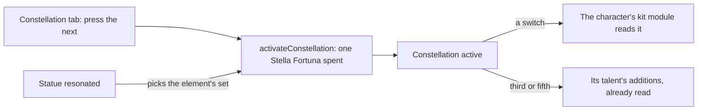

# Constellations

The table, the activation, the talent levels the third and fifth add, and the Stella Fortuna a wish brings are built, as the [constellations](/docs/genshin/constellations) page records. Three parts are left: each constellation's effect, which waits on the [character kits](/docs/proposals/genshin/character-kits); the Traveler's element sets, which wait on their sources; and the Constellation tab, which waits on the [character screen](/docs/proposals/genshin/character-screen).

## Decisions

- **Each constellation's effect is written in its character's kit module.** A switch is a small module over the kit's shared effects, reading its numbers from the table's `paramList`, as a character's own module reads its talents. Each is written from its constellation's description and the wiki's notes on it, the same as the module it joins.
- **The Traveler's sets come by element.** The statue a Traveler resonates with picks the set, and each set's source unlocks it: Archon Quests, Souvenir Shops, Adventure Rank rewards for Anemo, Statue of The Seven levels for Electro, Dendro, Hydro and Cryo, and Natlan's tribe reputation for Pyro, as the wiki lists them. Each comes with the page that builds its source.
- **The Constellation tab activates from the character screen.** It lists the six with their state and presses the activation. Its look is the character screen's.

## How it works

## Scope and order

**Today:** what is built is on the [constellations](/docs/genshin/constellations) page. Nothing yet reads a constellation's effect, and the Traveler has no set chosen.

**This adds, in order:**

1. **Each constellation's effect**, written in its character's kit module as each module is built on the [character kits](/docs/proposals/genshin/character-kits) page.
2. **The Traveler's sets**, each unlocked by its source, with the element a statue gives picking the set the Traveler's kit reads.
3. **The Constellation tab** on the [character screen](/docs/proposals/genshin/character-screen), and the wish screen's showing of the Stella Fortuna and Masterless Stella Fortuna a draw brings, with the store that hands a duplicate's Stella Fortuna to its character.

## Data and measures

- **Read from the game's tables:** each effect's numbers are the table's `paramList`, already written.
- **Measured:** nothing; the Constellation tab's look is the character screen's.

## Key files

Nothing is listed yet: each character's constellation effects are a module of their own under the kit folder, which this change creates, so no file it names exists to be listed.

## Sources

- [Constellation](https://genshin-impact.fandom.com/wiki/Constellation), Genshin Impact Wiki: what each constellation changes, and the Traveler's sources by element.
